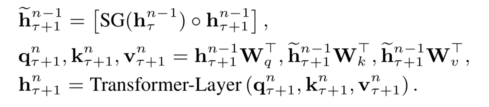

>Authors : Zihang Dai,    Zhilin Yang,   Yiming Yang,   William W. Cohen, Jaime Carbonell,   Quoc V. Le ,    Ruslan Salakhutdinov
>Institution : Carnegie Mellon University,    Google Brain,    Google AI
>Publication Date : June 2, 2019
>ACL 2019
>github : [https://github.com/kimiyoung/transformer-xl](https://github.com/kimiyoung/transformer-xl){:target="_blank"}
>paper : [https://arxiv.org/abs/1901.02860](https://arxiv.org/abs/1901.02860){:target="_blank"}

기존에 논문 리뷰를 스터디를 통해 해왔었고 이를 저만 보는 것이 아니라 공개하고 싶어서 github page로 남깁니다. 
psygrammer라는 그룹에서 '바벨봇' 스터디를 통해 자연어 처리 논문 리뷰를 격주로 진행하고 있습니다. 
이 논문은 19년도 초에 리뷰했던 것으로 기억합니다. 당시에 자연어 처리에 낯설어서 논문 이해하는데도 부족함이 있을 것이라 생각합니다.
즉, 실수가 있을 수 있음을 감안해주시고 잘못된 것이 있으면 댓글로 알려주시면 감사하겠습니다.
 

## Abstract
* Transformer networks는 장기의존성을 학습할 잠재성을 지녔지만 language modeling에서 고정된 길이의 context에 의해 제한된다는 단점이 있다. 
* 해결책으로 새로운 neural architecture인 Transformer-XL를 제안
    * 시간적 일관성을 망치지 않고 transformer가 고정된 길이의 한계를 넘어서 의존성을 학습하도록 만듦
    * segment-level recurrence mechanism과 새로운 위치 인코딩 체계로 구성
    * 장기 의존성 잡아내고, context fragmentation 문제도 해결
* [성능] Transformer-XL은 
    * RNNs보다 약 80% 더 긴 의존성을 학습
    * vanilla Transformers보다 45% 더 긴 의존성을 학습
    * 평가에서도 vanilla Transformer보다 짧고, 긴 시퀀스 모두에서 좋은 성능을 보였고 평가속도도 1,800배 이상 빠름
    * 최첨단의 결과를 향상시킴(bpc/perplexity)
        * enwiki8 : 1.06 -> 0.99
        * text8 : 1.13 -> 1.08
        * WikiText-103 : 20.5 -> 18.3
        * One Billion Word : 23.7 -> 21.8
        * Penn Treebank : 55.3 -> 54.5
* Pretrained Model
* hyperparameters are available in both Tensorflow and PyTorch

## 1. Introduction

#### RNN 구조에서 오는 장기의존성(long dependency) 문제는 LSTM이나 GRU, seq2seq 심지어 transformer에서도 해결하기 어렵다

* LSTM seq to seq(LSTM 두개를 인코더와 디코더로 사용)모델은?
    * 정보의 흐름을 조정하는 게이트만으로는 부족하다. 결국 입력 문장이 길어지면 답변의 정확도가 떨어진다.
* 경험적으로, LSTM 언어 모델이 200 개의 문맥 단어를 평균적으로 사용한다는 것을 발견했다. 반면에 attention 메커니즘에서 만들어진 장거리 단어쌍 간의 직접 연결은 최적화를 용이하게하고 장기 의존성을 학습할 수 있게 한다(Bahdanau et al., 2014; Vaswani et al., 2017)
* Al-Rfou et al. (2018)은 LSTM을 큰 차이로 능가하는 문자 단위 언어 모델링을 위해 deep Transformer 네트워크를 훈련시키기 위해 일련의 보조적인 손실을 설계했다(Vanilla transformer). vanilla transformer는 세그먼트를 통한 어떠한 정보 흐름더 없이 수백 개의 문자로 분리된 고정 길이 세그먼트에서 LM training을 수행한다.
    * ⇒ 고정된 context 길이의 때문에 모델은 미리 정의된 컨텍스트 길이를 초과하여 장기 의존성을 잡아낼 수 없다.
    * 고정 길이의 세그먼트는 문장이나 어떤 다른 의미론적 경계도 존중하지 않고 연이은 심볼 청크를 선택하면서 생성되었다. (문장 구조나 의미로 세그먼트를 만든 것이 아니라 연속된 청크를 기준으로해서 만들어졌다고 하는 듯함)
    * 결국! 이 모델은 처음 몇개의 심볼들을 잘 예측할 수 있는 필수적인 맥락 정보를 갖추지 못했고 비효율적인 최적화와 낮은 수준의 성능으로 이끌었다.

## 2. Related Work

* 최근 몇년 사이에 language modeling에 많은 진전이 있었다.
* 언어 모델링에서 먼 거리의 context를 잡아내기 위해 작업 라인은 광범위한 컨텍스트 표현을 추가 입력으로 네트워크에 직접 제공한다.
* 기존 작업물은 컨텍스트 표현을 수동으로 정의한 것부터 데이터에서 습득한 문서 수준 주제(topics)에 의존하는 것까지 다양하다.
* 범용 시퀀스 모델링에서 장기 의존성을 포착하는 방법은 오랫동안 다워진 문제였다. 이러한 관점에서, LSTM의 유비쿼터스 적응 이후, 초기화, 추가 손실 신호, 증강 메모리 구조 및 최적화를 용이하게 하기 위해 RNN의 내부 구조를 수정하는 등의 vanishing gradient 문제를 해결하는 데 많은 노력을 기울여왔다. 
이들과는 달리, 이 연구의 작업은 Transformer 아키텍처를 기반으로 하고 있으며, 실제 업무로서의 언어 모델링은 장기적인 의존성을 익힐 수 있는 이점을 지닌다.

## 3. Model

* tokens $x = (x_1, … , x_T)$를 가진 corpus가 주어진 상황에서 language modeling의 과제는 $P(x) = \prod P(x_t | x < t )$로 auto-regressive하게 인수분해되는 joint probability(결합확률) $ P(x) $를 추정하는 것
* $$P(x) = \prod P(x_t | x < t )$$
* 인수분해와 함께 문제는 각 조건부 요인을 추정하는 것으로 감소한다.
* 조건부 확률을 모델링하는데 표준 신경 접근(standard neural approach)을 고수함
* 훈련 가능한 신경망을 사용하여 컨텍스트 x < t 를 고정 된 크기의 hidden state로 인코딩하고,이를 단어 임베딩한 것과 곱하여 logits을 얻는다.
* logits은 Softmax 함수에 입력되어 다음 토큰에 대한 확률 분포를 산출한다.

### 3.1 VANILLA TRANSFORMER LANGUAGE MODELS

* Transformer나 self-attention을 language modeling에 적용하기 위해서 중요한 문제는 임의의 긴 컨텍스트를 고정된 크기의 표현으로 효과적으로 인코딩하기 위해 Transformer를 훈련시키는 것이다.
* 무한한 메모리와 계산을 감안할 때 간단한 해결책은 feed forward 뉴럴 네트워크와 마찬가지로, 무조건적인 Transformer 디코더를 사용하여 전체 컨텍스트 시퀀스를 처리하는 것이다.
* feed forward 신경망이란? 
    * feedback을 하지 않거나 loop 연결을 가지지 않는 망을 의미한다. 망막과 연결된 어떤 신경망들처럼 피드포워드 망은 신경세포를 오직 앞 방향으로만 연결시킨다. 맨 앞의 신경세포 층은 다음 층과 연결되고, 다음 층은 다시 그 다음 층과 연결되는 방식이다. 어떤 신경세포 층도 이전의 신경세포 층과는 달리 연결되지 않기 때문에 'feed forward'라는 이름을 갖게 되었다.
* 그러나 이것은 실제로 제한된 리소스로는 실행 불가능하다.

* 실현가능하지만 대략적인 근사법이 있는데 전체 corpus를 감당할만한 크기의 짧은 세그먼트로 분리해서, 이전 세그먼트에서 오는 모든 맥락 정보를 무시하고  각 세그먼트들을 모델에 학습시키는 것이다. 이 아이디어가 채택된 것이 vanilla model 이다. 
* 이 training 패러다임에서 정보는 절대로 전방 또는 후방 패스에서 현재 세그먼트로 흐르지 않는다.(figure1.a)
* 고정된 길이의 context를 사용하는 것은 두 가지 치명적인 한계를 지닌다
    1. 가능한 가장 큰 의존성 길이의 상한(upper bound)은 문자 수준의 language modeling에서 몇 백 개에 해당하는 세그먼트 길이 정도이다. 이로 인해, RNN에 비해 self-attention 메카니즘이 vanishing gradient 문제에 덜 영향을 받지만, vanilla model은 최적화 이점을 충분히 잘 활용할 수 없다.
    2. 문장 또는 다른 의미론적 경계를 존중하기 위해 패딩을 사용할 수도 있지만, 실제로는 높은 효율성을 위해 긴 텍스트를 고정 길이 세그먼트로 간단하게 청크하는 것이 표준 방식이었다. 하지만, 단순히 시퀀스를 고정 길이의 세그먼트로 자르는 것은 이전에서 말했듯이 context fragmentation 문제에 이르게 된다.
* 평가할 때(figure 1.b)는 각 스텝마다 훈련 때와 동일한 길이의 세그먼트를 사용하고 마지막 위치에서 하나의 예측값을 내놓는다.
* 다음 단계에서 세그먼트는 오른쪽으로 한칸씩 이동하고 새로운 세그먼트는 처음부터 모두 처리한다.
* 이러한 절차는 각 예측값이 학습하는 동안 노출된 가능한 가장 긴 컨텍스트를 활용할 수 있도록 하고 학습 중 발생하는 context fragmentation 문제도 없애준다. 하지만 이러한 절차는 극단적으로 비용이 많이 든다. 

* 하지만~!! 이 연구에서 제안하는 아키텍쳐는 평가 속도가 상당히 빠르다는 것을 알게 될 것이다.
* $$P(x) = \prod P(x_t | x < t )$$로 auto-regressive하게 인수분해되는 
### 3.2 Segment-Level Recurrence  with State Reuse

* 고정 길이의 컨텍스를 사용하는 것에 한계를 극복하기 위해 Transformer 아키텍쳐에 재귀 메커니즘을 도입함
    * 기존 transformer는 재귀를 사용하지 않고 attention 메커니즘만을 사용해 input과 output의 dependency를 포착해냈다. 
    재귀를 사용하지 않기 때문에 순서대로 학습할 필요가 없어서 학습 시 encoder에서는 각각의 position(단어)에 대해 attention을 해주기만 하고, 
    decoder에서는 masking 기법을 이용하여서 병렬 처리가 가능하게 되었다.
* 학습하는 동안, 이전 세그먼트에서 계산된 hidden state 시퀀스는 모델이 다음의 새로운 세그먼트를 진행할 때 확장된 context로 재사용되기 위해 
고정되고 캐시에 저장된다.(figure 2.a)

* tokens $x = (x_1, … , x_T)$를 가진 corpus가 주어진 상황에서 language modeling의 과제는 $P(x) = \prod P(x_t | x < t )$로 auto-regressive하게 인수분해되는 joint probability(결합확률) $ P(x) $를 추정하는 것
* gradient(경사도)가 여전히 세그먼트 내에 남아 있지만이 추가 입력을 통해 네트워크에서 history 정보를 활용할 수 있으므로 장기 의존성을 모델링하고 
context fragmentation을 피할 수 있다.
* L개의 길이를 가진 두개의 이어진 세그먼트 $$s_T = [x_{T,1} , … , x_{T,L} ], s_{T+1} = [x_{T,1} , … , x_{T,L} ]$$가 있다고 해보자 
* $$h_T^n \in R^{L \times d}$$에 의해 T 번째 세그먼트 $$s_T$$에 대해 생성된 n번째 레이어의 hidden state 시퀀스를 나타낸다. 여기서 d는 숨겨진 차원이다.
* 세그먼트 $$s_{T+1}$$을 위한 n번째 레이어의 hidden state는 (도식적으로) 다음과 같이 만들어진다

