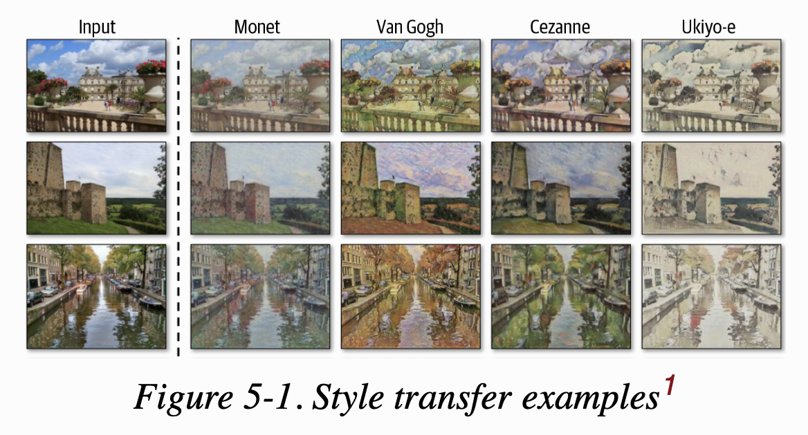
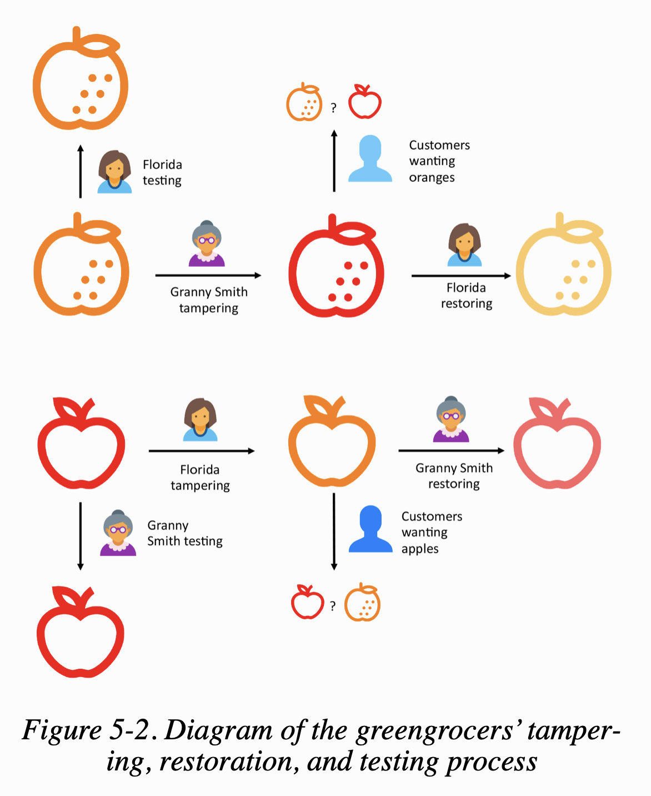
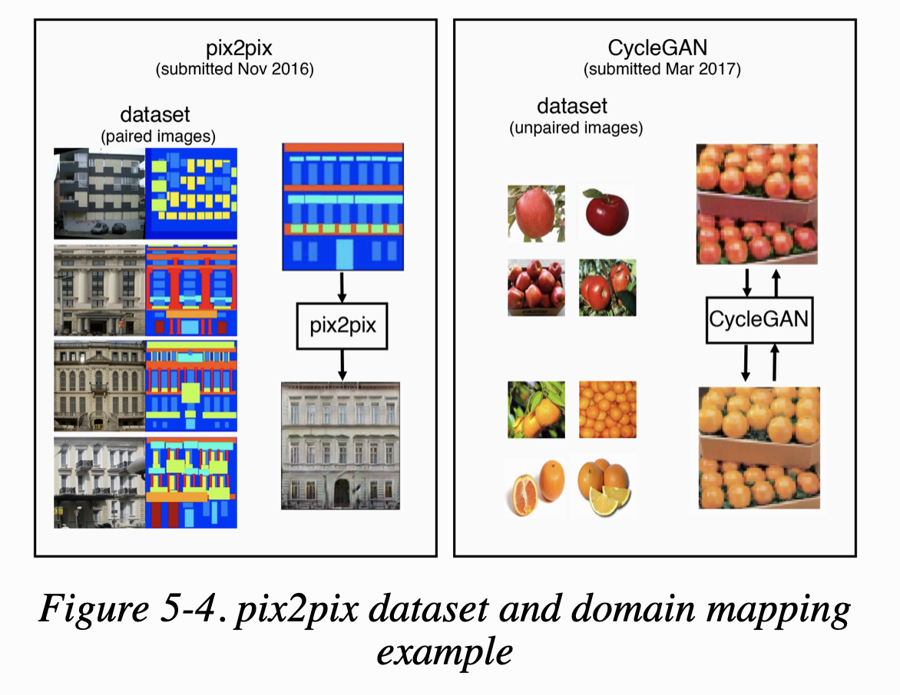
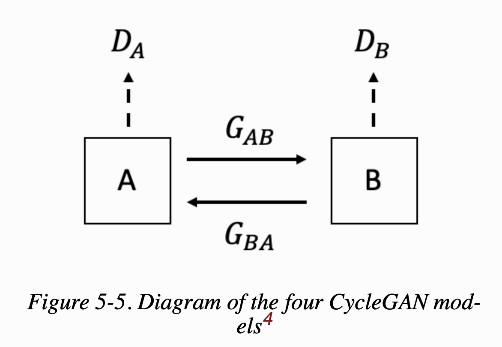
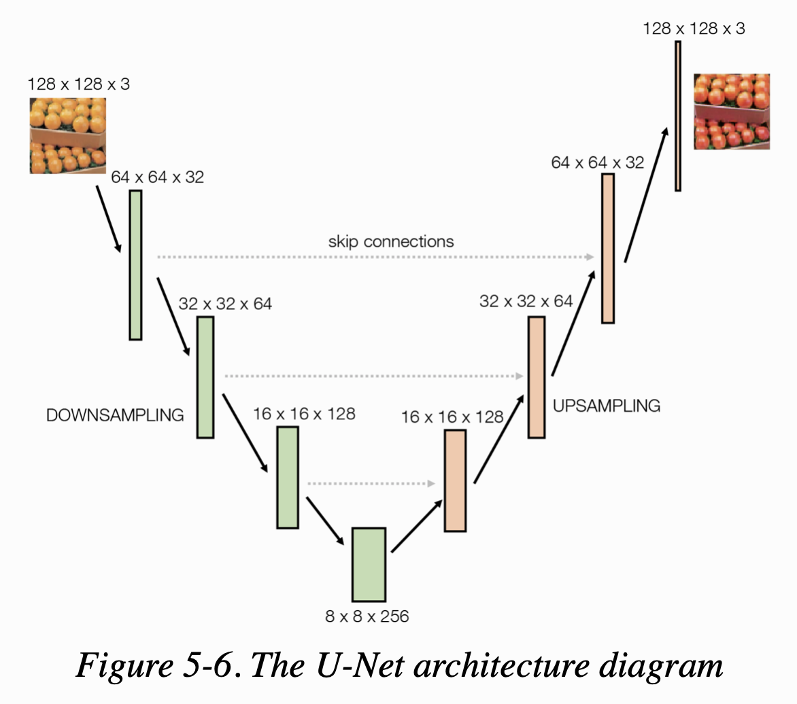
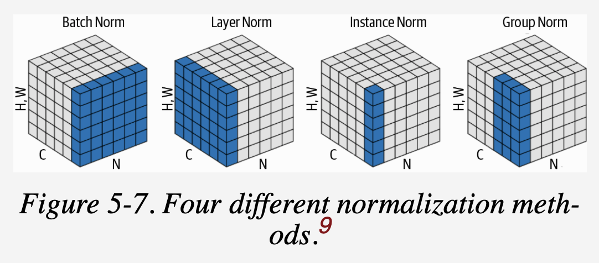

  
# 개괄

이전 챕터까지 우리가 따라해보려는 데이터셋 하나를 가지고 새로운 샘플을 만들어낼 수 있는 모델을 훈련하는 여러 방법들을 알아보았다.(VAE, GAN 등)
이번 챕터에서는 여러 데이터셋에 적용해보고, VAEs와 GANs가 내재된 잠재공간과 original pixel space 사이의 매핑을 어떻게 학습하는지 알아볼 것이다.

Generative model의 또 다른 응용분야에는 style transfer 분야가 있다.
여기서 우리의 목적은 입력 기반 이미지를 변형시킬 수 있는 모델을 만들어서 주어진 스타일 이미지 셋 같이 동일한 컬렌션으로부터 온 인상을 주는 것이다.



style transfer의 목적은 스타일 이미지의 내재된 분포를 모델링하려는 것이 아니라 **이 이미지들로부터 stylistic component를 추출하고 이 컴포넌트를 베이스 
이미지에 내장**하는 것이다.
베이스 이미지에 스타일 이미지를 덧붙이면 스타일 이미지의 컨텐트가 속이 들여다보이고 색깔이 탁하고 희미해져서 이 방식으로는 완전히 합칠 수 없다. 
그리고 한 종류의 스타일 이미지로는 화가의 스타일을 캡쳐할 수 없다. 그래서 그 화가의 전체 이미지에 걸쳐서 스타일(화풍)을 학습할 모델을 만드는 방법을 찾아야 한다.
그 화가가 베이스 이미지를 작품의 원작을 만들고 그 콜렉션 내의 다른 작품에서 동일한 화풍이 반영되도록 안내하는데 사용한다는 인상을 주고 싶다.

이번 챕터에서는 두 가지 종류의 style transfer model(CycleGAN, Neural Style Transfer)을 어떻게 빌드하는지 배우고, 이 기술들을 사진과 작품에 적용해 볼 것이다.
청과물 가게 예시로 시작을 하도록 한다.  

## Apples and Oranges

할머니 Smith와 Florida는 청과물점을 함께 소유하고 있다. 둘은 효율적으로 가게를 운영하기 위해 각각 다른 영역을 맡고 있다. 할머니는 사과를, Florida는 오렌지를 담당한다.
두 사람 모두 자신이 더 나은 과일 진열품을 가지고 있다고 확신하고 있기 때문에 그들은 다음과 같은 거래에 동의한다: 
>사과 판매로 얻는 이익은 전적으로 할머니 Smith에게 돌아갈 것이고 오렌지의 판매로 얻는 이익은 전적으로 Florida에게로 가게 될 것이다.

불행하게도 두 명 모두 공정한 경쟁을 계획하지 않는다. Florida가 보지 않을 때, 할머니는 오렌지 구역으로 슬쩍 넘어가서 오렌지를 빨간색으로 칠해서 사과처럼 보이게 만든다.
Florida도 동일한 게획을 하고 있고 할머니의 사과들을 오렌지처럼 보이게 하려고 스트레이를 몰래 뿌리려 한다.

손님들이 과일을 셀프계산대로 가져오면 기계에서 잘못된 옵션을 선택하는 경우가 있다. 
하루의 끝에는 과일별 이익을 합하고 그들의 정책에 따라 분할한다. 할머니는 그녀의 사과 중 하나가 오렌지로 팔릴 때 매번 돈을 잃고, Florida는 그녀의 오렌지가 사과로 
팔릴 때 돈을 잃는다.
마감 후에 두 주인들은 기분 상하면서도 상대방의 짖궂은 행동을 막는 게 아니라 그들의 과일이 바뀌기 전에 더 원래의 것처럼 보이게 하려고 만든다.
만약 과일이 제대로 보이지 않는다면, 그들은 다음날 그것을 팔 수 없을 것이고 다시 이윤을 잃을 것이기 때문에, 그들이 이것을 바로 잡는 것이 중요하다.
또한 일관성을 유지하기 위해, 그들은 위장하는 기술을 자신의 과일로 시험해본다. Florida는 오렌지에 스프레이를 뿌렸을 때 원래 하던 것과 똑같이 보이는지 체크한다. 
할머니도 같은 이유로 사과에 사과 그림 그리는 기술을 시험한다. 그들의 기술이 헛되었다는 것을 알게 된다면, 그들은 애써 번 수익을 더 나은 기술을 배우는 데 써야 할 것이다.

이 전체적인 프로세스는 Figure 5-2와 같다.



처음엔 손님들이 속겠지만 갈수록 손님들도 그 속이는 기술에 적응하여 속인 것이 어떤 것인지 점점 구별 능력을 기를 것이다.
이는 할머니와 Florida의 위장 기술을 더 고도화하게 하는 촉매제가 된다.

이 우스꽝스러운 게임을 몇 주간 해보니, 엄청난 일이 일어났다. 고객들은 진짜와 가짜를 구분할 수 있다고 못했으며 엄청 헷갈려했다.
  
## CycleGAN

앞선 이야기는 생성 모델과 특히 style transfer(the cycle-consistent adversarial network, or **CycleGAN**) 개발에 대한 우화이다.
CycleGAN의 원논문에서는 style transfer의 성장에 큰 기여를 했는데 이는 짝을 이룬 예제가 있는 training set 없이, reference 이미지 셋에서 
다른 이미지로 스타일을 복사할 수 있는 모델을 훈련하는 것이 어떻게 가능한지를 보여주었다는 것이다.

*pix2pix* 같은 이전의 style transfer 모델들은 training set의 각 이미지가 source와 target domain 모두에 있어야 했다. 
몇몇 스타일 문제 상황(e.g. 흑백 사진에서 컬러 사진으로, 위성 이미지에 대한 지도)에서는 이러한 데이터셋을 만드는 것이 가능하지만 다른 경우에는 불가능하다.
예를 들어, 우리는 모네가 수련 시리즈를 그린 연못의 원본 사진도 없고, 엠파이어 스테이트 빌딩의 피카소 그림도 없다. 동일한 위치에 말과 얼룩말을 위치시킨 
사진을 배열하는 데에도 엄청난 노력이 요구된다. 

CycleGAN 논문은 pix2pix 논문이 나오고 몇달 안되서 발표가 되었고 source와 target domain에 pair image가 없는 문제를 해결하는 모델을 어떻게 훈련시키는지 보여주었다.
Figure 5-4가 두 모델의 차이점을 보여준다.



pix2pix model은 source에서 target으로 한 방향으로만 작동하지만, CycleGAN은 동시에 양방향으로 모델을 훈련시킨다. 그래서 CycleGAN의 모델은 source에서 target으로 하는 것만큼 target에서 source로도 이미지를 바꾸는 것을 배운다.

이제 Keras를 이용해 CycleGAN 모델을 빌드해보겠다.

  
# Your First CycleGAN

### data
* 앞선 이야기에 나오는 사과와 오렌지 예제를 사용한다. 
* download script

```shell script
$bash ./scripts/download_cyclegan_data.sh apple2orange
```

데이터는 4개 폴더로 구분된다.
* trainA : 사과
* testA : 사과
* trainB : 오렌지
* testB : 오렌지

목표는 train dataset을 사용하여 이미지를 domain A(사과)에서 B(오렌지)로 그리고 그 반대로 변환하면서 모델을 훈련시키는 것이다.

  
## Overview

CycleGAN은 사실 4개의 모델로 구성되어 있다. 두 개의 generator와 두 개의 discriminator이다. 
* 첫 번째 generator(G_AB) : 이미지를 A --> B 로 변환
* 두 번째 generator(G_BA) : 이미지를 B --> A 로 변환

generator를 훈련시킬 paired images가 없기 때문에 이미지가 generator에 의해 만들어진 것인지 판단하는 두 개의 discriminator도 필요하다.
* 첫 번째 discriminator(D_A) : domain A의 실제 이미지인지 G_BA가 만들어낸 가짜 이미지의 차이를 식별하도록 학습
* 두 번째 discriminator(D_B) : domain B의 실제 이미지인지 G_AB가 만들어낸 가짜 이미지의 차이를 식별하도록 학습

위의 관계는 Figure 5-5에서 볼 수 있다.


* code file
    * 05_01_cycle-gan_train.ipynb(main)
    * models/cycleGAN.py

*Example 5-1. Defining the CycleGAN*
```python
gan = CycleGAN(
        input_dim = (128,128,3)
        , learning_rate = 0.0002
        , lambda_validation = 1
        , lambda_reconstr = 10
        , lambda_id = 2
        , generator_type = 'u-net'
        , gen_n_filters = 32
        , disc_n_filters = 32
        )
```

generator의 아키텍쳐부터 살펴보면, 보통 CycleGAN generator는 두 가지 중 하나를 사용한다; *U-Net or ResNet(residual network)*
pix2pix 논문에서는 U-Net 아키텍쳐를 사용했지만 CycleGAN에서는 ResNet을 사용한다.
이 챕터에서는 두 가지 모두를 사용해볼 것이다. 먼저, U-Net부터.

  
## The Generator (U-Net)

Figure 5-6은 U-Net의 아키텍쳐를 보여준다. 왜 U-Net이라고 명명되었는지 바로 알 수 있다.



VAE와 동일한 방식으로 U-Net은 반 쪽짜리 두 개로 이루어져 있다
* downsampling 반 : input images를 공간적으로 압축하지만 채널은 넓게 늘린다.
* upsampling 반 : representation값을 공간적으로 팽창시키고 채널 개수는 줄인다.

VAE와 달리, U-Net의 양 쪽에는 skip connection이 동일하게 존재한다.
* VAE는 선형적이다; 데이터가 네트워크를 통해 input에서 output으로, 하나의 레이어에서 다음 레이어로 흐른다.
* U-Net은 비선형적이다; 정보를 지름길을 통해 (바로 다음이 아니라) 그 이후의 레이어로 흐르게 하는 skip connection을 지녔다.

**여기서 얻을 수 있는 직관은 네트워크의 다운샘플링 부분에서 뒤에 있는 레이어를 지닌 모델일수록 점점 더 이미지가 무엇인지를 포착하고 어디에 있는 것인지는 잃게 된다는 것이다. 
U의 정점에서, feature map은 그것이 어디에 있는지 거의 이해하지 못한 채, 이미지에 무엇이 있는지를 문맥적으로 이해하게 될 것이다.**
예측 분류 모델의 경우, 우리가 요구하는 것은 이것뿐이므로, 우리는 이것을 최종 **Dense layer**에 연결하여 이미지에 특정 클래스가 존재할 확률을 출력할 수 있다.  
하지만 원래 U-Net application(image segmentation)과 style transfer에서는 원래 이미지 사이즈로 되돌아가는 upsampling을 할 때, 
downsampling 동안 잃어버린 공간 정보를 각 레이어에 다시 제공한다. 이것이 skip connection이 필요한 이유이다.   
skip connection은 네트워크가 다운샘플링 프로세스 간에 포착된 고도의 추상적 정보(즉, 이미지 스타일)를 네트워크의 이전 계층에서 다시 공급되고 있는 특정한 공간 정보(즉, 이미지 콘텐츠)와 
혼합할 수 있도록 한다.  
skip connection을 구축하려면 새로운 층인 'Concatenate'를 도입해야 한다.
  
### Concatenate Layer

Concatenate layer는 특정 축(기본은 마지막 축)을 기준으로 이어붙이는 것을 말한다. 
예를 들어, Keras에서는 2개의 이전 레이어, x와 y를 다음과 같이 이어붙일 수 있다.

> Concatenate()([x,y])

U-Net에서는 Concatenate layer를 사용해서 upsampling layer를 동일한 사이즈의 downsampling layer에 연결한다.
layer들이 채널의 차원에 따라 이어지기 때문에 채널의 개수는 k에서 2k로 두 배가 된다. 공간의 차원 수는 동일하게 유지된다.
**여기서 concatenate layer는 단지 이전 레이어들을 붙이는 역할**을 하니 그렇게 신경쓸 필요는 없다.

### Instance Normalization Layer

generator는 또다른 새로운 유형의 레이어를 가지는데 그것이 InstanceNormalization 이다.
이 CycleGAN의 generator는 BatchNormalization layer가 아닌 InstanceNormalization layer를 사용하는데, 이는 style transfer 문제에서 더 만족스러운 결과를 만들 수 있다.

InstanceNormalization layer는 배치 단위가 아니라 개별 샘플을 각각 정규화한다. 특히 mu와 sigma를 패러미터로 필요하지 않는데 이는 테스트할 때도 훈련과 동일한 방식으로
샘플마다 정규화를 할 수 있기 때문이다. 단 각 레이어를 정규화하기 위해 사용되는 평균과 표준 편차는 채널별로 나누어 샘플별로 계산된다.
(반면 BatchNormalization 레이어는 이동 평균을 위해 훈련과정에서 mu와 sigma가 필요하다) 

또한 InstanceNormalization layer에는 스케일(gamma)이나 이동(beta) 패러미터를 사용하지 않기 때문에
학습되는 가중치가 없다.

다음 figure 5-7은 4개의 다른 정규화를 보여준다.



* 여기에서 N은 배치 축이고, C는 채널 축이다. (H,W)는 공간 축을 나타낸다.
* 이 정육면체는 정규화 레이어의 입력 tensor를 나타낸다.
* 파란색의 픽셀은 (이 픽셀에서 계산된) 동일한 평균과 분산으로 정규화된다.

U-Net generator를 만들어 볼 차례이다.

*Example 5-2. Build a U-Net Generator*
```python
def build_generator_unet(self):
    
    def downsample(layer_input, filters, f_size=4):
        d = Conv2D(filters, kernel_size=f_size,
            strides=2, padding='same')(layer_input)
        d = InstanceNormalization(axis=-1, center=False, scale=False)(d)
        d = Activation('relu')(d)

        return d

    def upsample(layer_input, skip_input, filters, f_size=4, drop_rate=0):
        u = UpSampling2D(size=2)(layer_input)
        u = Conv2D(filters, kernel_size=f_size, strides=1, padding='same')(u)
        u = InstanceNormalization(axis=-1, center=False, scale=False)(u)
        u = Activation('relu')(u)
        if dropout_rate:
            u = Dropout(dropout_rate)(u)

        u = Concatenate()([u, skip_input])
        return u

    # image input
    img = Input(shape=self.img_shape)

    # downsampling
    # generator는 두 부분으로 나뉜다.
    # 먼저 strides가 2인 Conv2D 레이어로 이미지를 downsampling한다
    d1 = downsample(img, self.gen_n_filters)
    d2 = downsample(d1, self.gen_n_filters*2)
    d3 = downsample(d2, self.gen_n_filters*4)
    d4 = downsample(d3, self.gen_n_filters*8)
   
    # Upsampling
    # 그 다음 tensor를 upsampling하여 원본 이미지와 같은 크기로 복원
    # upsample 함수에는 U-Net 구조를 구성하기 위해 Concatenate layer를 포함한다.
    u1 = upsample(d4, d3, self.gen_n_filters*4)
    u2 = upsample(u1, d2, self.gen_n_filters*2)
    u3 = upsample(u2, d1, self.gen_n_filters)
    u4 = UpSampling2D(size=2)(u3)

    output = Conv2D(self.channels, kernel_size=4, strides=1,padding='same', activation='tanh')(u4)

    return Model(img, output)
```

## The Discriminator

기존의 discriminator는 입력 이미지가 진짜인지 아닌지를 판별하는 하나의 숫자를 출력했었다. 
반면 CycleGAN의 discriminator 는 숫자가 아니라 16 * 16 크기의 채널 하나를 가진 텐서를 출력한다.

이는 CycleGAN이 PatchGAN의 discriminator 구조를 이었기 때문이다.
PatchGAN의 discriminator 는 이미지 전체에 대해 예측하는 것이 아니라 중첩된 patch로 나누어 각 패치가 진짜인지 
아닌지를 추측한다. 따라서 그 output이 하나의 숫자가 아니라 각 패치에 대한 예측 확률을 담은 텐서가 되는 것이다.

네크워크에 이미지를 전달하면 패치들을 한꺼번에 예측한다. 이미지를 수동으로 나누어 전달할 필요없다.
discriminator가 합성곱(convolution) 구조를 가지고 있어서 자동으로 이미지가 패치로 나뉜다.

PatchGAN의 장점은 스타일을 기반(내용이 아니라)으로 한 discriminator의 판별 능력을 손실함수가 측정할 수 있다는 점이다.
discriminator 예측의 개별 원소는 이미지의 부분에 기반하기에 내용이 아니라 스타일을 사용하여 결정하는 것이다.

*Example 5-3. Build a discriminator*
```python
def build_discriminator(self):

    def conv4(layer_input, filters, stride=2, norm=True):
        y = Conv2D(filters, kernel_size=4, strides=stride,
                    padding='same')(layer_input)

        if norm:
            y = InstanceNormalization(axis=-1, center=False, scale=False)(y)

        y = LeakyReLU(0.2)(y)

        return y

    img = Input(shape=self.img_shape)

    # CycleGAN의 discriminator는 연속된 convolution neural net이다.
    # 처음 레이어를 제외하고 모두 샘플 정규화를 사용한다.
    y = conv4(img, self.disc_n_filters, strid=2, norm=False) # 128 * 128
    y = conv4(y, self.disc_n_filters*2, strid=2)             # 64 * 64
    y = conv4(y, self.disc_n_filters*4, strid=2)             # 32 * 32
    y = conv4(y, self.disc_n_filters*8, strid=1)             # 16 * 16
    
    # 마지막 conv layer에는 하나의 필터만 사용하고, 활성화 함수는 적용하지 않는다.
    # strides가 1이고 padding을 same으로 줬기 때문에 이미지 크기는 변경없다.
    # 채널이 1개
    output = Conv2D(1, kernel_size=4, strids=1, padding='same')(y) # 16 * 16 * 1

    return Model(img, output)
```


