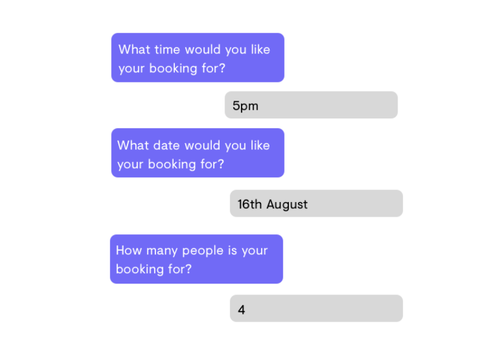
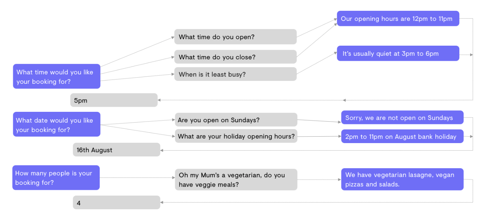

챗봇 관련 글 중에 관심이 가는 글이 있어서 이를 기록으로 남기려 합니다.

PolyAI라는 회사의 사장은 아닌 듯 한데 Brad Stein라는 분이 쓴 글입니다.
견문이 짧아 누군지 모르겠네요. 암튼.. 시작합니다!!

---

처음 가상 어시스턴트를 만들고자 할 때, 많은 회사들은 구글 Dialogflow, 아마존 Lex 같은 챗봇 빌더 플랫폼을 찾는다.
그 회사 내에서 가상 어시스턴트를 만드는 매력은 이해가는 부분이지만 그 결정은 많은 회사들이 후회하는 부분이다.

이 글에서 봇 빌더 플랫폼의 문제를 알아보고 회사에서 가상 어시스턴트를 개발하고자 생각하는 사람이라면 마음에 새겨야할 
핵심 고려사항에 대해 조명할 것이다.

## 1. 인력 문제

봇 빌더가 간단한 것처럼 광고하지만 성공적으로 가상 어시스턴트를 개발하려면 여전히 새로운 팀을 만들 필요가 있다.
 
훌륭한 봇 빌딩 팀은 적어도 한 명의 PM, 음성 유저 인터페이스 디자이너, API 개발자, 구현 엔지니어, 테스터로 구성될 것이다.
세금과 초과금을 제외하고 일년에 30만 파운드(한화 약 4억 5천만원)가 넘게 비용이 들 것이다. 
거기에다가 경력직 머신러닝 엔지니어랑 음성 디자이너는 여전히 굉장히 희귀하고 고용하는데 시간이 걸릴 것이다.

시제품 하나 만드는데 3~6개월의 예산을 잡아야 한다. 여기에는 리서치와 팀을 훈련시키는데 드는 시간은 포함하지 않았다. 
운영 준비 상태로 만드는데 개발 프로젝트가 12개월을 넘는 경우가 흔한 일이고 
우리는 FTSE 250 회사들(런던 증권거래소에 상장된 큰 규모의 기업) 중 솔루션을 만들려고 1년을 보냈지만 결국 버리는 경우를 알고 있다.

## 2. 설계

음성 인터페이스 디자인을 당연하게 여기가 쉽다. 무엇보다 우리 모두는 대화 하는 방법을 알고 있다.

하지만 음성을 디자인하는 것은 생각보다 훨씬 어렵다. 불행하게도, 개발팀 대다수는 그 솔루션이 고객 앞에서 망신을 당하기 전까지 이를 깨닫지 못한다.

많은 개발자들이 실패한 이유는 가상 어시스턴트가 사람이 말하는 방식대로 말하기를 원하지 않아서이다.
어시스턴트와 소통하는 방식은 사람과 소통하는 방식과 매우 다르다. 
사람과 소통하는 방식이 설계에 반영될 필요가 있다.

훌륭한 음성 디자이너는 어시스턴트가 사용하는 언어가 사용자가 주는 반응에 영향을 끼친다는 것을 이해하게 될 것이다.
그들은 사용자들의 걱정을 완화시키기 위해 소리를 사용하는 방법을 알게 될 것이고 사용자가 취할 수 있는 대화의 경로가 다양하다는 것을 
이해하게 될 것이다.

아래는 간단한 대화 예시이다

이런 흐름을 잡는 어시스턴트를 만드는 것은 비교적 쉽다. 하지만 현실에서 사람들은 이렇게 말하지 않는다.
사람들은 마음을 바꾸고 종종 질문을 한다. 다음 플로우처럼 말이다

물론 이것도 여전히 간단한 축에 속한다. 당신의 고객이 물어볼 만한 모든 질문들과 그들이 마음을 바꾸는 방식들 
그들이 취할 모두 다른 대화경로들을 생각해보자. 
(모든 것을 고객에 맞추는게 아니라 고객을 유도하면 안되나 생각이 듭니다...)

구글의 검색은 음성 인터페이스 디자인에 유용한 많은 무료 자원을 제공할 것이다. 
그러나 경험이 부족한 디자이너들은 규율을 받아들이기 위한 시간이 필요할 것이다. 
그리고 이 학습은 개발 일정과 예산에 반영될 필요가 있다. 심지어 음성 인터페이스 디자인이 여전히 극히 전문화된 필드이고
경험이 부족한 디자이너들에게 실수는 불가피할 것이고 실제로 시스템이 운영되고 소비자와 소통하게 될 때까지 그 실수들은 드러나지 않을 것이다.

## 3. 통합

가상 어시스턴트가 바람직한 작업 흐름에 어떻게 적응할지 고려하는 것도 중요하다.
CRMs(고객 관계 관리), 예약 플랫폼, 인벤토리 관리 sw, 배달 파트너, 결제 시스템, 전화 시스템 등을 통합할 필요가 있는가?

어떠한 통합이든 완전히 범위를 넓혀야 하며 어떤 것은 다른 것보다 훨씬 복잡할 있다는 것을 기억해야 한다.
경험이 부족한 팀은 통합을 연구하는데 많은 양의 시간을 들일 필요가 있고,
올바른 정보에 대한 접근하기 위해 써드파티 플랫폼과 계약을 체결하고 협력할 필요가 있다는 것을 알게 될 수도 있다.

## 4. 학습과 어플리케이션 성능

즉시 사용할 수 있는 봇 빌더는 여전히 인식 모델을 학습하는 관점에서 여전히 많은 작업량을 필요로 한다.
그 작업은 고객을 이해하고 고객에게 반응하는 방법을 모델에게 학습시킬 개발 팀의 책임일 것이다. 
이는 고객이 자신의 질문을 표현하고 이를 봇빌더 대시보드에 입력하는 방법을 생각해내는데 몇 시간을 소비한다는 것을 의미한다.
유사한 인텐트를 주의 깊게 듣기 위해(구분하기 위해) 어시스턴트를 만들 때 이는 특히 복잡해진다. 
학습 문구를 특정 인텐트에 매핑하는 훈련 과정 없으면 어시스턴트가 인텐트를 잘못 인식하고 터무늬 없는 반응을 주는 '교차 오염(cross contamination)' 현상을 볼 것이다.

## 5. 음성 인식

가상 어시스턴트가 얼마나 잘 단어와 구문을 인식하고 번역하는지는 당신이 사용하는 ASR(automatic speech recognition) 기술에 달려있다.
전에 가상 어시스턴트와 대화를 한 적이 있다면, ASR이 얼마나 신뢰할 수 없는지 바로 이해할 것이다.

챗봇 빌더를 사용하는 것은 그 플랫폼이 사용하는 ASR 솔루션에 의존한다는 의미이다.
하지만 경험상 신뢰할 수 있는 ASR 솔루션은 없다. 
좋은 결과는 여러 ASR 솔루션을 활용하고 정확한 결과를 얻기 위해 그것들을 함께 사용하는 데서 나온다.

또한 예상된 입력에 따라 시스템이 다르게 행동하도록 편향을 두는 것도 적합하다. 
예를 들어, (영어를 기준으로) 8과 'hate', 'ate', 'h'를 구분하는 것은 어려운 일이다.
하지만 어시스턴트가 소비자에게 휴대폰 번호를 물어보는 상황이라면 시스템을 ASR에게 들어오는 모든 입력으로부터 숫자를 선택하게 편향을 가질 수 있다.
이러한 유형의 조정은 챗봇 빌더를 사용할 때 불가능하지만 기업에게는 중요한 것이다.

## 6. 지속적인 개선

다른 기술 플젝과 마찬가지로, 당신은 대화 에이전트가 배치된 후에 요구사항에 대해 엄청나게 많을 것을 배울 것이다.

챗봇 빌더는 관찰된 행동에 기반하여 가상 어시스턴트의 성능을 높이기 위해 머신 러닝을 사용한다.
그러나 이 플랫폼에서 지속적인 개선은 공짜가 아니다. 레이블링 작업을 더 많이 요구한다.
왜냐하면 이 플랫폼에 있는 머신 러닝 모델은 최고가 아니다. 머신러닝은 간단히 데이터를 엄청 원한다(data hungry).

예를 들어, 새로운 기능을 어시스턴트에 넣기 시작할 때, 그 시스템이 놀랍도록 빠르게 복잡해지는 것을 볼 수 있을 것이다.
새로운 스텝이나 노드를 설계에 추가하는 것은 노드들을 연결해야 하는 결과를 가져올 것이고
시스템이 더 많이 이해하고 상호작용할수록, 바꾸기 위해 들어가는 시간과 비용은 늘어날 것이다.

# 대화형 AI 서비스

지금 가상 어시스턴트를 만드는 것은 15년 전 웹사이트를 만드는 것과 비슷하다.

요즘은 누구나 Squarespace 같은 플랫폼으로 웹사이트를 만들 수 있고, 
심지어 처음부터 사이트를 만들고 싶으면, 좋은 가격에 훌륭한 팀을 고용할 수 있다.
하지만 그렇게 멀지 않은 시기에는 웹사이트 구축은 오직 제한된 수의 사람만이 가진 기술이었다. 

Lex와 Dialogflow 같은 챗봇 빌더는 언젠가는 Squarespace 처럼 간단히 사용하게 될 것지만
지금은 빌더를 사용하는 데 엄청난 전문가와 경험을 필요로 한다.
심지어 상업적 용도로 받아들이기 어려운 경우가 많다.

다음 십년 동안 웹사이트 만드는 기술을 쉽게 바꿨던 진보가 챗봇을 만드는데에도 나타날 것이다. 
지금으로서는 즉시 성과를 원하는 기업들은 전문가들로 구성된 독립된 팀이 내부적으로 개발한 신경망 모델을
활용해 사용자의 비지니즈 요구를 직접 충족하는 가상 어시스턴트를 구축하는 관리형
대화형 AI 서비스를 활용해야 한다. 

# 정리하자면,

챗봇 빌더 플랫폼은 지금으로서는 그들이 광고하는 것처럼 그렇게 쉽지도 효과가 크지도 않다.
문제는 다음 6가지이다.
1. 인력 문제
    * 챗봇 빌더를 사용해도 이를 맡을 팀을 꾸려야 하고 그 인건비도 만만치 않은데 경험있는 머신러닝 개발자 구하는 것도 어렵다.
2. 설계 문제
    * 실제 사람들이 말하는 방식대로 또는 사람들이 물어보는 모든 유형의 질문들을 준비하는 것이 어렵고 많은 시간이 들어간다.
3. 통합
    * CRM이나 예약 시스템 등을 챗봇으로 통합하는 작업은 쉽지 않고 일률적이지도 않다.
4. 학습과 성능
    * 고객을 이해하고 고객에게 반응하는 방법을 학습하는 것이 쉽지 않고 유사한 인텐트를 구분하는 것이 어려워 교차오염을 일으킬 수 있다.
5. 음성 인식
    * 가상 어시스턴트는 ASR에 큰 의존성을 지니는데 신뢰성 있는 독보적인 ASR 솔루션은 없다. 그러므로 여러 ASR 솔루션을 같이 써서 좋은 결과를 내야 하는데
    챗봇 빌더 플랫폼은 보통 하나의 ASR 솔루션을 사용한다.
6. 지속적인 개선
    * 최초 구축 후에 추가적인 성능 개선을 위해서는 그 개선을 위해 엄청나게 많은 labeled data가 필요하다. 또한 기능을 추가할 때도 그 시스템은 빠른 속도로 복잡해질 것이다.
    
이 글의 취지는 "지금 당장은 그렇게 간단한 챗봇 빌더는 없어. 쉬워 보이지만 실제로 사람은 그렇게 말하지 않을 뿐더러 성능을 내려면 훨씬 더 복잡하게 만들어야 하는데
그렇게 하기 위해서는 돈도 많이 들고 사실 성과도 보장하기 어려워. 그니깐 챗봇 빌더 말고 우리 제품 PolyAI 써봐." 이것이라고 생각한다.

그럼에도 이 글은 챗봇으로 돈을 벌기 위한 궁리를 하던 사람에게는 생각해볼만한 고민거리를 준다.
B2B로 챗봇을 팔 때는 인텐트(classification)와 엔티티만 잘 구분해내고 구조만 잘 잡으면 그 다음은 개발자의 영역은 아니라고 보았다.
그런데 내가 기업 담당자라면...정말 귀찮을 것 같다. 내 돈주고 사용해야 하는데 데이터도 내가 만들고 그 자질구레한 일까지 내가 하다니...
물론 하청 업체를 하나 둬도 되지만 우리 회사의 업무 프로세스는 하청업체가 잘모르니깐 내가 또 설명해야 한다.
이런 생각이 들 것이다. 분명 고객사에서 제공해야 하는 데이터나 스크립트는 있을 것이다. 적은 양의 데이터라도 정확한 데이터라면 성과가 나오는 
그런 챗봇을 고객에게 제공하는 것이 그 강점이 될 것이다.

PolyAI 웹사이트를 좀 더 살펴보았다. PolyAI의 강점은 다음과 같다(고 한다)
* Natural. Scalable. Enjoyable.
    * PolyAI는 소비자가 워딩을 어떻게 하든 진짜로 원하는 것을 이해할 수 있다.
    * PolyAI는 *결정트리 아키텍쳐로 만든 것이 아니다.* 소비자는 그들이 원하는 방식대로 대화를 이끌고 통제할 수 있다.
    * --> 챗봇 빌더가 아니다. 다양한 변이 요청에 대답할 수 있다.
* Speak to your customers in their language
    * 소비자가 원하는 언어로 대화가 진행된다.
    * --> 번역 기술이 있다.
* High performance, even with small data
    * 이미 수백만의 대화를 학습해서 조금의 도메인 데이터만 있어도 성능이 나온다.
    * --> 이 부분은 더 알아봐야 겠지만 잘된다면 엄청난 메리트
* Omnichannel. Cross-industry.
    * PolyAI agents는 텍스트, 음성 둘 다 지원된다.
* Low cost maintenance
    * 유지비용이 적다. 추가 개선에도 어려움이 적다. 

### 마무리하면서

PolyAI에 대해 간단히 알아봤는데 일단 인사이트는 있었다. 그런데 PolyAI 자신감의 근거를 제대로 알아보고 싶어진다.
다음 글에서 그 웹사이트에 기술 포스트를 더 읽어서 리뷰하도록 하겠다.

# Reference

* [https://www.polyai.com/why-businesses-regret-using-self-build-solutions-to-create-virtual-assistants/?fbclid=IwAR2Mh_MdfEhxRt_XLf344UlZPidkaDjB2nf49Ztr08A8hrppCoGBV_zREF4](https://www.polyai.com/why-businesses-regret-using-self-build-solutions-to-create-virtual-assistants/?fbclid=IwAR2Mh_MdfEhxRt_XLf344UlZPidkaDjB2nf49Ztr08A8hrppCoGBV_zREF4){:target="_blank"}
* [https://www.polyai.com](https://www.polyai.com){:target="_blank"}
* [https://www.polyai.com/technology/](https://www.polyai.com/technology/){:target="_blank"}
