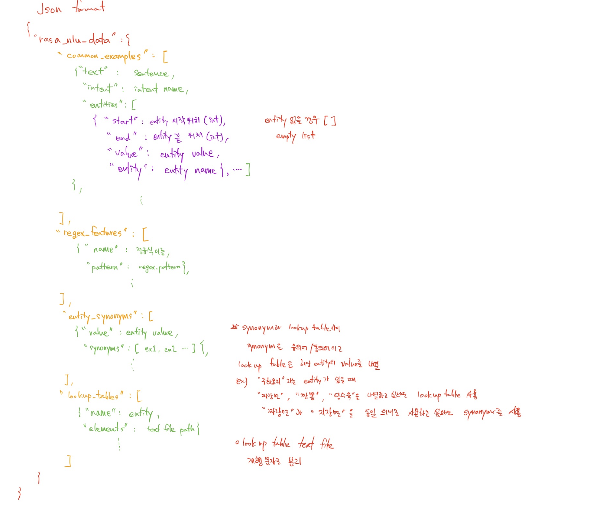

Rasa는 텍스트와 음성에 기반한 챗봇을 만들고 deploy 할 수 있는 Open source ML tool 입니다.
다른 오픈소스에 비해 참고할 만한 자료가 많고 개발자를 위한 준비도 많이 되어 있다는 느낌이 듭니다.

라사에서 제공하는 마스터클래스 영상과 자료를 참고하였습니다.

이 글에서는 개괄적으로 라사를 살펴보면서 제가 실제로 써보면서 느낀 점이나 특이사항에 대해 다뤄보도록 하겠습니다.

라사에서는 AI assistant 를 그 능력에 따라 5단계로 구분합니다.

* Level 1 : Notification Assistants
    - 단순 알림 기능 
    - 예시 : 텍스트 메시지, push 알림
* Level 2 : FAQ Assistants
    - rule 기반한 state machine
    - FAQ 와 같은 간단한 질문들에 답변 가능
    - 현재 대부분의 assistant 가 아직 이 단계에 머물러 있다고 주장
* Level 3 : Contextual Assistants
    - 대화의 맥락을 이해할 수 있는 단계
        - 사용자가 전에 어떤 말을 했는지 알고 있다.
    - 학습 데이터셋과 다른 예상치 못한 입력을 이해하고 응답할 수 있음
    - 이전 대화로부터 학습할 수 있고, 시간에 따라 정확도를 향상시킬 수 있음
    - **라사가 이 단계**
* Level 4 : Personalized Assistants
    - 차세대 assistant 로, 시간이 지남에 따라 개인 사용자에 대해 더 잘 알게 된다
* Level 5 : Autonomous Organization of Assistants
    - 모든 고객을 개별적으로 알고 있음
    - 회사 업무의 다양한 분야에서 일을 진행할 수 있음
    - 산업에 대한 장기적 안목 갖춤
    
라사를 간단히 살펴보면 

* Rasa NLU : 말그대로 NLU 부분이고 입력값을 feature 로 바꾸고 여기서 intent 와 entity 를 추출하는 역할을 한다.
* Rasa Core : 라사의 대화 관리 component. 대화의 상태나 맥락에 근거하여 어떻게 응답할지 결정한다.
* Rasa X : 라사 프로젝트를 만들고 관리할 수 있는 GUI 툴이다.  


# Rasa 설치하기

## 설치 환경

* OS :  MacOS Mojave
* anaconda 사용

## 설치

1. conda environment 만들기(환경 이름은 rasa로 했습니다.)

```
# env 만들기
conda create --name rasa python==3.7

# 새로 만든 가상환경에 접속하기
conda activate rasa
```

2. rasa 설치하고 rasa project 만들기

```
# rasa 설치
pip install rasa

# rasa X 도 함께 설치하려면
pip3 install rasa-x --extra-index-url https://pypi.rasa.com/simple

# rasa project 설치하기
rasa init
```

아래 캡쳐본처럼 rasa init을 치면 일단 설치 위치를 물어봅니다.
이미 설치하려는 프로젝트라면 그냥 enter 치시면 되고 아니라면 저처럼 디렉토리 이름을 지정해주시면 됩니다.
저는 튜토리얼대로 rasabot으로 했습니다.

그다음에는 만드냐는 질문에 Y,
최초 모델을 학습시키냐는 질문에 Y


학습이 마무리되면 아래와 같은 질문이 나옵니다.
> Do you want to speak to the trained assistant on the command line?
> (커맨드 라인으로 학습된 어시스턴트에 말 걸어볼래?)

Y 를 누르면 대화를 할 수 있습니다.

슬프다고 하면 새끼 호랑이 사진을 올려줍니다. 
/stop 을 입력하면 대화는 종료합니다.

여기까지가 [첫 번째 동영상](https://youtu.be/-F6h43DRpcU){:target="_blank"} 내용입니다.

---

# Rasa 살펴보기(이 부분이 episode 2)

최초 모델이 어떻게 구성되어 있는지 살펴보겠습니다.

여기까지 했으면 아래와 같은 파일이 해당 디렉토리에 있을 겁니다.


여기서 인텐트와 엔티티를 담고 있는 것이 *data/nlu.md* 파일입니다.
내용을 보면 아래 형식처럼 되어 있습니다.


## training data format

rasa에서는 두 종류의 training data format를 지원하고 있습니다.

1. markdown
    * 사람이 쓰고 읽기 편한 포맷
    * '*', '-', '+'를 사용한 unordered list로 예시를 작성
    * intent와 entity로 그룹지을 수 있음 
    * intent의 예시에서 entity를 명명할 수 있음, e.g. \[entity_value\](entity_name)
        * entity_name 에 entity_value 를 2개 이상 작성하는게 분류에 도움이 된다고 나옴.
    * synonym 의 경우 SynonymMapper 라는 컴포넌트에서 사용하는데 분류의 성능을 높여주진 않는다.
        * synonym 으로만 등록할 경우에는 본래 엔티티를 추출했을 때 이를 synonym으로 치환하는 효과만 있음.
        * 파이프라인 구성할 때도 엔티티 추출 컴포넌트 뒤에 놓는다.
    * 정규식의 경우 CRFEntityExtractor 라는 컴포넌트를 도와주는 역할로만 사용됨.
        * 만약 exact match 방식으로 추출하고 싶으면 따로 컴포넌트를 만들어서 하라고 함.
    * lookup table 기능은 entity 를 외부 텍스트 파일에 저장하여 사용할 수 있는 기능 
        * entity 가 nlu 데이터에 포함되어 있어야 작동함
        * nlu 데이터에 2~3개 이상 있어야 됨.
    * 아래와 같이 다양하게 사용 가능
    
    
2. json
    * 최상위에 'rasa_nlu_data'가 있고 그 아래가 다음과 같습니다.
    ```json
   {
    "rasa_nlu_data": {
        "common_examples": [],
        "regex_features" : [],
        "lookup_tables"  : [],
        "entity_synonyms": []
        }
    }
    ```
   * common_examples가 주요 train data
   * regex_features는 정규식
   * lookup_tables 는 md에서와 동일한 기능
   * entity_synonyms 를 통해 유의어, 동의어를 지정해 줄 수 있다.
   * common_examples 는 필수값이지만 나머지는 없어도 학습 가능하다.
   * json format 에서 상세 키값들은 다음과 같다.
   

3. convert nlu format for Rasa
    * rasa nlu 파일로 사용하기 위해 몇가지 포맷을 라사용 포맷으로 바꾸는 커맨드를 제공한다.
    * LUIS(ms chatbot), WIT, Dialogflow 파일을 라사용 포맷으로 변경 가능
    * 라사용 md, json 파일 간에도 변환 가능
    * command
    
```shell script
    $rasa data convert nlu --data path/to/inputdata --out path/to/outputdata -f json or md
    
    # 예시
    $rasa data convert nlu --data nlu.md --out nlu.json -f json   
```
   

### Training data를 만들 때 유의사항
* 인텐트당 10~15개의 예시를 목표로 만든다.
* 다만 더 많으면 더 좋다
* 정확한 예시가 더 좋다
* 다양한 예시가 더 좋다
* 그 예시가 실제 인텐트에 부합하는 문장인지 확인하다.

#### 한글일 때 유의사항
* 엔티티 name 은 한글이 안 된다. 영어로 해야 한다.
    * 제가 테스트한 결과는 CRFEntityExtractor 가 sklearn 을 사용하는데 여기서 한글 entity name 이면 에러가 발생함.
    * DIET 에도 CRF 가 있어서 엔티티 추출이 되지만, 정규식이 CRFEntityExtractor 에서만 사용 가능해서 tradeoff 상황임.
* 인텐트는 name 에도 한글이 지정된다.


config.yml 파일을 보면 현재 파이프라인이 어떻게 구성되어 있는지 볼 수 있습니다.
rasa init 직후에 보면 다음과 같습니다. 이 챕터에는 일단 이렇게 생겼다는 것만 확인하고 이후 챕터에서
파이프라인 구성에 대해 자세히 알아보겠습니다.


## story

가상 어시스턴트의 대부분은 대화 흐름을 가지고 있습니다. 다양한 용어로 표현되는데 
Rasa에서는 이를 story 라고 부릅니다.

어시스턴트에게 유저의 질문에 어떻게 답변해야 할지 알려주는 것입니다.
Rasa 의 core model 이 story 에서 대화를 학습합니다.

story는 기본적으로 다음과 같이 구성됩니다.

* '##' 스토리 이름, 이 부분은 필수는 아니나 디버깅을 수훨하게 하기 위해 명확히 해준다.
* '*' 사용자 발화 이름, 형식은 intent{entity_name: entity_value} 이고, entity 는 생략 가능하다.
* '-' 어시스턴트의 action

```markdown
## greet + location/price + cuisine + num people    <!-- name of the story - just for debugging -->
* greet
   - utter_ask_howcanhelp
* inform{"location": "rome", "price": "cheap"}  <!-- user utterance, in format intent{entities} -->
   - action_on_it
   - action_ask_cuisine
* inform{"cuisine": "spanish"}
   - action_ask_numpeople        <!-- action that the bot should execute -->
* inform{"people": "six"}
   - action_ack_dosearch
* affirm OR thankyou
   - action_handle_affirmation

```

어시스턴트의 action은 API를 콜하는 것을 포함해서 정의하는 바에 따라 모든 행동을 할 수 있습니다.  
action 의 경우 naming 규칙이 있습니다. 단순 텍스트 응답이면 "utter_" 를 접두어로 붙여야 하고, 
그게 아닐 경우에는 제한이 없으나 "action_" 을 붙이는 것을 권고합니다.  
또한 domain.yml 에서 정의된 이름이랑 동일해야 합니다. 

story 에 대해 더 자세히 알고 싶으면 [여기](https://rasa.com/docs/rasa/core/stories/#stories){:target="_blank"}를 눌러주세요


## domain

domain은 어시스턴트가 있는 세상이라고 표현합니다. 기본적으로 도메인에는 인텐트, 액션, 리스펀스가 있습니다. 
* intent : 유저가 말하는 내용의 의도
* action : 어시스턴트가 행동하거나 말할 수 있는 것
* responses : 액션의 구체적인 내용, template 이라고 전에는 부른 듯함.

responses 에서 이미지도 url로 올릴 수 있고 custom action도 endpoints.yml 에 url 등록해놓으면 api 도 콜할 수 있습니다.

예시는 다음과 같습니다.

```yaml
intents:
  - greet
  - goodbye
  - affirm
  - deny
  - mood_great
  - mood_unhappy
  - bot_challenge

action:
  - utter_greet
  - utter_cheer_up:
  - utter_did_that_help:
  - utter_happy:
  - utter_goodbye:
  - utter_iamabot

responses:
  utter_greet:
  - text: "Hey! How are you?"

  utter_cheer_up:
  - text: "Here is something to cheer you up:"
    image: "https://i.imgur.com/nGF1K8f.jpg"

  utter_did_that_help:
  - text: "Did that help you?"

  utter_happy:
  - text: "Great, carry on!"

  utter_goodbye:
  - text: "Bye"

  utter_iamabot:
  - text: "I am a bot, powered by Rasa."

session_config:
  session_expiration_time: 60
  carry_over_slots_to_new_session: true
```

# 마무리

라사 설치에서 데이터 포맷, 구조 등을 간단히 살펴보았습니다. custom action 이나 다른 slot, form 등 더 다양한 요소들이 있으나
현 단계에서는 없어도 동작하여 이후 챕터에서 다루도록 하겠습니다.
다음 포스트에서는 파이프라인에 대해 알아보도록 하겠습니다.

# Reference

* [Rasa Masterclass EP01](https://youtu.be/-F6h43DRpcU){:target="_blank"}
* [Rasa Masterclass EP02](https://www.youtube.com/watch?v=k5UeywXA28k){:target="_blank"}
* [https://rasa.com/docs/getting-started/](https://rasa.com/docs/getting-started/){:target="_blank"}
* [https://rasa.com/docs/rasa/user-guide/rasa-tutorial/#create-a-new-project](https://rasa.com/docs/rasa/user-guide/rasa-tutorial/#create-a-new-project){:target="_blank"}
