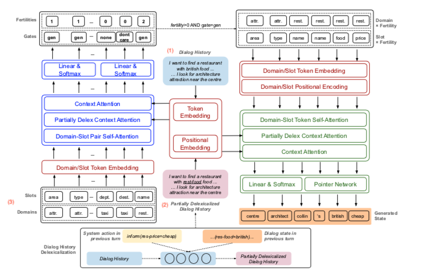

>Author : Hung Le, Richard Socher†, Steven C.H. Hoi  
>Institution : Salesforce Research, Singapore Management University  
>Publication Date : Feb 19, 2020  
>Conference Paper at ICLR 2020

# Abstract

태스크 중심 대화(task oriented dialogues)를 위한 대화 상태 추적(Dialogue State Tracking, DST) 영역에서 최근 노력들은 오픈 어휘사전, 생성 기반 접근법(모델이 대화 이력 자체에서 slot value 후보를 
만들어낼 수 있음)을 향하고 있다. 이러한 접근법은 특히, 역동적인 slot value를 가지고 있는 복잡한 대화 도메인에서 좋은 성과를 보였다. 
하지만 두 가지 측면에서 부족한데 다음과 같다.
* 모델이 (domain, slot) pair 간 잠재적인 의존성을 감지해내기 위해 domain과 slot에서 신호를 명백하게 배우도록 하지 못한다. 
* 기존에 모델은 대화가 여러 도메인과 여러 회차(대화를 주고 받는 횟수)로 변화하면 많은 시간을 잡아먹는 auto-regressive 접근법을 따른다.

이 논문에서는 auto-regressive 하지 않은 DST framework를 제안한다.

**NADST의 장점**    
    * domain과 slot 간의 의존성 factor를 최적화하여 대화 상태를 더 잘 예측하게 한다.(분리된 slot 형태로 예측하는 것보다)
    * non-autoregressive 특성
        - 실시간 대화 응답을 생성할 때, DST의 대기시간(latency)를 줄이기 위해 병렬로 디코딩을 할 수 있게 했다.
        - 토큰 레벨 뿐만 아니라 slot, domain 레벨에서도 slot 사이의 의존성을 감지

* 결과
    * MultiWOZ 2.1 corpus 모든 도메인에서 SOTA를 달성
    * 시간이 지남에 따라 대화 기록이 늘어날수록 지연되는 시간(latency)이 이전 SOTA 모델보다 줄어들었다.
    

# 1. Introduction

task oriented dialogues 에서 에이전트는 식당 찾기나 호텔 예약 같은 일을 한다. 
사용자의 발화에는 한 대화 도메인에서 slot으로 인식될 수 있는 중요한 정보가 있다. 대화 상태를 (slot, value) 쌍으로 표현한다.
DST는 이 대화 상태를 추적하여 사용자의 목적을 알아내는 것을 목표로 한다. task oriented dialogues에서 중요한 부분이다.
"주변 극장 알려줘"라는 발화가 있다. slot은 장소 타입이고, value는 극장이다. (장소, 극장)으로 표현할 수 있다.

DST 모델은 2가지로 나뉜다.
1. fixed-vocabulary
    - 구축된 slot ontology를 이용해서 각 대화 상태 후보를 생성한다
2. open-vocabulary
    - 대화 기록에서 엔티티 이름이나 시간 같은 slot으로 구성된 대화 상태 후보를 생성한다.
    - 최근에 대두

기존 open-vocabulary DST model은 autoregressive encoder와 decoder를 사용해왔다.
    - autoregressive : 대화기록을 순서대로 인코딩하고 특정 토큰 $$ t_{i} $$ 를 생성하기 위해 $$ t_{i} $$ 이전 발생한 토큰과 조건부 확률을 계산한다.
autoregressive하면 시간이 오래 걸린다는 단점이 있다.
* 시간은 다음 조건에서 늘어난다.
    1. 대화 기록 길이가 길수록(대화 턴 횟수가 많을수록)
    2. slot values가 길수록
    3. 여러 도메인일수록

   
앞선 문제가 NMT(Neural Machine Translation) 영역에서도 발생하여 참고하였다.
convolution과 attention 같은 신경망 네트워크를 적용하여 latency 문제를 개선하였고 여러 non-autoregressive, semi-autoregressive
접근법이 대상 언어의 토큰으로 독립적으로 생성하는 것을 목표로 했다. 
이러한 연구에 영감을 받아 모델 성능을 떨어뜨리지 않고 DST model의 time cost를 최소화하기 위해 non-autoregressive 접근법을 사용하였다.

Non-autoregressive model을 만들기 위해 fertility 개념을 적용한다.
fertility는 non-autoregressive decoding 동안 각 입력 토큰이 디코더의 입력값인 시퀀스 형태로 복사되는 횟수를 의미한다.
첫번째로 concatenated slot value 의 sequence 로 dialogue state 를 재구성하고, 
이 결과 sequence 는 Fertility concept 을 적용할 수 있는 고유한 구조적 representation 을 가지고 있다. 
그리고 이 구조는 개별 slot values 의 boundary 에 의해 정의된다.

이 모델은 2 단계의 decoding process 가 존재한다. 
1) 첫 번째 디코더가 input dialogue history 에서 관련된 signal 학습하고, 각 입력 slot value 의 representation 에 대한 fertility 를 생성한다. 
2) 이 예측된 fertility 는 구조화된 sequence 를 만드는 데 사용되고 구조화된 sequence 는 multiple sub-sequence 로 구성되어 있다.
sub-sequence 는 (slot token x slot fertility) 로 표현된다. 한 번에 target dialogue state 의 모든 토큰을 생성하기 위해 
결과 sequence(구조화된 sequence) 는 두 번째 디코더에 입력값으로 사용된다. 

또한 이 모델은 slot level 과 token level 모두에서 의존성을 고려한다. 
기존의 대부분 DST model 들은 여러 slot 에 걸쳐 나타나는 잠재적인 시그널을 고려하지 않고 slot 간의 독립성을 가정했다. 
하지만 많은 경우에 slot 간에는 같은 도메인이건 다른 도메인이건 의존성이 나타날 수 있다. 예를 들어, 기차 출발 장소와 도착 장소는 
같은 value가 아니라는 점을 고려해야 한다. 
NADST model은 dialog state를 생성하기 위해 모든 도메인에서 가능한 모든 시그널과 slot 을 고려한다.
이것이 DST 평가 척도로 사용하는 joint accuracy 를 직접적으로 높인다.
    - joint accuracy : slot level 이 아니라 state (set of slots) level 에서 정확도를 측정
      
이 논문의 Contribution
1. Non-Autoregressive Dialogue State Tracking(NADST) 제안
    - Dialogue State 의 완벽한 set 을 디코딩하기 위해 slot 들 간에 inter-dependency 를 학습한다.
2. 실시간을 위해 latency 를 줄였고 와 token level 뿐 아니라 slot level 의 Dependency 를 capture 한다.
3. Multi-domain Task-oriented MultiWOZ 2.1 에서 SOTA 를 기록했고, Inference latency 를 줄였다.
4. Ablation study 를 통해서 이 논문에서 제안하는 모델이 slot 간에 잠재적인 Signal 을 학습하고, 또 효과가 있다는 것을 보여준다. 
또한 slot 의 sets 을 더 정확하게 dialogue domain 에서 생성한다는 것을 보여준다.

# 2. Related Work

## Dialog State Tracking(DST)

DST는 task-oriented dialogues, 특히 관련 slot 들의 세세한 추적이 필요한 복잡한 도메인의 대화에서 중요한 요소이다.
전통적으로 DST 는 NLU 와 함께 사용했었다. dialog state 를 업데이트하기 위해 사용자 발화에 태깅한 NLU의 출력값을 DST model 의 입력값으로 사용했다.  
최근에는 NLU 와 DST 를 합쳐서 credit assignment problem(CAP)을 해결하고  NLU 의 필요성을 제거했다. 
DST 모델은 2가지로 나뉜다.
1. fixed-vocabulary
    - 구축된 slot ontology를 이용해서 각 대화 상태 후보를 생성한다
    - 추출 기반 메서드
2. open-vocabulary
    - 대화 기록에서 대화 상태 후보를 생성한다.
    - 최근 방법
    - NADST 모델도 이 방식
    - NADST는 현재의 다른 모델과도 달리, slots 과 domains 간 의존성도 고려한다. 

## Non-Autoregressive Decoding 

### Non-autoregressive decoding in NMT
대부분 Non-autoregressive decoding 은 NMT에서 번역 속도를 빠르게 하기 위해서 사용되어 왔다.
decoding process 에서 target sequence 를 디코드하기 위해 source sequence 를 긴 sequence 에 projecting 하고, CTC loss를 적용하는 *sequence labeling task*를 수행한다.
여기에 regularization terms 를 추가하여 반복된 토큰과 불완전한 문장들 같은 번역 에러를 줄이려고 했다. 

### Non-autoregressive decoding in DST
NMT에서의 문제 해결 방식을 DST에 적용한 것이다. dialogue state 를 sub-sequences(slot value 를 fertility 만큼 concatenate 한 것으로 정의)로 구성된 구조화된 sequence 로 재구성하였다.
이러한 형태의 dialogue state 는 dialogue state annotation 자체에서 쉽게 추론할 수 있는 반면, NMT에서 직접 이용할 수 없다. 
NMT의 긴 문장에 비해 슬롯 값의 낮은 의미 복잡성은 DST에 non-autoregressive 접근 방식을 채택하기 쉽게 한다. 
연구자의 검토에 따르면, 본 논문이 생성 기반 DST 에 대해 non-autoregressive 프레임워크를 최초로 적용한 것이다. 
이 접근방식은 슬롯에 걸친 joint state tracking 을 가능하게 하며, 그 결과, 더 나은 성능을 보이고 추론할 때 지연 시간을 더 줄여준다.

# 3. Approach

NADST model 은 세 가지 파트로 구성되어 있다.
1. encoders
2. fertility decoder
3. state decoder 

### 전제

*Dialogue history* $$ X = (x_{1}, x_{2}, ... , x_{N}) $$  
(domain, slot) pair $$ X_{ds} = ((d_{1}, s_{1}), ... , (d_{G}, s_{H}))$$  
*G* = total number of domains  
*H* = total number of slots

전통적으로, dialogue state 의 output 형태는 (slot, value) 튜플이었다.
이 논문에서는 이를 slot value 를 concatenate 하는 형태로 재구성하였다.

$$ Y^{d_i, s_j}: Y = (Y^{d_{1}, s_{1}}, ..., Y^{d_{I}, s_{J}}) = (y_{1}^{d_{1}, s_{1}}, y_{2}^{d_{2}, s_{2}}, ..., y_{1}^{d_{I}, s_{J}}, y_{2}^{d_{I}, s_{J}}, ...) $$  
*I* = number of domains in the output dialogue state  
*J* = number of slots in the output dialogue state

인코더는 토큰 레벨 임베딩과 위치 인코딩을 사용하여 input dialogue history 와 (*domain, slot*) pair 들을 연속적인 representation 으로 인코딩한다.  
인코딩된 도메인과 슬랏은 stacked self-attention 과 feed-forward network 에 input 으로 들어가서 dialogue history 에서 나오는 관련된 신호들을 얻고,
각 (domain, slot) pair ($$ d_g, s_h $$) 에 대해, fertility $$ Y^{d_1, s_1}_f $$를 생성한다.  
fertility decoder 의 output 은 다음과 같은 sequence 로 정의된다.  
$$ Y_{fert} = Y^{d_1, s_1}_f, ..., Y^{d_G, s_H}_f $$  
where $$ Y^{d_g, s_h}_f \in $${0, max(SlotLength)}  
예를 들어, 본 논문에서 사용하는 MultiWOZ dataset 에서 학습 데이터에 의하면 {0, max(SlotLength)} = 9 이다.  

또한 보조적인 예측 기능으로 slot gating mechanism 을 추가하였다. 
각 게이트 g 는 3가지 value('none', 'dontcare', and 'generate') 로 제한된다. 이 값들은 fertility decoding process 를 지원하기 위해
높은 수준의 분류 신호를 만드는 데 사용된다. 게이트의 결과값은 다음과 같은 sequence 로 정의된다.   
$$ Y_{gate} = Y^{d_1, s_1}_g, ..., Y^{d_G, s_H}_g $$  

예측된 fertility 값들은 non-autoregressive decoding 을 위한 state decoder 의 입력으로 들어갈 sequence 를 형성하기 위해 사용된다.
sequence 는 ($$ d_s, s_h $$)를 $$Y^{d_s, s_h}_f$$ 만큼 반복하고 순서대로 연결되어 있는 sub-sequences 를 포함한다.  
    * $$ X_{ds X fert} = ((d_1, s_1)^{Y^{d_1, s_1}_f}, ..., (d_G, s_H)^{Y^{d_G, s_H}_f} ) $$ and
    $$ \| X_{ds X fert} \| = \| Y \| $$ 
디코더가 dialogue history 가 있는 attention layer 를 통해 이 sequence 를 투영시킨다.
decoding process 동안, dialogue history 의 hidden states 에 대한 메모리를 유지시킨다. state decoder 로부터 나온 결과값은 그 메모리에 참여하기 위한 쿼리로 사용되고
dialogue history 에서 토큰을 복사하여 dialogue state 를 생성한다. 

이전 dialogue turn 으로부터 정보를 통합하여 현재 dialogue turn 의 state 를 예측한다.  
    * 부분적으로 delexicalized dialogue history $$ X_{del} = (x_{1,del}, ..., x_{N,del}) $$ 를 모델의 입력값으로 사용한다.  
    * dialogue history 는 이전에 디코딩된 slot values 와 일치하는 real-value 토큰을 domain-slot 에 의해 표현된 토큰에서 삭제함으로써 마지막 시스템 발언까지 비어휘화한다.   
    * token $$x_n$$이 주어지고, 현재 dialogue turn 을 t 라고 할 때, 토큰은 다음과 같이 비어휘화된다.  

예를 들어, "저렴한 호텔을 찾고 있어"라는 발화를 delexicalize 하면 "**호텔_가격범위** 호텔을 찾고 있어"가 된다. 
이전 turn 의 "저렴한" 이라는 단어가 "호텔_가격범위" 라는 slot 으로 예측된 것이다.   
이러한 접근법은 DST model 그 자체로부터 상태를 예측하고자 할 때, NLU module 에 의지하지 않으면서 delexicalized 형태의 dialogue history 를 사용할 수 있게 한다.
비슷한 방식으로 dialogue history 를 delexicalize 하기 위해 이전 turn 의 system action 을 사용한다. 

### Figure 1. NADST 전체 구조

* 빨간색 : encoder
    * 인코더는 (1) dialogue history 의 sequence, (2) 부분적으로 delexicalized dialogue history, (3) domain 과 slot 토큰 이 세 가지를 연속적인 representations 로 인코딩한다.
* 파란색 : fertility decoder
    * fertility decoder 는 3개의 attention mechanism 을 가지고 dialogue history 의 (domain, slot) 쌍들에 있는 잠재적인 의존성을 학습한다.
    * 결과값은 fertility 와 slot gate 를 생성하는 데 사용한다.
* 초록색 : state decoder
    * subsequences of (domain, slot) x *fertility* 로 구성된 input sequence 를 받아서 완전한 dialogue state sequence 를, slot value 를 이어놓은 형태로 디코딩한다.
    (State Decoder receives the input sequence including sub-sequences of (domain, slot)×fertility to decode a complete dialogue state sequence as concatenation of component slot values.)  
* 구조도를 간단하게 그리기 위해서, feed-forward, residual connection, layer-normalization layer 는 생략하였다. 

## 3.1 Encoders

....계속 할 예정....

