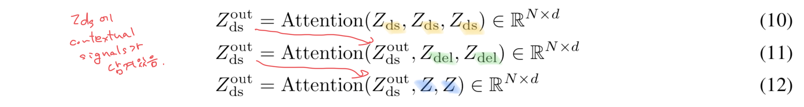
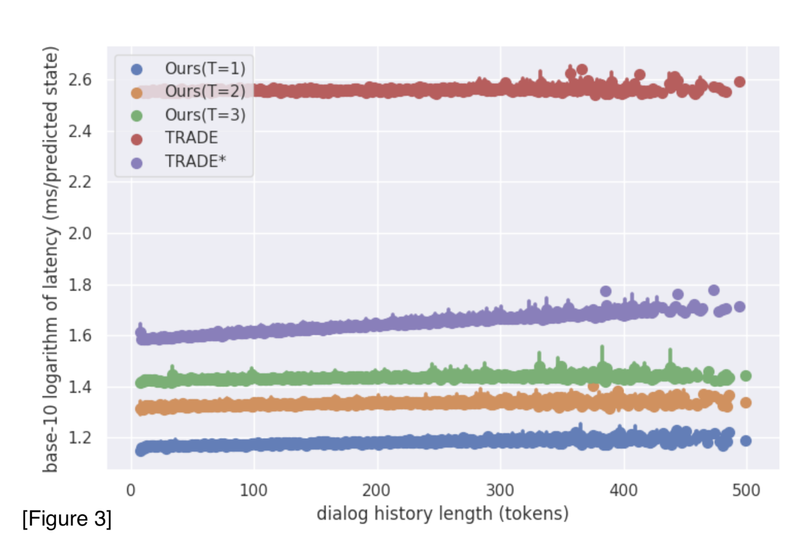

>Authors : Hung Le, Richard Socher†, Steven C.H. Hoi  
>Institution : Salesforce Research, Singapore Management University  
>Publication Date : Feb 19, 2020  
>Conference Paper at ICLR 2020  
>Paper link : [https://arxiv.org/abs/2002.08024](https://arxiv.org/abs/2002.08024){:target="_blank"}  
>Github : [https://github.com/henryhungle/NADST](https://github.com/henryhungle/NADST){:target="_blank"}  

# Abstract

태스크 중심 대화(task oriented dialogues)를 위한 대화 상태 추적(Dialogue State Tracking, DST) 영역에서 최근에는 오픈 어휘사전, 
생성 기반 접근법(모델이 대화 이력 자체에서 slot value 후보를 
만들어냄)이 대두되고 있다. 이러한 접근법은 특히, 역동적인 slot value 를 가지고 있는 복잡한 대화 도메인에서 좋은 성과를 보였다. 
하지만 두 가지 측면에서 부족한데 다음과 같다.
* 모델이 (domain, slot) pair 간 잠재적인 의존성을 감지해내지 못 해서 domain 과 slot 에서 신호를 명백하게 배우지 못한다. 
* 기존 모델은 대화가 multi-domain과 multi-turn(대화를 주고 받는 횟수)으로 변할수록 많은 시간을 잡아먹는 auto-regressive 접근법을 따른다.

이 논문에서는 auto-regressive 하지 않은 DST(**NADST**) framework 를 제안한다.

**NADST의 장점**    
* domain 과 slot 간의 의존성 factor 를 최적화하여 대화 상태를 더 잘 예측할 수 있다.(분리된 slot 형태로 예측하는 것보다)
* non-autoregressive 특성
    - 실시간 대화 응답을 만들 때, DST의 대기시간(latency)를 줄이기 위해 병렬로 디코딩을 한다.
    - 토큰 레벨 뿐만 아니라 slot, domain 레벨에서도 slot 사이의 의존성을 감지

* 결과
    * MultiWOZ 2.1 corpus 모든 도메인에서 SOTA를 달성
    * 시간이 지남에 따라 대화 기록이 늘어서, 예측에 지연되는 시간(latency)이 이전 SOTA 모델보다 줄어들었다.
    

# 1. Introduction

task oriented dialogues 에서 에이전트는 식당 찾기나 호텔 예약 같은 일을 한다. 
사용자의 발화에는 한 대화 도메인에서 slot으로 인식될 수 있는 중요한 정보가 있다. 대화 상태를 (slot, value) 쌍으로 표현한다.
DST는 사용자의 목적을 알아내기 위해 대화 상태를 추적한다. task oriented dialogue 에서 중요한 부분이다.
예를 들어, "주변 극장 알려줘"라는 발화가 있다. slot은 장소 타입이고, value는 극장이다. 즉, (장소, 극장)으로 표현할 수 있다.

DST 모델은 2가지로 나뉜다.
1. fixed-vocabulary
    - 구축된 slot ontology 를 이용해서 각 대화 상태 후보를 생성한다.
2. open-vocabulary
    - 대화 기록(dialogue history)에서 엔티티 이름이나 시간 같은 slot으로 구성된 대화 상태 후보를 생성한다.

기존 open-vocabulary DST model은 autoregressive encoder와 decoder를 사용해왔다.  
(autoregressive : 대화기록을 순서대로 인코딩하고 특정 토큰 $$ t_{i} $$ 를 생성하기 위해 $$ t_{i} $$ 이전 발생한 토큰과 조건부 확률을 계산한다.
autoregressive하면 시간이 오래 걸린다는 단점이 있다.)  
* 시간은 다음 조건에서 늘어난다.
    1. 대화 기록 길이가 길수록(대화 턴 횟수가 많을수록)
    2. slot values가 길수록
    3. 여러 도메인일수록

앞선 문제가 NMT(Neural Machine Translation) 영역에서도 발생하여 참고하였다.
convolution과 attention 같은 신경망 네트워크를 적용하고 여러 non-autoregressive, semi-autoregressive
접근법이 대상 언어의 토큰으로 독립적으로 생성하도록 하여 latency 문제를 개선하였다. 
이러한 연구에 영감을 받아 모델 성능을 떨어뜨리지 않고 DST model의 time cost를 최소화하기 위해 non-autoregressive 접근법을 활용하였다.

Non-autoregressive model을 만들기 위해 fertility 개념을 사용한다.
fertility는 non-autoregressive decoding 을 하는 동안 각 입력 토큰이 디코더의 입력값인 시퀀스 형태로 복사되는 횟수를 의미한다.
dialogue state 는 concatenated slot value 의 sequence 로 하고, 
이 sequence 는 Fertility concept 을 적용할 수 있는 고유한 구조적 representation 을 가지고 있다. 

이 모델은 2 단계의 decoding process 가 존재한다. 
1. 첫 번째 디코더가 input dialogue history 에서 관련된 signal 을 학습하고, 각 입력 slot value 의 representation 에 대한 fertility 를 생성한다. 
2. 이 fertility 는 구조화된 sequence 를 만드는 데 사용된다. 구조화된 sequence 는 multiple sub-sequence 로 구성되어 있다.
sub-sequence 는 (slot token x slot fertility) 로 표현된다. 한 번에 target dialogue state 의 모든 토큰을 생성하기 위해 
결과 sequence(구조화된 sequence) 는 두 번째 디코더에 입력값으로 사용된다. 

또한 이 모델은 slot level 과 token level 모두에서 의존성을 고려한다. 
기존의 대부분 DST model 들은 slot 간의 독립성을 가정해서 여러 slot 에 걸쳐 나타나는 잠재적인 시그널을 고려하지 않았다. 
하지만 많은 경우에 slot 간에는 같은 도메인이건 다른 도메인이건 의존성이 나타날 수 있다. 예를 들어, 서울역이라는 기차역이
기차 출발 장소와 도착 장소로 각각 표현되었을 때 여기서 이 둘은 같은 value 가 아니라는 점을 고려해야 하고 
출발-도착 이라는 관련성도 있음을 반영해야 한다. 
NADST model 은 dialog state 를 생성하기 위해 모든 도메인에서 가능한 모든 시그널과 slot 을 고려한다.
이것이 DST 평가 척도로 사용하는 joint accuracy 를 직접적으로 높인다.
- joint accuracy : slot level 이 아니라 state (set of slots) level 에서 정확도를 측정
      
이 논문의 기여
1. Non-Autoregressive Dialogue State Tracking(NADST) 제안
    - Dialogue State 의 완벽한 set 을 디코딩하기 위해 slot 들 간에 inter-dependency 를 학습한다.
2. 실시간 대화가 가능하도록 latency 를 줄였고 와 token level 뿐 아니라 slot level 의 Dependency 도 잡아낸다.
3. Multi-domain Task-oriented MultiWOZ 2.1 에서 SOTA 를 기록했고, Inference latency 를 줄였다.
4. Ablation study 를 통해서 이 논문에서 제안하는 모델이 slot 간에 잠재적인 signal 을 학습하고, 또 효과가 있다는 것을 보여준다. 
또한 더 정확한 slot 의 sets 을 dialogue domain 에서 생성한다는 것을 보여준다.

---
# 2. Related Work

## Dialogue State Tracking(DST)

DST는 task-oriented dialogues, 특히 관련 slot 들의 세세한 추적이 필요한, 복잡한 도메인을 지닌 대화에서 중요한 요소이다.
전통적으로 DST 는 NLU 와 함께 사용했었다. dialog state 를 업데이트하기 위해 사용자 발화에 태깅한 NLU의 출력값을 DST model 의 입력값으로 사용했다.  
최근에는 NLU 와 DST 를 합쳐서 credit assignment problem(CAP)을 해결하고 NLU 의 필요성을 제거했다. 
    
## Non-Autoregressive Decoding 

### Non-autoregressive decoding in NMT
대부분 Non-autoregressive decoding 은 NMT에서 번역 속도를 빠르게 하기 위해서 사용되어 왔다.
decoding process 에서 target sequence 를 디코드하기 위해 source sequence 를 긴 sequence 에 projecting 하고, CTC loss를 적용하는 *sequence labeling task*를 수행한다.
여기에 regularization terms 를 추가하여 반복된 토큰과 불완전한 문장들 같은 번역 에러를 줄이려고 했다. 

### Non-autoregressive decoding in DST
NADST는 NMT에서의 문제 해결 방식을 DST 에 적용한 것이다. dialogue state 를 sub-sequences(slot value 를 fertility 만큼 concatenate 한 것으로 정의)로 이뤄진 
구조화된 sequence 로 정의하였다.  
이러한 형태의 dialogue state 는 dialogue state annotation 자체에서 쉽게 추론할 수 있는 반면, NMT에서 직접 이용할 수 없다. 
대화에서 slot value의 의미 복잡성은 NMT의 긴 문장에 비해 낮은 편이라 DST에 non-autoregressive 접근 방식을 채택하기 쉽게 한다. 
연구자의 검토에 따르면, 본 논문이 생성 기반 DST 에 대해 non-autoregressive 프레임워크를 최초로 적용한 것이다. 
이 접근방식은 슬롯에 걸친 joint state tracking 을 가능하게 하며, 그 결과, 더 나은 성능을 보이고 추론할 때 지연 시간을 더 줄여준다.

---
# 3. Approach

NADST model 은 세 가지 파트로 구성되어 있다.
1. encoders
2. fertility decoder
3. state decoder 

$$\text{Dialogue history X} = (x_{1}, x_{2}, ... , x_{N}) $$  
$$\text{(domain, slot) pair } X_{ds} = ((d_{1}, s_{1}), ... , (d_{G}, s_{H}))$$  
<i>G = total number of domains 
H = total number of slots</i>

전통적으로, dialogue state 의 output 형태는 (slot, value) 튜플이었다.
이 논문에서는 dialogue state 를 slot value 를 concatenate 하는 형태로 재구성하였다. 아래와 같다.

$$ Y^{d_i, s_j}: Y = (Y^{d_{1}, s_{1}}, ..., Y^{d_{I}, s_{J}}) = (y_{1}^{d_{1}, s_{1}}, y_{2}^{d_{2}, s_{2}}, ..., y_{1}^{d_{I}, s_{J}}, y_{2}^{d_{I}, s_{J}}, ...) $$  
<i>I = number of domains in the output dialogue state 
J = number of slots in the output dialogue state</i>

**인코더**는 토큰 레벨 임베딩과 위치 인코딩을 사용하여 input dialogue history 와 (*domain, slot*) pair 들을 연속적인 representation 으로 인코딩한다.  
인코딩된 도메인과 슬랏은 stacked self-attention 과 feed-forward network 에 input 으로 들어가서 dialogue history 에서 나오는 관련된 신호들을 얻고,
각 (domain, slot) pair ($$ d_g, s_h $$) 에 대해, fertility $$ Y^{d_1, s_1}_f $$를 생성한다.  
fertility decoder 의 output 은 다음과 같은 sequence 로 정의된다.  

$$ Y_{fert} = Y^{d_1, s_1}_f, ..., Y^{d_G, s_H}_f $$  
$$\text{where } Y^{d_g, s_h}_f \in&nbsp; \{0, max(SlotLength) \} $$
    
예를 들어, 본 논문에서 사용하는 MultiWOZ dataset 의 학습 데이터에 에서는 *{0, max(SlotLength)}* = 9 이다.  

또한 보조적인 예측 기능으로 slot gating mechanism 을 추가하였다. 
각 게이트 g 는 3가지 value('none', 'dontcare', 'generate') 로 제한된다. 이 값들은 fertility decoding process 를 지원하기 위해
높은 수준의 분류 신호를 만드는 데 사용된다. 게이트의 결과값은 다음과 같은 sequence 로 정의된다.   

$$ Y_{gate} = Y^{d_1, s_1}_g, ..., Y^{d_G, s_H}_g $$
  

fertility 값들은 state decoder 의 입력으로 들어갈 sequence 를 형성하기 위해 사용된다.
이 sequence 는 ($$ d_s, s_h $$)를 $$Y^{d_s, s_h}_f$$ (s번째 domain 과 h 번째 slot 쌍의 fertility 값)만큼 반복하고 순서대로 연결되어 있는 sub-sequences 로 이루어진다.  

 $$ X_{ds \times fert} = ((d_1, s_1)^{Y^{d_1, s_1}_f}, ..., (d_G, s_H)^{Y^{d_G, s_H}_f} ) \text{ and }
\| X_{ds \times fert} \| = \| Y \| $$
  
디코더가 dialogue history 가 있는 attention layer 를 통해 이 sequence 를 투영시킨다.
decoding process 동안, dialogue history 의 hidden states 에 대한 메모리를 유지시킨다. state decoder 로부터 나온 결과값은 그 메모리에 참여하기 위한 쿼리로 사용되고
dialogue history 에서 토큰을 복사하여 dialogue state 를 생성한다. 

이전 dialogue turn 으로부터 정보를 통합하여 현재 dialogue turn 의 state 를 예측한다.  
* partially delexicalized dialogue history $$ X_{del} = (x_{1,del}, ..., x_{N,del}) $$ 도 모델의 입력값으로 사용한다.  
* Delexicalizing : 이전에 예측된 slot value 들과 일치하는 현재 토큰이 있으면 그 토큰을 그 value 의 slot 으로 대체한다. 
    - The dialogue history is delexicalized till the last system utterance by removing real-value tokens that match the previously decoded slot values to tokens expressed as domain-slot.   
* token $$x_n$$이 주어지고, 현재 dialogue turn 을 t 라고 할 때, 토큰은 다음과 같이 delexicalize 된다.  
    

예를 들어, "저렴한 호텔을 찾고 있어"라는 발화가 있다.
이전 turn 에서 "저렴한" 이라는 단어가 "호텔_가격범위" 라는 slot 으로 예측되었다면 
"**호텔_가격범위** 호텔을 찾고 있어" 로 delexicalize 된다. 
   
이러한 접근법은 DST model 그 자체로부터 상태를 예측하고자 할 때, NLU module 에 의지하지 않으면서 delexicalized 형태의 dialogue history 를 사용할 수 있게 한다.
비슷한 방식으로 dialogue history 를 delexicalize 하기 위해 이전 turn 의 system action 을 사용한다. 

### Figure 1. NADST 전체 구조

* 빨간색 : encoder
    * 인코더는 (1) dialogue history 의 sequence, (2) partially delexicalized dialogue history, (3) domain 과 slot 토큰 이 세 가지를 연속적인 representations 로 인코딩한다.
* 파란색 : fertility decoder
    * fertility decoder 는 3개의 attention mechanism 을 가지고 dialogue history 의 (domain, slot) 쌍들에 있는 잠재적인 의존성을 학습한다.
    * 결과값은 fertility 와 slot gate 를 생성하는 데 사용한다.
* 초록색 : state decoder
    * sub-sequences of (domain, slot) x *fertility* 로 구성된 input sequence 를 받아서 완전한 dialogue state sequence 를, slot value 를 이어놓은 형태로 디코딩한다.
    (State Decoder receives the input sequence including sub-sequences of (domain, slot)×fertility to decode a complete dialogue state sequence as concatenation of component slot values.)
* 구조도를 간단하게 그리기 위해서, feed-forward, residual connection, layer-normalization layer 는 생략하였다. 

## 3.1 Encoders

인코더는 세 가지 입력을 사용한다. 
1. 인코더는 dialogue history *X* 를 연속적인 representations 형태의 sequence 로 임베딩한다.
연속적인 representations 는 다음과 같이 표현된다.  

$$\text{Dialogue history X} = (x_{1}, x_{2}, ... , x_{N}) $$

$$ Z = (z_1, ..., z_N) \in \mathbb{R}^{N \times d} $$
  
2. 이와 유사하게 partially delexicalized dialogue history $$ X_{del}$$도 다음과 같이 연속적인 representations 로 임베딩된다.

$$ Z_{del} \in \mathbb{R}^{N \times d} $$
  
3. 각 (domain, slot) 쌍을 continuous representation $$z_{ds}$$으로 인코딩하여 decoder 의 input 으로 사용한다. 
$$z_{ds}$$ 는 디코딩 프로세스에서 slot 과 fertility 예측을 위한 맥락(상황, contextual) 신호를 저장하는데 사용된다.  

$$z_{ds} \in \mathbb{R}^{d}$$
  

인코딩된 dialogue history *Z* 를 메모리에 저장한다.
*Z* 는 dialogue state 생성시 단어 복사를 하기 위해 포인터 네트워크(pointer network)로 전달된다. 
이는 OOV(out of vocabulary) 문제 해결에 도움이 된다.  

### Context Encoder

context encoder 는 토큰 수준의 학습가능한 임베딩 레이어와 layer normalization을 포함하고 있다. 또한 사인, 코사인 함수를 따르는 위치 인코딩 레이어도 가지고 있다.
토큰 수준의 벡터들과 위치 인코딩 벡터들을 결합시킬 때 요소별 합산(element-wise summation)을 사용한다.  
dialogue history 와 dexicalized dialogue history 를 임베딩하기 위해 임베딩 가중치를 공유한다.
또한 임베딩 가중치는 fertility decoder 와 state decoder 모두의 입력값으로 인코딩하기 위해서도 공유된다.  
$$X$$ 와 $$X_{del}$$의 마지막 임베딩은 다음과 같이 정의된다.  

PE = positional embedding
  

$$ Z = Z_{emb} + PE(X) \in \mathbb{R}^{N \times d} $$
  

$$ Z_{del} = Z_{emb, del} + PE(X_{del}) \in \mathbb{R}^{N \times d} $$
  

### Domain and Slot Encoder

각 (domain, slot) 쌍은 대응하는 domain 과 slot 의 두 개의 분리된 임베딩 벡터를 사용해서 인코딩된다. 
각 domain *g*와 slot *h* 가 continuous representation 으로 임베딩된 것을 $$ z_{d_g} \text{ 와 } z_{s_h} $$ 라고 한다. ($$z_{d_g}, z_{s_h}\in \mathbb{R}^d $$)
최종 벡터는 요소별 합(element-wise summation)으로 결합되며 다음과 같다:  

 $$ z_{d_g, s_h} = z_{d_g} + z_{s_h} \in \mathbb{R}^d $$ 

앞서 말했듯이, domain 과 slot 토큰을 임베딩하기 위해 임베딩 가중치를 2개의 디코더에서 공유한다. 
하지만 state decoder 의 input 의 경우, 순차적 정보를 입력값인 $$X_{ds \times fert}$$ 에 주입한다.
target state sequence 를 디코딩하기 위해 위치별 정보를 요소로 사용한다.

여기서 $$ \oplus $$는 concatenation 동작을 의미한다.
전형적인 transformer decoder 의 입력값과 다른 점은 non-autoregressive 디코딩 프로세스에서 fertility decoder 및 state decoder 의 입력 시퀀스를 이동(shift)하지 않았다는 것이다.
즉, 모든 결과 토큰은 위치 i 를 기반으로 한다.(i-1이나 i+1이 아니라)    

## 3.2 Fertility Decoder

$$Z$$ (인코딩된 dialogue history), $$Z_{del}$$ (인코딩된 partially delexicalized dialogue history), $$Z_{ds}$$ (인코딩된 (domain, slot) 쌍)이 주어진 상황에서 맥락(contextual) 신호는 학습되고 attention layer 의 시퀀스를 통해 각 $$z_{ds}$$ 벡터로 전달된다.
representations 를 multiple sub-spaces 에 투영하고자 multi-head attention mechanism 을 도입하였다. 
attention mechanism 은 query(Q), key(K), value(V) 사이에서 scaled dot-product attention 으로 정의된다.

각 multi-head attention 은 position-wise feed-forward network 를 따른다. feed-forward 는 각 위치에 동일하게 적용되었다. 
두 개의 선형 레이어를 그 사이에 ReLU 활성화 함수와 함께 사용했다. fertility decoder 는 3개의 attention layer 로 구성되며, 
각 레이어는 관련 맥락 신호를 학습하고 맥락 신호들을 $$z_{ds}$$ 벡터에 통합한다. 
다음 attention 레이어에 대한 입력으로 이전 레이어의 출력값인 $$ Z^{out}_{ds}$$ 를 사용한다.

attention mechanism 을 이 모델에 적용하기 위해 연구자들은 모델이 명백하게 (1) 첫 번째 attention layer 에서부터 (domain, slot) 쌍들 간에 잠재적 의존성과
(2) 뒤이은 attention layer 들에서 맥락 의존성의 신호를 얻도록 하였다.  
입력값으로 delexicalized dialogue history 를 추가한 것은 중요한 맥락 신호를 줄 수 있다. 
모델이 real-value tokens 와 generalized domain-slot tokens 사이의 매핑을 학습할 수 있기 때문이다.
이러한 의존성들을 더 잘 잡아내기 위해, $$ Z_{ds}^{T_{fert}}$$ 만큼 attention sequence 를 반복한다.

>comment : 이미 attention 에서 가중치값을 계산할 때 중요한 값에는 가중치를 크게 하는데 여기서는 직접적으로 fertility 값을 계산하여
>fertility 만큼 반복해서 의미적, 관계적 강화를 꾀한다고 볼 수 있다.

attention 의 현재 단계를 t 라 할 때, 이전 attention layer(t-1) 에서 오는 출력값인 $$Z_{ds}^{t-1}$$은 $$Z_{ds}^{t}$$를 계산하기 위해 
현재 레이어의 입력값으로 쓰인다.  

마지막 attention layer($$ Z_{ds}^{T_{fert}}$$)에서 출력값은 fertility 와 gate 값을 예측하기 위해 
두 개의 독립적인 선형 변환을 거친다. 손실함수는 표준의 cross-entropy 를 사용했다.
   

## 3.3 State Decoder

gate 는 (gen, none, dontcare) 세 가지 중 하나의 레이블로 예측된다. gate 가 gen 이고 fertility 가 0 이상인 (domain, slot) 만 state decoder 의 입력값으로 사용된다.

state decoder 의 입력값으로 $$ Z_{ds \times fert}$$를 사용하고, fertility decoder 에서 사용하는 attention sequence 를 적용하여
맥락 신호들을 각 $$ Z_{ds \times fert}$$ 벡터에 통합시켰다. domain/slot 수준보다는 토큰 수준의 의존성이 더 잘 잡힌다. 
$$ T_{state}$$ 만큼 attention sequence 를 반복한 후에, 마지막 출력값인 $$ Z^{T_{state}}_{ds \times fert}$$ 는 state 를 예측하기 위해 사용된다. 다음과 같다.  

$$W_{state} \in \mathbb{R}^{d \times \|V\|} $$ *V* : the set of output vocabulary  
open-vocabulary DST 모델이라서 알려진 slot ontology 를 가정하지는 않지만 dialogue history 로부터 후보군을 만들 수 있어서 어휘 셋을 상정할 수 있다.  
추론시 oov 문제를 해결하기 위해 pointer network 를 Transformer decoder 에 통합시켰다.  
(Pointer network *1는 attention mechanism 을 간략화해서 output dimension 이 input sequence 의 길이에 따라 변할 수 있게 하였다. 
Attention weight 을 그대로 예측의 softmax 값으로 사용하는 것이다. Input 의 일부를 point 한다는 의미에서 pointer network 라고 한다.)  
이는 저장해놓은 encoded dialogue history(Z) 에서 oov 한 state 를 찾겠다는 의미이다. 이를 수식으로 표현하면, state decoder 의 출력값과 Z 사이의 내적(dot-product) attention 을 수행한다.
 

예측된 state 의 마지막 확률값($$P_{state}$$)은 두 확률값의 가중치 합으로 정의된다.

여기서 $$ W_{gen} \in \mathbb{R}^{3d \times 1} $$ 이고 $$Z_{exp}$$는 $$Z_{ds \times fert}$$의 차원(dimension)을 맞추기 위한 Z의 확장된 벡터이다.
마지막 확률값도 cross-entropy loss function 을 사용해서 state generation 을 학습한다.  

## 3.4 Optimization

3 개의 loss(state, gate, fertility) 값의 가중치 합이 최소화되도록, 함께 학습하는 방식으로 모든 패러미터를 최적화하였다.

---

# 4 Experiments

## 4.1 Dataset

MultiWOZ 는 multi domain, task-oriented dialogue dataset 이다. 이 논문에서는 2017년 초판이 아닌 2019년에 나온 버전을 사용한다.
각 대화는 하나의 도메인 이상을 가지고 있다.  
대화를 전처리 할 때,(Wu et al., 2019) 에 나오는 전처리 스크립트 폼을 따라서 토크나이징, 소문자화, delexicalizing 하였다.  
* [Wu et al., 2019](https://www.aclweb.org/anthology/P19-1078/){:target="_blank"}  
총 35 개의 (domain, slot) 쌍을 확인했다. 하나의 대화에 평균적으로 14.7 턴이 존재한다.

## 4.2 Training Procedure

dialogue state Y 예측하는 것을 학습하기 위해 **label smoothing** 을 사용했다.(fertility, gate 예측에는 사용하지 않는다.)  
* label smoothing*2 : model 이 overfitting 하거나 overconfidence 일 때, 사용한다. mislabeled data 가 있을 때 smoothing 하여 모델이 잘못된 label 에 fit 하지 않도록 한다.
주로 uniform distribution 과 결합하는 방식으로 smoothing 한다.  

학습할 때, 100% teacher-forcing learning 전략*3을 사용하는데, state decoder 의 입력값으로 $$X_{ds \times fert}$$의 ground-truth 를 사용한다.
delexicalized dialogue history 에 대해서도 동일 전략을 사용한다.
* teacher-forcing learning 은 주로 recurrent 구조에서 사용된다. recurrent 구조에서 이전 출력값을 다음 입력값으로 사용하는 방식을 사용한다. 
이 경우 이전 출력값이 잘못된 예측이라면 그 다음의 모든 값이 잘못 예측될 것이다. 그래서 다음 입력값으로 ground-truth 를 사용하는 것이다. 
teacher-forcing 을 사용하면 사용하지 않은 경우보다 더 빠른 학습이 가능하다. 왜냐하면 초기에 잘 틀리지 않아서 정확도가 빠르게 올라간다.
* multi-modal 학습이 쉽지 않기 때문에 학습의 안정성을 높이기 위해 사용한 것을 보인다.   
     

추론할 때는, dialogue state 를 턴마다 생성하고 t turn 에서 dialogue history 를 delexicalize 하기 위해 t-1 turn 의 예측 state 값(출력값)을 사용한다.
$$X_{ds \times fert}$$도 예측값인 $$\hat{Y}_{gate} \text{ 와 } \hat{Y}_{fert}$$ 에 의해 구성되었다. 

* adam optimizer 사용
* learning rate 는 ([Vaswani et al., 2017](https://www.aclweb.org/anthology/E17-1042/){:target="_blank"})의 전략을 따른다.
* 모든 패러미터는 uniform distribution 으로 랜덤하게 초기화되었다.
* 사전학습된 단어 혹은 문자 기반 임베딩 가중치를 사용하지 않는다.
* hyper parameters 조정에는 grid search 를 활용
* pytorch 사용

## 4.3 Baselines

DST baseline 은 두 가지가 있다. (1) open-vocabulary (2) fixed-vocabulary 접근법이 있다.
(2)의 경우 추론할 때 unseen slot value 를 찾지 못하는 단점을 지닌다.

### 4.3.1 Fixed Vocabulary

* GLAD
    - 여러 개의 self-attentive RNNs 을 사용하여 slot 사이의 공유된 패러미터들을 위한 *global tracker*와 개별 slot 을 위한 *local tracker*를 학습한다.
    - 이전 system actions 를 입력값으로 활용한다
    - 결과값과 ontology 단어들과의 의미적 유사성(semantic similarity)를 계산한다.
      
* GCE
    - GCE 는 GLAD 의 더 간단하고 빠르게 바꾼 버전이다
    - DST model 의 성능은 유지하면서 slot 특정적인 RNNs 을 없애는 방식을 사용한다
    
* MDBT
    - 시스템 발화, 유저 발화, (slot, value) 쌍을 위한 각각의 인코딩 모듈을 가지고 있다. 
    - GLAD 와 유사하게, 발화와 ontology 단어들 간의 의미적 유사성을 바탕으로 학습을 한다.
    
* FJST and HJST
    - FJST : Flat Joint State Tracker
        * Bi-LSTM network 로 구성된 dialogue history encoder
    - HJST : Hierarchical Joint State Tracker
        * FJST 와 유사한 아키텍처를 지녔고 다른 점은 dialogue history 를 인코딩할 때 hierarchical LSTM network 를 사용한다.
        
* SUMBT
    - Slot-independent Belief Tracker
    - (domain, slot) 쌍과 키의 representation 으로서 쿼리 벡터와 BERT 인코딩 dialogue history 로서 value 벡터를 가진 multi-head attention layer 로 구성된다.

### 4.3.2 Open Vocabulary

* TSCP
    - end-to-end dialogue model
    - 한 개의 RNN encoder 와 두 개의 RNN decoder 로 구성
    - TSCP 를 baseline 으로 선택한 이유는 TSCP 가 dialogue state 를 단일 시퀀스로 디코딩하고 이는 NADST 처럼 slot 간의 잠재적 의존성을 요소로 사용하는 것이기 때문이다
    - DST 요소의 성능만 지표로 삼았다
    - TSCP 와 달리, NADST 는 예측된 fertilities 의 합으로 각 state sequence 의 길이를 역동적으로 학습할 수 있다는 점이다. TSCP 는 최대 길이에 의존한다.
        
* DST Reader
    - DST 과제를 reading comprehension task 로 재구성한 것이다.
    - attention 기반 신경망 아키텍처
    
* HyST
    - fixed 와 open vocabulary 방식 중 각 slot 에 맞는 접근법을 선택하는 방식
    - open vocabulary 의 경우 dialogue history 에서 단어 n-gram 으로 slot 후보군을 형성한다.
     
* TRADE
    - 이 모델이 MultiWOZ 2.0과 2.1에서 현재 SOTA 모델이다.
    - dialog history encoder, slot gating module, (state 생성을 위한, pointer network 로 구성) RNN decoder 로 구성된다. 
    - pointer network 에서 토큰 기반이 아니라 인덱 기반 copying mechanism 을 사용한다.

## 4.4 Results

* DST 평가에 흔히 사용하는 joint goal accuracy 를 사용한다. 
    - 이 측정법은 각 대화 turn 에서 예측된 dialogue state 와 ground-truth 를 비교한다.
    - 예측값은 모든 slot 의 모든 예측된 값이 그에 대응하는 ground truth 와 정확해야 맞는 것으로 한다.  
* 모델들을 5번 돌려서 평균값으로 성능으로 삼았다. 

* table 2를 보면 NADST 가 non-autoregressive 한 접근법을 사용했지만 성능도 가장 좋았다.
    - NADST 가 cross-domain, cross-slot signal 을 학습함으로써 개별 slot 의 정확도가 아니라 joint accuracy 를 최적화하는데 목표했기 때문이다.

* table 3를 보면 MultiWOZ 2.0의 restaurant 도메인에서는 joint accuracy 와 slot accuracy 모두 NADST 가 베이스라인 모델들보다 성능이 좋았다.
    - slot accuracy 는 개별 slot 에 대한 정확도

* table 8은 모든 도메인에서 NADST 의 성능을 보여준다.

### Latency Analysis

* latency 는 예측 state 하나당 well-clock time(microsecond)을 비교하였다. 
* table 4에서 TRADE, TSCP 모델을 NADST 와 비교하였다.
    - TSCP 의 경우, 모델 전체가 아니라 DST 요소만의 시간을 산출했고, dialogue state 의 최대 출력 길이(*L*)를 8과 20으로 각각 돌려서 두 개를 비교했다.
    - NADST 의 경우, 모델의 다양성을 보여주기 위해, T(=$$T_{fert} = T_{state}$$)값을 각각 1, 2, 3으로 해서 총 세개를 돌렸다.
    - 동일한 단일 GPU 환경에서 실행시켰다.
* table 4 결과
    - 성능은 NADST에서 T 가 3일 때 가장 좋고, T 가 1일 때 속도면(latency, speed up)에서 가장 좋았다.
    - 다만 T=1 일 때는 성능이 베이스라인(TRADE)보다 조금 떨어졌다. 그에 비해 TRADE보다 latency 가 24배나 빠르다. 
* figure 2 는 dialogue history 길이에 따른 latency 를 보여준다
    - NADST 모델들은 길이에 따라 latency 에 거의 변동이 없는데, TSCP 는 길수록 latency 도 늘어난다.
* figure 3 는 figure 2에서 latency 가 너무 작아서 비교가 안 보이는 것을 감안하여 log 를 취하여 비교해본 것이다.

### Ablation Analysis

모델 평가를 위해 ablation analysis 폭넓게 진행했다.  
다음은 metric 에 대한 설명이다.  
* DST metric : Joint Slot Accuracy ,Slot Accuracy  
* fertility decoder metric :  Joint Gate Accuracy, Joint Fertility Accuracy
    - joint slot accuracy 랑 유사한데 단지 예측값이 각각 gate 와 fertility 의 예측값이라는 점이 다르다.
* Oracle Joint Slot Accuracy, Oracle Slot Accuracy
    - State decoder 의 input 으로 모델의 예측값이 아닌 ground truth $$X_{ds \times fert} \text{ 와 } X_{del}$$ 로 할 때 state 를 예측한 결과와 비교
    - 즉, 올바른 input 이 들어갔을 때 올바른 output 이 나오는지 알 수 있음.  

**결과 해석**
1. state decoder 를 통과하기 전에 $$X_{ds \times fert} $$의 위치 인코딩이 삭제되면 모델은 실패한다.
    - joint slot accuracy 가 다른 것들보다 2배 정도 떨어진다(19.56%)
    - non-autoregressive 디코딩이 가능하도록, 위치 인코딩(PE)이 순차적 속성을 주입하는 일을 담당하기 때문에 위치 인코딩을 삭제할 경우 성능이 떨어지게 된다.
2. slot gating 이 삭제 되었을 때 약간의 성능 저하가 있다.
    - 모델들이 "none"과 "doncare" slot 에 대해 1의 fertility 를 예측하는 것을 배워야 하기 때문이다
3. 입력값으로의 $$X_{del}$$ 값을 삭제하는 것은 모델 성능을 떨어뜨린다
    - 대부분은 가파르게 joint fertility accuracy 가 떨어져서이다.
4. pointer generation network를 삭제하여 오직 $$P^{state}_{vocab}$$ 에만 의존하는 것도 모델 성능을 떨어뜨린다
    - 학습 시 보지 못한 slot value 를 추론할 수 없기 때문이다.
    - 특히 "restaurant-name", "train-arriveby" 같은 slot 이 해당된다
     

### Auto-regressive DST

모델의 나머지는 다 동일하고 auto-regressive state decoder 를 쓰는 모델을 만들어 실험을 해보았다.  
fertility decoder 에서 이 경우는 fertility 가 중복이라 수식 14, 16을 사용하지 않았다. slot gates 예측을 위해 그 결과값은 사용한다.  
TRADE 와 유사하게, state decoder 로의 입력값으로 각 domain 과 slot 쌍의 임베딩 벡터들을 합하여 사용하고 토큰별로 slot value 를 생성한다.  
table 6 는 두 개의 데이터셋에서 auto-regressive 버전의 성능을 보여준다.

**결과 해석**
1. auto-regressive 버전은 NADST 모델의 성능과 크게 다르지 않다. 
    - NADST 모델이 fertility 를 합리적으로 잘 예측할 수 있고 성능도 auto-regressive 접근법에 비교할만할 정도이다.
2. auto-regressive 모델은 system action 사용에 덜 민감하다
    - table 5에서 non-autoregressive 모델의 차이가 더 크다.
    - 이는 slot gate 를 예측하는 것이 fertility 를 예측하는 것보다 쉬워서라고 예상한다.
3. 이 실험을 위해 만든 auto-regressive 모델이 기존의 접근법들보다 뛰어나다
    - slot gate 를 예측하기 위한 모델의 첫 번째 부분에서 학습된 (domain, slot) 쌍 사이의 높은 의존성 때문일 수 있다. 
 

### Visualization and Qualitative Evaluation

figure 4에는 두 개의 dialogue state 예측 예시와 그에 대응되는 state decoder 내 $$X_{ds \times fert}$$ 의 self-attention 점수를 시각화한 것을 담았다.
heatmap 에 하이라이트로 친 박스는 비대칭인 domain-slot 쌍 사이의 attention 점수를 표현한 것이다. 색깔별로 보면 된다.

* 첫 번째 행(줄)을 보면, 모델이 두 개의 쌍 (train-leaveat, train-arriveby) 와 (train-departure, train-destination)의 의존성을 잡았다는 것을 발견할 수 있다.
* 두 번째 행(줄)을 보면, (taxi-departure, taxi-destination) 같은 slot 수준의 의존성도 보이고, attraction-type 과 attraction-name 간에 토큰 수준의 의존성도 보인다.

---

# 5. Conclusion

Non-Autoregressive neural architecture for DST 제안  
* slot 수준과 token 수준의 의존성을 학습하여 joint accuracy 를 향상시켰다.
* 병렬 디코딩 전략을 채택하여 dialogue states 를 빠르게 디코딩할 수 있다
* 다양한 실험 결과 잘 알려진 대표 데이터셋인 MultiWOZ 코퍼스에서 SOTA 를 이뤄냈다.
* 추론에 들어가는 지연 시간을 획기적으로 줄였다.

# My Opinion

서비스에 있어서 중요한 것은 정확도도 있지만 반응속도도 중요하다고 생각합니다.
현 시대에 조금만 응답이 느려도 발길을 돌리는 사용자들이 많은 상황에서 NADST의 반응속도를 줄인 것은
본받을만 하다고 생각합니다. 또한 지연시간을 줄이면서도 다양한 수준의 의존성을 잡아내고 다양한 도메인, 멀티턴 대화에서
학습하여 joint accuracy 를 높인 것 또한 서비스 적용에 도움이 될 것입니다.

end-to-end dialogue system 을 만드는데 있어서 이 논문의 코드도 참고하여 개발할 예정입니다.  
감사합니다.

---
# References

1. pointer network 참조 : [https://jiminsun.github.io/2019-02-15/Vinyals-2015/](https://jiminsun.github.io/2019-02-15/Vinyals-2015/){:target="_blank"}
2. label smoothing : [https://towardsdatascience.com/what-is-label-smoothing-108debd7ef06](https://towardsdatascience.com/what-is-label-smoothing-108debd7ef06){:target="_blank"}
3. teacher-forcing learning : [참조 블로그](https://blog.naver.com/PostView.nhn?blogId=sooftware&logNo=221790750668&categoryNo=0&parentCategoryNo=0&viewDate=&currentPage=1&postListTopCurrentPage=1&from=postView){:target="_blank"}

