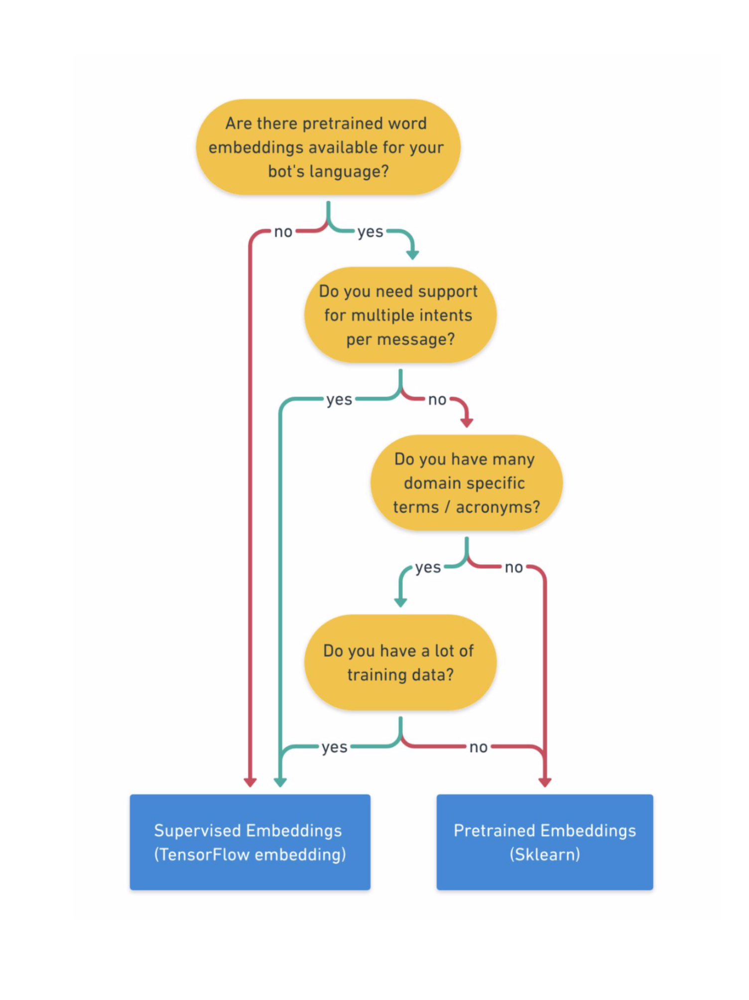
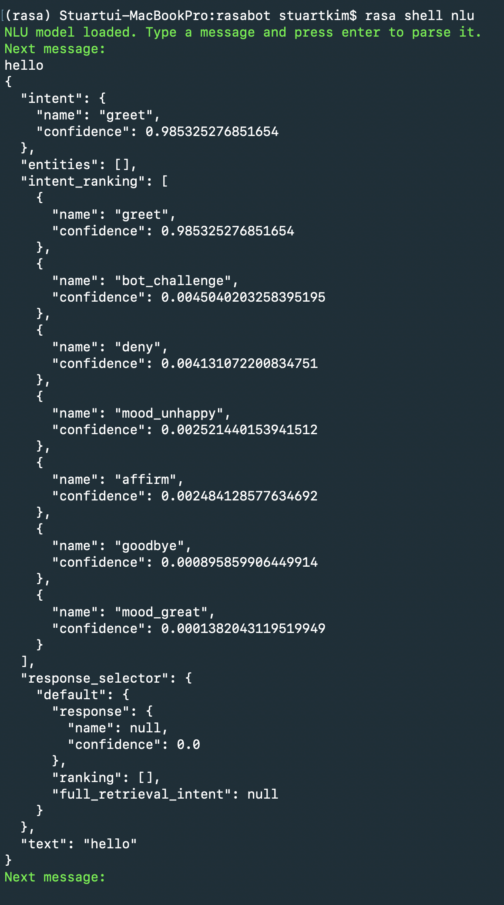

nlu 모델 학습을 위한 파이프라인 구성에 대해 알아보겠습니다.


# 주요 개념들

### NLU model 

text input 으로부터 의미를 추출하기 위해 사용되는 모델.
앞선 에피소드에서 인텐트와 엔티티가 포함된 labeled 데이터를 어떻게 만드는지 살펴보았다.
그 데이터에서 nlu model 을 학습시켜서 새로운 메시지에 대해서 인텐트와 엔티티를 예측하도록 한다.
심지어 그 메시지가 모델이 사전에 학습하지 않았더라도 가능하도록 한다.


### Training pipeline

nlu model 은 training pipeline 에 의해 만들어진다. training pipeline 은 학습 데이터에 내재된 패턴들을 학습하도록
하는 일련의 과정이다. 

다음 에피소드에서 개별 파이프라인의 내부적인 작동 원리를 알아보고 
이 시간에는 두 개의 사전 설계된 파이프라인에 집중한다(따로 설치할 필요없음)
custom training pipeline 은 에피소드 4에서 다룰 예정이다.

### Word embeddings

단어를 벡터 혹은 다차원 기반 dense numeric representation 으로 바꾼 것이다. 
비슷한 단어들은 비슷한 벡터로 표현되기 때문에 의미를 잡아낼 수 있도록 한다. 
텍스트 데이터를 머신러닝 모델이 이해할 수 있도록 만들기 위해 word embeddings 는 training pipeline 의 요소로 사용된다.
 
 
# Choosing a Pipeline Configuration

라사는 2개의 사전 구성된 파이프라인을 가지고 있다. 두 개 다 인텐트 분류와 엔티티 추출은 가능하다.
알맞은 파이프라인을 선택하도 두 개를 비교할 예정이다.

1. **Pretrained_embeddings_spacy** : spaCy library 를 사용하여 사전학습된 언어 모델을 로드함. 단어를 워드 임베딩으로 표현함.  
    1. 장점  
        - 학습 데이터가 적어도 모델 정확도를 빨리 올리고 학습 시간을 줄일 수 있다.
    2. 참고사항
        - 완전하고 정확한 워드 임베딩이 모든 언어에서 가능한 것이 아니다. 공개된 데이터 대부분은 영어이다.
        - 워드 임베딩은 특정 도메인에서 사용하는 단어들을 커버하지 않는다. 학습데이터로 보통 위키피디아와 같은 일반적인 데이터를 사용하기 때문이다.  

2. **Supervised_embeddings** : 사전 학습된 임베딩과 달리, supervised_embeddings 는 NLU training data 를 사용해서 밑바닥부터 모델을 학습시킨다.
    1. 장점
        - 도메인 특정 다너와 메시지에 적응 가능하다. 모델이 사용자 학습 데이터만으로 학습하기 때문이다.
        - 모든 언어에서 사용 가능하다. 사용자가 원하는 언어로 된 데이터를 만들면 된다.
        - 여러 인텐트를 가진 메시지 지원 가능
    2. 참고사항
        - 사전 학습 임베딩과 비교했을 때, 모델 정교화에 더 많은 학습 데이터가 필요하다. 추천하는 예시 데이터 개수는 천 개 이상이다.

아래 결정트리를 보고 선택을 하면 좋다.




# Training the Model

학습 데이터를 만들고 나면 파이프라인 만들 준비가 된 것이다.   
파이프라인은 config.yml 파일에서 정의된다. 이 파일은 rasa project 를 만들 때 *rasa init* 이라는 명령어를 칠 경우
프로젝트와 함께 생성된다. 

supervised_embeddings pipeline 을 만들려면 config.yml 에 다음과 같이 쓰면 된다.

```
language: "en"
pipeline: "supervised_embeddings"
```

그 다음 (rasa 관련 가상환경을 사용했다면 활성화하고) rasa repository 에서 *rasa train nlu* 라고 명령어를 치면 학습이 시작된다.
후에 *models* 라는 디렉토리에 모델이 저장된다.


# Testing the Model

새로 학습한 모델을 CLI 환경에서 테스트하려면 *rasa shell nlu* 라고 치면 **가장 최근에 학습된 모델**을 불러온다.
다음은 "hello" 라고 입력했을 때의 반응이다.




# 마무리

이번 포스트에서는 사전에 정의되어 있는 파이프라인을 등록하고 테스트 해보는 과정을 진행해보았다.
다음에는 파이프라인 구성요소를 바꾸어 커스텀 모델을 만드는 것을 다루도록 하겠다.


# References

* [Training the NLU model: pre-configured pipelines - Rasa Masterclass ep.#3 (YouTube)](https://youtu.be/seBN1gMJN0U){:target="_blank"}
* [Choosing a Pipeline (Rasa docs)](https://rasa.com/docs/rasa/nlu/choosing-a-pipeline/){:target="_blank"}
* [Supervised Word Vectors from Scratch in Rasa NLU (Rasa blog)](https://medium.com/rasa-blog/supervised-word-vectors-from-scratch-in-rasa-nlu-6daf794efcd8){:target="_blank"}

