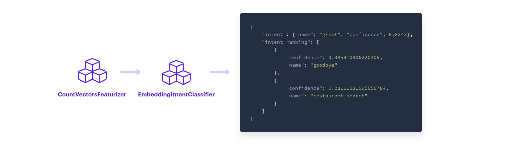
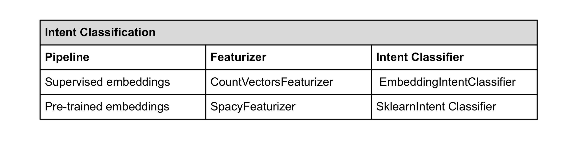

#  Training Pipeline Overview

파이프라인에서는 어떤 구성요소가 있어야 하는지를 정의하는 것뿐만 아니라, 
어떻게 구성요소가 배치되어야 하는지 순서까지 규정한다.

1. 필요하다면 사전학습 언어 모델을 로드한다(Optional)
2. 데이터를 단어 혹은 토큰으로 토크나이즈한다.
3. Named Entity Recognition(NER). 모델에게 메시지 안의 어떤 단어가 엔티티이고
어떤 엔티티 유형인지 인식하도록 학습시킨다.
4. Featurization. 토큰을 벡터나 dense numeric representation 으로 변환한다.
이 단계는 ner 전이나 후에 할 수 있다. 하지만 토크나이징 후에, 인텐트 분류 전에 실시한다.
5. Intent Classification. 사용자 메시지의 의미를 예측할 수 있도록 모델을 학습시킨다.


# Training Pipeline Components

에피소드 3에서 알아본 2개의 파이프라인이 어떻게 구성되어 있는지 알아본다.


## Word Vector Sources 

* SpacyNLP
    - *pretrained_embeddings_spacy* pipeline 은 Spacy 언어 모델을 로드하기 위해 SpacyNLP component 를 사용한다. 
    spaCy pretrained embeddings 를 사용하는 파이프라인에서만 SpacyNLP 를 사용할 수 있다. 그리고 파이프라인 맨 처음에 쓰여져야 한다.
    - 지원하는 언어에서만 사용 가능하다.
        - 영어, 독일어, 불어, 스페인어, 포르투갈어, 이태리어, 네덜란드어, 그리스어, 리투아니아어, 노르웨이어
            - 향후 늘어날 수도 있으니 확인 바람.
        - 한글 지원 안 됨.

* HFTransformersNLP
    - 사전학습 모델 기반의 HuggingFace 의 transformers 초기화 컴포넌트입니다.
    - 맨 처음에 쓰여져야 함.
    - 설치 command  
    ```
    $ pip install rasa[transformers]
    ```  
    - *LanguageModelTokenizer* 와 *LanguageModelFeaturizer*를 함께 사용함.
    - 사전학습 모델을 선택 가능
        - options
            - Language Model : parameter "model_name"
            - BERT : bert (default)
            - GPT : gpt
            - GPT-2 : gpt2
            - XLNet : xlnet
            - DistilBERT : distilbert
            - RoBERTa : roberta
        - pipeline example  
        ```
        pipeline:
          - name: HFTransformersNLP  
            model_name: 'bert'
        ```  
    
## Tokenizer

토크나이저는 텍스트 흐름을 입력으로 받아서 작은 청크나 토큰으로 쪼개는 일을 한다. 토크나이저는 주로 파이프라인의 첫 번째 단계에 나온다.
왜냐하면 다음 단계에서 쓰일 수 있도록 텍스트 데이터를 준비하는 과정이기 때문이다. 모든 학습 파이프라인은 토크나이저를 포함하고 있고
다음에서 사용자가 고를 수 있다.

* WhitespaceTokenizer
    - 공백을 기준으로 자른다. 
    - supervised_embeddings pipeline 에서 기본 토크나이저로 사용됨.
    - pre-trained embeddings 을 사용할 계획이 없다면 사용하기 좋음

* Jieba 
    - 중국어를 위한 토크나이저

* SpacyTokenizer
    - spaCy 를 사용하면 함께 사용하는 토크나이저로 각 언어에 맞는 룰을 적용한다.
    - pre-trained embeddings 를 사용할 때 유용하다.
    
* ConveRTTokenizer
    - ConveRT model 사용을 위한 토크나이저
    - ConveRT 가 라사에서는 영어만 지원하기 때문에 언어가 영어여야 함.

### 특이점 : intent 분리 기능
* 파이프라인에서 토크나이저 이름 아래에 다음 두 개를 추가하면 인텐트를 분리할 수 있다.

```markdown
pipeline:
- name: "WhitespaceTokenizer"
  # Flag to check whether to split intents
  "intent_tokenization_flag": True
  # Symbol on which intent should be split
  "intent_split_symbol": "_"
```

## Named Entity Recognition (NER)

NER 은 사용자의 메시지에서 entity 를 추출하는 것이다. 
예를 들어, "샌프란시스코에서 가장 훌륭한 커피샵은?" 이라는 메시지에서 모델은 "샌프란시스코"와 "커피샵"을 추출하고 그것들이 각각 사업과 장소 유형인 것을
인식해야 한다. 

* CRFEntityExtractor
    - Conditional Random Field(CRF) 모델로 작동
    - 대상 단어와 그 주변 단어들의 텍스트 특징(feature)을 관찰하여 문장에서 entity 를 확인한다
    - 특징에는 접두사, 접미사, 대문자, 그 단어가 숫자를 포함하는지 등이 있다
    - POS tagging 을 함께 사용할 수 있는데 이는 spaCy 설치가 요구된다
 
* SpacyEntityExtractor
    - pre-trained word embeddings 를 사용할 것이라면, SpacyEntityExtractor 를 사용하는 것도 좋다
    - 작은 데이터셋으로 학습하더라도 pos tagging 및 기타 features 를 활용하여 학습 예시에서 엔티티를 찾을 수 있다.
    
* DucklingHttpExtractor
    - 일부 엔티티 유형들은 날짜와 같이 특정한 패턴을 따른다.
    - DucklingHttpExtractor 는 구조화된 엔티티 유형을 추출하는 데 사용할 수 있다
    - 날짜, 숫자, 거리, 데이터 유형들을 인식할 수 있다

* Regex_featurizer
    - 엔티티 추출을 보조하기 위해 *정규식이나 look-up table 을 사용*할 때 CRFEntityExtractor 이전에 regex_featurizer 를 추가할 수 있다.
    - 정규식은 특정한 패턴이 합치하는지 볼 수 있다.
    - lookup table 은 사전에 정의된 값들을 제공한다
        - 그 엔티티 유형이 한정된 값을 가지고 있을 때 유용하다.
        - 예를 들어, 국가 유형은 195 개의 값이 정해져 있어서 lookup table 로 목록화 해놓으면 좋다.
    

## Intent Classification

인텐트 분류를 함께 하는 두 가지 유형의 component 가 있다   
1. featurizer
    - 토큰이나 개별 단어를 입력으로 받아서, 벡터로 인코딩한다.
2. intent classification model
    - featurizer 의 출력값(벡터)을 입력으로 받아서 어떤 인텐트가 사용자의 메시지와 합치하는지 예측을 한다.
    - intent classification model 의 출력값은 인텐트 예측값을 내림차순으로 표현된다.


featurizer 와 intent classifier 에 어떤 옵션들이 있는지 살펴본다.

### Featurizers

Text Featurizer 는 크게 두 개로 나뉜다. spare featurizers, dense featurizers 이다. 
일부 소개하면 다음과 같다.

* CountVectorsFeaturizer

    - sklearn 의 CountVectorizer 를 사용해서 사용자의 메시지를 BOW(bag-of-words)로 만든다.
    - BOW 는 텍스트의 순서는 무시하는 대신 문장에서 해당 단어가 몇 번 등장했는지에 집중한다.
    - BOW 를 intent classifier 의 입력으로 제공한다.
    - CountVectorsFeaturizer 는 단어 혹은 문자 n-grams 를 사용하도록 구성될 수 있다.
        - 사용하는 analyzer config parameter 를 통해 정의
        - 기본적으로 단어 n-grams 로 설정되어 있어서 단어 토큰이 feature 로 사용된다.
        - 문자 n-grams 를 사용하고 싶으면, analyzer 를 "char" 혹은 "char_wb"
        - n-gram 의 개수를 늘릴 수 있는데 그러면 인텐트 분류의 탄력성은 높아지지만 그만큼 학습 시간도 늘어난다.
        - 다음과 같이 문자 n-gram 으로 지정할 수 있다.
        

    
* SpacyFeaturizer
    - pre-trained embeddings 를 쓸 때 사용
    - 각 토큰에 대해 spaCy word vectors 를 반환한다
    - 지원하는 언어에서만 사용 가능하다.
        - 영어, 독일어, 불어, 스페인어, 포르투갈어, 이태리어, 네덜란드어, 그리스어, 리투아니아어, 노르웨이어
            - 향후 늘어날 수도 있으니 확인 바람.
        - 한글 지원 안 됨.
        
        
### Intent Classifiers

* EmbeddingIntentClassifier
    - CountVectorsFeaturizer 를 사용할 예정이면 EmbeddingIntentClassifier 를 추천
        - CountVectorsFeaturizer 를 통해 추출한 features 를 EmbeddingIntentClassifier 로 전이시켜서 인텐트를 예측한다.
    - EmbeddingIntentClassifier 는 사용자 메시지 입력값과 (학습 데이터로부터) 인텐트 레이블을 임베딩 레이어의 각각 마지막 부분인 두 개의 분리된 신경망에 공급함으로써 작동한다.
    - 임베딩 메시지 입력값과 임베딩 인텐트 레이블 간 코사인 유사도를 계산한다.
    - 타겟 레이블과의 유사도를 최대화하고 틀린 레이블과의 유사도를 최소화하는 방식으로 supervised embeddings 를 학습한다.
    - 인텐트 예측 결과는 NLU model 의 마지막 출력값으로 표현된다. 


    
    
* SklearnIntentClassifier
    - pre-trained word embeddings 를 사용할 경우
    - SpacyFeaturizer 로 추출한 features 뿐만 아니라 pre-trained word embeddings 를 사용하여 SVM(Support Vector Machine) model 을 학습시킨다
        - SVM 모델은 관찰된 텍스트 feature 에 근거하여 사용자 입력값의 인텐트를 예측한다.


두 개의 사전 구성 파이프라인에 맞는 옵션들은 다음과 같다.  



위에 정리한 내용들은 라사가 지니고 있는 일부 component 이다. 아래 사이트에서 더 많은 component 를 찾아볼 수 있다.

[component](https://rasa.com/docs/rasa/nlu/components/){:target="_blank"}


# FAQ

NLU model 학습을 진행할 때 가장 자주 등장하는 질문에 대해 답한다.

### Q. 파이프라인에서 구성 요소들의 순서가 문제가 되는가?

A. 그렇다! 일부 구성 요소들은 이전 순서의 출력값이 필요하다. 예를 들어, 토크나이저는 파이프라인의 처음에 와야 한다.
featurizer 는 intent classifier 이전에 와야 한다.

### Q. NLU 학습 데이터의 클래스 불균형(class imbalance)을 신경써야 하나?
(클래스 불균형은 학습 데이터 일부 인텐트가 다른 것들보다 많은 예시를 가지고 있는 것을 말한다.)

A. 그렇다! 클래스 불균형은 모델 성능에 영향을 미친다. 이 문제를 완화시키기 위해서 
라사는 기본으로 balanced batching strategy 를 사용한다.
이 알고리즘은 데이터셋을 균형적으로 만들기 위해 배치들에 클래스를 분배한다.
희귀한 클래스의 oversampling 과 자주 등장하는 클래스의 undersampling 을 막기 위해, 
전체 데이터 세트의 상대적인 예시 개수와 대략 비례하게 배치당 예시 수를 유지한다.

### Q. 학습 데이터 예시에서 구두점이 문제가 되나?

A. 구두점은 토큰으로 추출되지 않아서 모델 학습에 쓰이는 feature 로 표현되지 않는다. 
즉, 구두점은 라사에서는 결과에 영향을 주지 않는다.

### Q. 소문자, 대문자인 것이 영향을 미치는가? 

한글에는 해당이 없는 문제임. 일단 상황에 따라 다르지만 원한다면 이 또한 설정에서 바꿀 수 있다.

### Q. 학습 데이터에서 일부 인텐트가 굉장히 유사하다. 어떻게 해야 하는가?

유사한 인텐트들을 하나로 합칠 수 있는지 검사해보는 것이 좋다. 
예를 들어, 사용자가 이름이나 요일을 말하는 시나리오가 있다고 상상해보자.
이름을 말하는 거라면(**이름 말해주기**) "사라야", 요일을 말하는 거라면(**요일 말해주기**) "월요일이야" 라고 할 것이다.
NLU 의 관점에서 보면, 이 메세지들은 엔티티가 다른 것을 제외하고 매우 비슷하다.
이러한 이유로 "이름 말해주기"와 "요일 말해주기"를 "**알리기**"로 합치는 것이 더 낫다.

### Q. 하나의 단어로 이루어진 입력값으로부터 엔티티를 추출하고 싶다면 어떻게 해야 하나?

하나의 단어 입력값으로부터 엔티티를 추출하는 것은 아직도 도전적인 문제이다. 
가장 좋은 해결책은 특정한 인텐트를 만드는 것이다. 예를 들어, "알리다"는 사용자가 정보를 제공한다는 의미로 여러 도메인에서 "알리다"의 입력값은
하나의 단어로 구성될 수도 있다.

### Q. 파이프라인에 인텐트 분류기를 2 개 이상 추가할 수 있는가?

기술적으로 가능하지만 실질적인 이득이 없다. 마지막 인텐트 분류 모델의 예측이 항상 결과로 표현될 것이기 때문이다.

### Q. 유저의 오타를 어떻게 처리해야 되는가

사용자의 오타는 피할 수 없는 것이지만 문제를 해결하는 몇 가지가 있긴 하다. 
하나는 custom spell check 를 구현하여 파이프라인에 추가하는 것이다.  
또 다른 하나는 학습 데이터에 오타가 있는 예를 추가하는 것이다.

# Conclusion

custom pipeline 에서 components 를 고르고자 한다면 최고의 성능을 달성하기 위해서 실험이 필수적이다.  
다음 에피소드에서는 dialogue management 에 대해 다루도록 하겠다. 

# Additional Resources

* [Rasa Masterclass Ep.#4](https://youtu.be/ET1k9OrsfYQ){:target="_blank"}
* [Entity Extraction docs](https://rasa.com/docs/rasa/nlu/entity-extraction/){:target="_blank"}
* [NLU Components docs](https://rasa.com/docs/rasa/nlu/components/){:target="_blank"}
* [Rasa blog - NLU in Depth: Par1 Intent Classification](https://blog.rasa.com/rasa-nlu-in-depth-part-1-intent-classification/){:target="_blank"}
* [Rasa blog - NLU in Depth: Par2 Entity Recognition](https://blog.rasa.com/rasa-nlu-in-depth-part-2-entity-recognition/){:target="_blank"}

# References

* [https://blog.rasa.com/the-rasa-masterclass-handbook-episode-4/](https://blog.rasa.com/the-rasa-masterclass-handbook-episode-4/){:target="_blank"}
