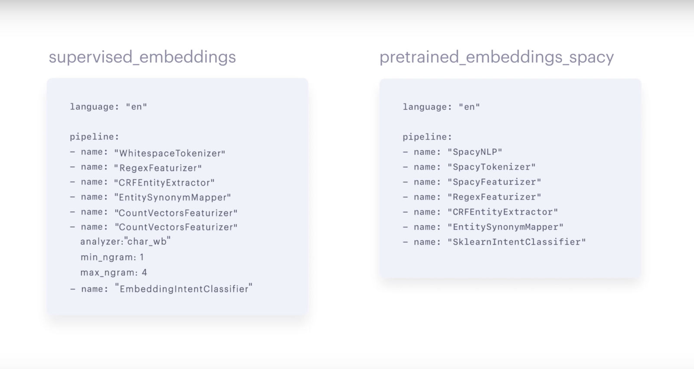
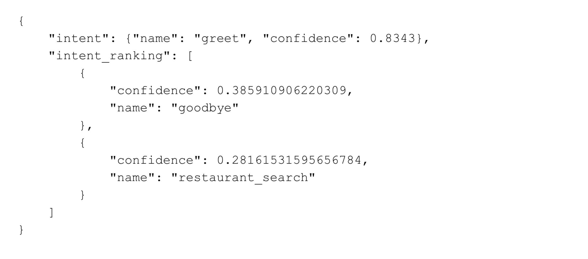
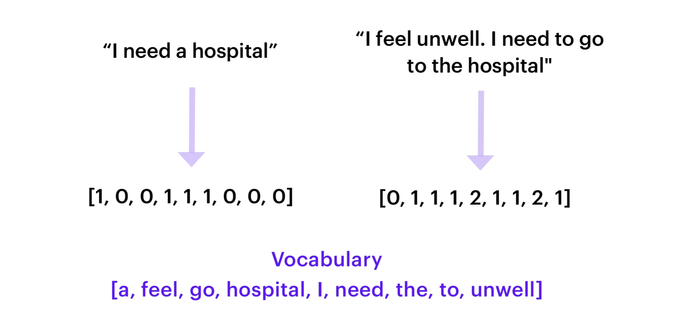
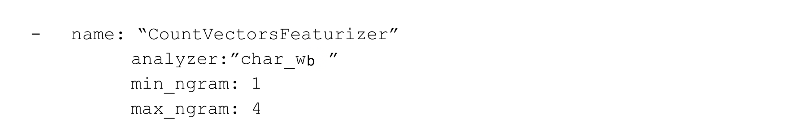

#  Training Pipeline Overview

파이프라인에서는 어떤 구성요소가 있어야 하는지를 정의하는 것뿐만 아니라, 
어떻게 구성요소가 배치되어야 하는지 순서까지 규정한다.

1. 필요하다면 사전학습 언어 모델을 로드한다(Optional)
2. 데이터를 단어 혹은 토큰으로 토크나이즈한다.
3. Named Entity Recognition(NER). 모델에게 메시지 안의 어떤 단어가 엔티티이고
어떤 엔티티 유형인지 인식하도록 학습시킨다.
4. Featurization. 토큰을 벡터나 dense numeric representation 으로 변환한다.
이 단계는 ner 전이나 후에 할 수 있다. 하지만 토크나이징 후에, 인텐트 분류 전에 실시한다.
5. Intent Classification. 사용자 메시지의 의미를 예측할 수 있도록 모델을 학습시킨다.

# Training Pipeline Components

에피소드 3에서 알아본 2개의 파이프라인이 어떻게 구성되어 있는지 알아본다.

## SpacyNLP

*pretrained_embeddings_spacy* pipeline 은 Spacy 언어 모델을 로드하기 위해 SpacyNLP component 를 사용한다.
spaCy pretrained embeddings 를 사용하는 파이프라인에서만 SpacyNLP 를 사용할 수 있다. 그리고 파이프라인 맨 처음에 쓰여져야 한다.

## Tokenizer

토크나이저는 텍스트 흐름을 입력으로 받아서 작은 청크나 토큰으로 쪼개는 일을 한다. 토크나이저는 주로 파이프라인의 첫 번째 단계에 나온다.
왜냐하면 다음 단계에서 쓰일 수 있도록 텍스트 데이터를 준비하는 과정이기 때문이다. 모든 학습 파이프라인은 토크나이저를 포함하고 있고
다음에서 사용자가 고를 수 있다.

* WhitespaceTokenizer
    - 공백을 기준으로 자른다. 
    - supervised_embeddings pipeline 에서 기본 토크나이저로 사용됨.
    - pre-trained embeddings 을 사용할 계획이 없다면 사용하기 좋음

* Jieba 
    - 중국어를 위한 토크나이저

* SpacyTokenizer
    - spaCy 를 사용하면 함께 사용하는 토크나이저로 각 언어에 맞는 룰을 적용한다.
    - pre-trained embeddings 를 사용할 때 유용하다.

## Named Entity Recognition (NER)

NER 은 사용자의 메시지에서 entity 를 추출하는 것이다. 
예를 들어, "샌프란시스코에서 가장 훌륭한 커피샵은?" 이라는 메시지에서 모델은 "샌프란시스코"와 "커피샵"을 추출하고 그것들이 각각 사업과 장소 유형인 것을
인식해야 한다. 

* CRFEntityExtractor
    - Conditional Random Field(CRF) 모델로 작동
    - 대상 단어와 그 주변 단어들의 텍스트 특징(feature)을 관찰하여 문장에서 entity 를 확인한다
    - 특징에는 접두사, 접미사, 대문자, 그 단어가 숫자를 포함하는지 등이 있다
    - POS tagging 을 함께 사용할 수 있는데 이는 spaCy 설치가 요구된다
 
* SpacyEntityExtractor
    - pre-trained word embeddings 를 사용할 것이라면, SpacyEntityExtractor 를 사용하는 것도 좋다
    - 작은 데이터셋으로 학습하더라도 pos tagging 및 기타 features 를 활용하여 학습 예시에서 엔티티를 찾을 수 있다.
    
* DucklingHttpExtractor
    - 일부 엔티티 유형들은 날짜와 같이 특정한 패턴을 따른다.
    - DucklingHttpExtractor 는 구조화된 엔티티 유형을 추출하는 데 사용할 수 있다
    - 날짜, 숫자, 거리, 데이터 유형들을 인식할 수 있다

* Regex_featurizer
    - 엔티티 추출을 보조하기 위해 *정규식이나 look-up table 을 사용*할 때 CRFEntityExtractor 이전에 regex_featurizer 를 추가할 수 있다.
    - 정규식은 특정한 패턴이 합치하는지 볼 수 있다.
    - lookup table 은 사전에 정의된 값들을 제공한다
        - 그 엔티티 유형이 한정된 값을 가지고 있을 때 유용하다.
        - 예를 들어, 국가 유형은 195 개의 값이 정해져 있어서 lookup table 로 목록화 해놓으면 좋다.
    

## Intent Classification

인텐트 분류를 함께 하는 두 가지 유형의 component 가 있다   
1. featurizer
    - 토큰이나 개별 단어를 입력으로 받아서, 벡터로 인코딩한다.
2. intent classification model
    - featurizer 의 출력값(벡터)을 입력으로 받아서 어떤 인텐트가 사용자의 메시지와 합치하는지 예측을 한다.
    - intent classification model 의 출력값은 인텐트 예측값을 내림차순으로 표현된다.

featurizer 와 intent classifier 에 어떤 옵션들이 있는지 살펴본다.

### Featurizers

* CountVectorsFeaturizer
    - sklearn 의 CountVectorizer 를 사용해서 사용자의 메시지를 BOW(bag-of-words)로 만든다.
    - BOW 는 텍스트의 순서는 무시하는 대신 문장에서 해당 단어가 몇 번 등장했는지에 집중한다.
    - BOW 를 intent classifier 의 입력으로 제공한다.
    - CountVectorsFeaturizer 는 단어 혹은 문자 n-grams 를 사용하도록 구성될 수 있다.
        - 사용하는 analyzer config parameter 를 통해 정의
        - 기본적으로 단어 n-grams 로 설정되어 있어서 단어 토큰이 feature 로 사용된다.
        - 문자 n-grams 를 사용하고 싶으면, analyzer 를 "char" 혹은 "char_wb"
        - n-gram 의 개수를 늘릴 수 있는데 그러면 인텐트 분류의 탄력성은 높아지지만 그만큼 학습 시간도 늘어난다.
        - 다음과 같이 문자 n-gram 으로 지정할 수 있다.
        

    

# Additional Resources

# References

* [https://blog.rasa.com/the-rasa-masterclass-handbook-episode-4/](https://blog.rasa.com/the-rasa-masterclass-handbook-episode-4/){:target="_blank"}
