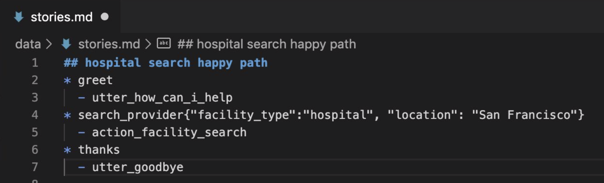
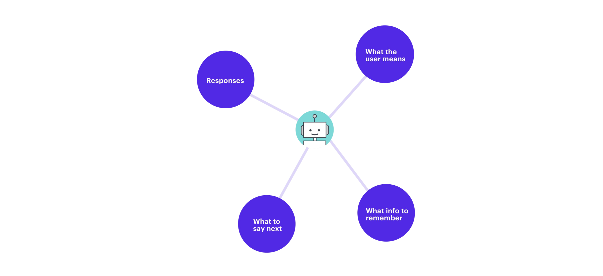
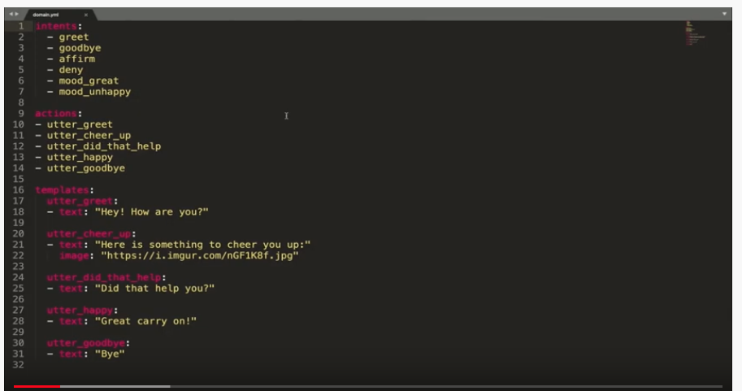
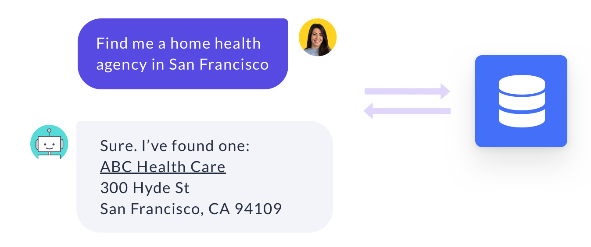

5 번째 에피소드에서는 Rasa core 라는 component 에 의해 통제되는 dialogue management 에 대해 소개한다.
dialogue management 는 대화 중에 어시스턴트가 취하는 다음 행동(action)을 통제하는 기능이다.

# Dialogue Management with Rasa

Rasa core 는 머신 러닝을 사용하여 예제 대화에서 대화의 패턴을 찾아낸다. state machine 과 달리, 모든 가능한 경우를 프로그래밍하지 않아도 된다.
또한 사용자와 상호작용하면서 직접적으로 대화 데이터를 얻어 시간이 지날수록 성능을 높일 수 있다.

## Stories

Rasa core 에서, 대화 학습 데이터의 기본 단위를 story 라고 부른다. story 는 stories.md 파일에 저장된다.

```markdown
## greet + location/price + cuisine + num people    <!-- name of the story - just for debugging -->
* greet
   - action_ask_howcanhelp
* inform{"location": "rome", "price": "cheap"}  <!-- user utterance, in format intent{entities} -->
   - action_on_it
   - action_ask_cuisine
* inform{"cuisine": "spanish"}
   - action_ask_numpeople        <!-- action that the bot should execute -->
* inform{"people": "six"}
   - action_ack_dosearch
```

### Story Name

스토리 이름 시작에 ## 를 붙인다. 이름 붙이는 것은 필수는 아니나 디버깅을 더 쉽게 해주니 하는 것을 추천한다.
같은 이유로 이름을 한 번에 알아볼 수 있도록 기술적으로 표현하는 것이 좋다.

### Messages from Users

스토리는 사용자들로부터 온 메시지와 그 메시지에 대한 어시스턴트의 응답을 구조화한 것이다. 사용자의 메시지는 * 로 시작한다.
intent{entity_name: entity_value} 형태이다. 엔티티는 생략 가능하다.  
동일한 intent 여도 엔티티를 어떻게 지정하느냐에 따라 분기처리를 따로 할 수도 있다.
아래 두 예시를 보면 그 차이를 알 수 있다.




첫 번째는 가고 싶은 장소의 유형과 위치를 모두 한 번에 말해서 바로 그 위치를 찾아 안내한다.
두 번째는 위치를 말하지 않아서 위치를 물어보고 이를 확인하고 나서 샌프란시스코에 있는 병원을 안내한다.


# Training Data Tips

스토리를 만드는데 고정된 룰이 있는 것은 아니지만 두 가지 명심해야 할 것은 있다.

1. 학습 데이터가 많을수록 더 낫다. 

2. 실제 사용자와의 상호작용으로 나온 예제를 더 선호한다.
    * 처음에 간단한 skill 들을 구현하고 그 이후에는 실사용자와 어시스턴트를 공유해보는 것이 좋다.
    * Rasa X 에서는 interactive learning 기능이 있다. 이후 에피소드에서 다룰 예정이다.
    

---

5 번째 에피소드가 너무 짧아서 6번째 에피소드를 이어서 진행하겠다.
6 번째 에피소드에서는 domain, custom actions, slot 등을 포함해서 라사의 대화 관리의 핵심 component 를 다룬다.

# Domain File in Rasa

domain 은 라사의 대화 관리 모델에서 핵심 component 이다. 도메인은 어시스턴트가 작동하는 환경을 정의한다.
다음을 포함한다
* What the user means
    - 특히, 인텐트와 엔티티 모델이 이해할 수 있는 것
* What responses the model can provide
    - utterance or custom actions
* What to say next
    - 모델이 응답할 준비가 되어 있는 발화 혹은 행동
* What info to remember
    - 어시스턴트가 대화를 통해 기억하고 사용해야 하는 정보가 무엇인지
    



예시를 살펴보자.



domain.yml 파일 내용이다. 기본적으로 intents, actions, templates 로 되어있다. 
순서대로 intents 는 인텐트 리스트이고 actions 는 어시스턴트의 response 를 의미하는 action 리스트이다.
인텐트와 actions 이름은 stories.md, nlu.md(or .json) 파일들과 동일해야 한다.
templates 는 어시스턴트의 텍스트 형태의 반응만 기록하는 곳이다. 추가로 이미지, 버튼, custom payloads 등을 달 수 있다.


domain.yml 파일에 entity 를 인텐트처럼 목록화하는 것이 가능하다. 다만 하지 않아도 작동하여 다른 기능이 있지
않은 이상은 사용하지 않을 예정이다.


# Custom Action in Rasa



custom action 으로 api 를 요청하거나 데이터베이스와 연결하는 등 다양한 action 을 정의할 수 있다.  
custom action 은 action.py 파일에서 정의할 수 있다.


custom action class 를 만들기 위해서는 위의 빨간색 네모 안에 있는 모듈들을 import 해야 한다.


custom action class 는 두 가지 function 으로 구성된다. name 과 run 이다.
name 은 custom action 의 이름을 반환하고 stories.md 파일에서 있는 이름과 동일해야 한다.  
run 이 custom action 이 예측되었을 때 실행하는 부분이다. run function 은 tracker 와 dispatcher elements 를 가지고 있다.
* tracker
    - 대화의 각 지점에서 어떤 일이 일어났는지 추적한다
        - 인텐트, 엔티티, 그외 다른 정보들 
* dispatcher
    - 사용자에게 반응을 보내는 요소
    
단순히 문자열을 보내는 custom action 을 만들면 다음과 같다.

```python
# This is a simple example for a custom action which utters "Hello World!"

from typing import Any, Text, Dict, List

from rasa_sdk import Action, Tracker
from rasa_sdk.executor import CollectingDispatcher


class ActionHelloWorld(Action):

    def name(self) -> Text:
        return "action_hello_world"

    def run(self, dispatcher: CollectingDispatcher,
            tracker: Tracker,
            domain: Dict[Text, Any]) -> List[Dict[Text, Any]]:

        dispatcher.utter_message(text="Hello World!")

        return []
``` 

# Slots in Rasa


# References

* [https://blog.rasa.com/the-rasa-masterclass-handbook-episode-5/](https://blog.rasa.com/the-rasa-masterclass-handbook-episode-5/){:target="_blank"}
* [https://blog.rasa.com/the-rasa-masterclass-handbook-episode-6-2/](https://blog.rasa.com/the-rasa-masterclass-handbook-episode-6-2/){:target="_blank"}

