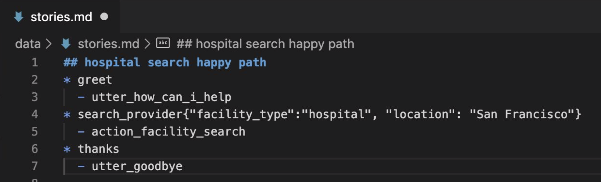
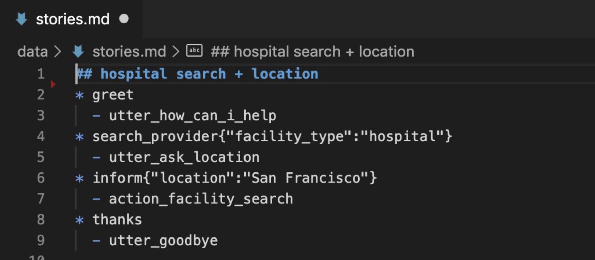
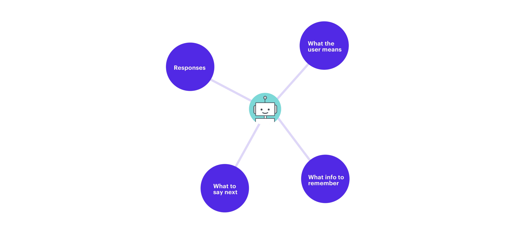
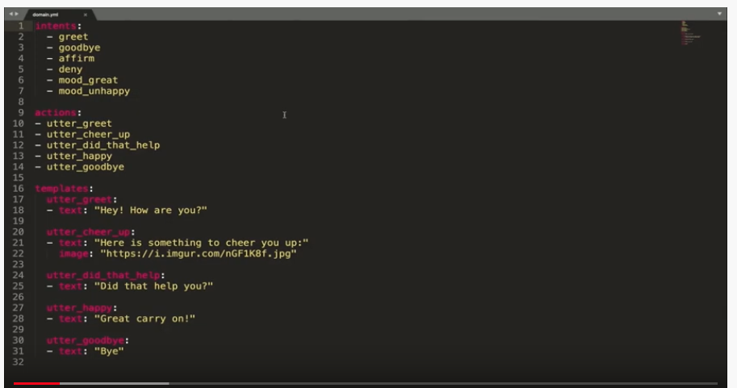
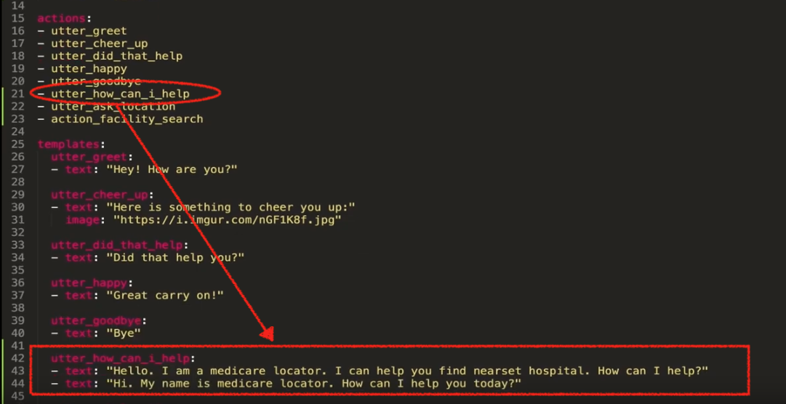
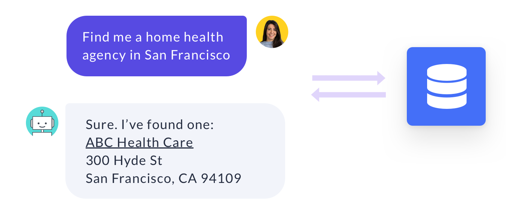
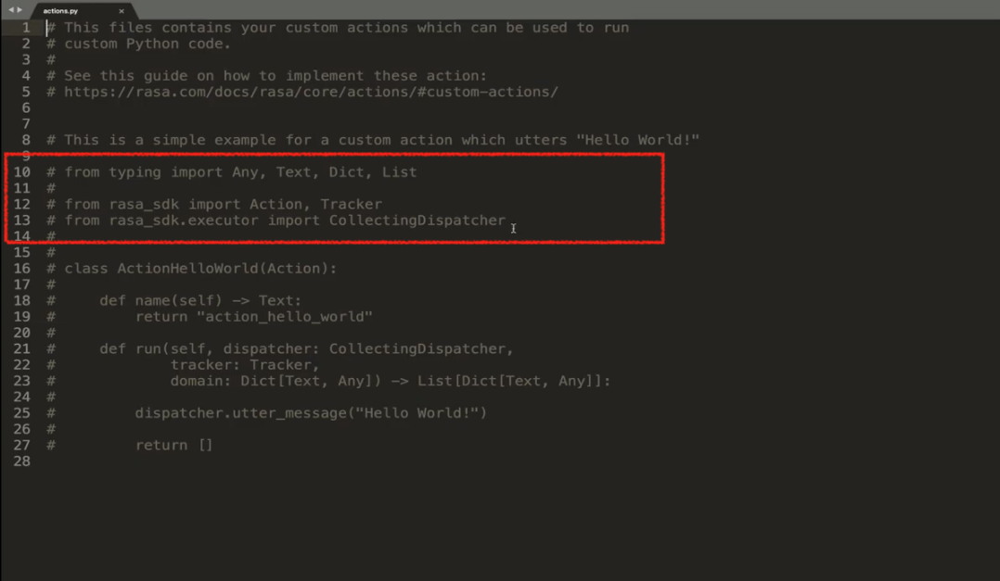
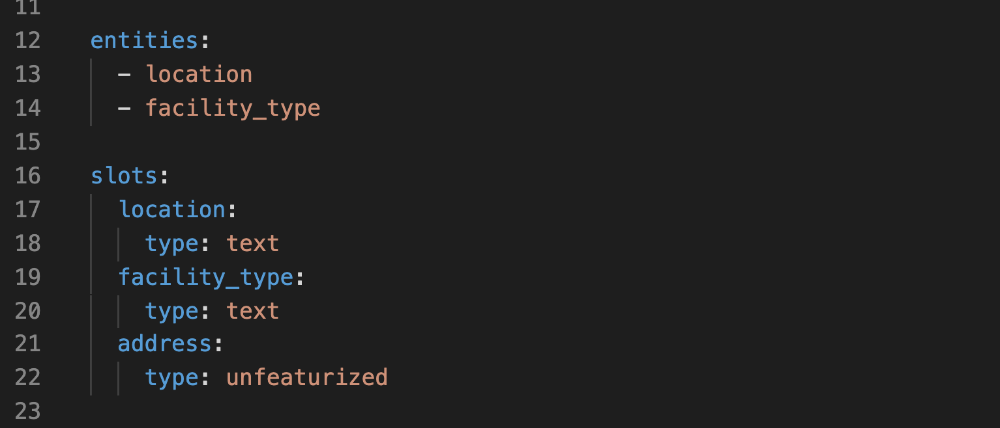
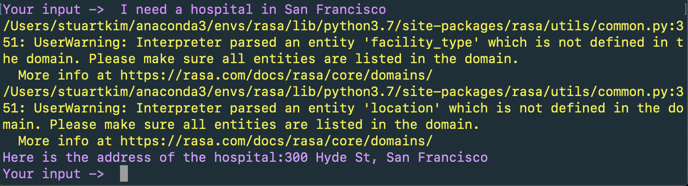
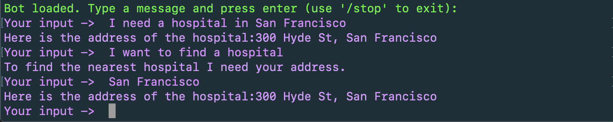

5 번째 에피소드에서는 Rasa core 라는 component 에 의해 통제되는 dialogue management 에 대해 소개한다.
dialogue management 는 대화 중에 어시스턴트가 취하는 다음 행동(action)을 통제하는 기능이다.

# Dialogue Management with Rasa

Rasa core 는 머신 러닝을 사용하여 예제 대화에서 대화의 패턴을 찾아낸다. state machine 과 달리, 모든 가능한 경우를 프로그래밍하지 않아도 된다.
또한 사용자와 상호작용하면서 직접적으로 대화 데이터를 얻어 시간이 지날수록 성능을 높일 수 있다.

## Stories

Rasa core 에서, 대화 학습 데이터의 기본 단위를 story 라고 부른다. story 는 stories.md 파일에 저장된다.

```markdown
## greet + location/price + cuisine + num people    <!-- name of the story - just for debugging -->
* greet
   - action_ask_howcanhelp
* inform{"location": "rome", "price": "cheap"}  <!-- user utterance, in format intent{entities} -->
   - action_on_it
   - action_ask_cuisine
* inform{"cuisine": "spanish"}
   - action_ask_numpeople        <!-- action that the bot should execute -->
* inform{"people": "six"}
   - action_ack_dosearch
```

### Story Name

스토리 이름 시작에 ## 를 붙인다. 이름 붙이는 것은 필수는 아니나 디버깅을 더 쉽게 해주니 하는 것을 추천한다.
같은 이유로 이름을 한 번에 알아볼 수 있도록 기술적으로 표현하는 것이 좋다.

### Messages from Users

스토리는 사용자들로부터 온 메시지와 그 메시지에 대한 어시스턴트의 응답을 구조화한 것이다. 사용자의 메시지는 * 로 시작한다.
intent{entity_name: entity_value} 형태이다. 엔티티는 생략 가능하다.  
동일한 intent 여도 엔티티를 어떻게 지정하느냐에 따라 분기처리를 따로 할 수도 있다.
아래 두 예시를 보면 그 차이를 알 수 있다.





첫 번째는 가고 싶은 장소의 유형과 위치를 모두 한 번에 말해서 바로 그 위치를 찾아 안내한다.
두 번째는 위치를 말하지 않아서 위치를 물어보고 이를 확인하고 나서 샌프란시스코에 있는 병원을 안내한다.


# Training Data Tips

스토리를 만드는데 고정된 룰이 있는 것은 아니지만 두 가지 명심해야 할 것은 있다.

1. 학습 데이터가 많을수록 더 낫다. 

2. 실제 사용자와의 상호작용으로 나온 예제를 더 선호한다.
    * 처음에 간단한 skill 들을 구현하고 그 이후에는 실사용자와 어시스턴트를 공유해보는 것이 좋다.
    * Rasa X 에서는 interactive learning 기능이 있다. 이후 에피소드에서 다룰 예정이다.
    

---

5 번째 에피소드가 너무 짧아서 6번째 에피소드를 이어서 진행하겠다.
6 번째 에피소드에서는 domain, custom actions, slot 등을 포함해서 라사의 대화 관리의 핵심 component 를 다룬다.

# Domain File in Rasa

domain 은 라사의 대화 관리 모델에서 핵심 component 이다. 도메인은 어시스턴트가 작동하는 환경을 정의한다.
다음을 포함한다
* What the user means
    - 특히, 인텐트와 엔티티 모델이 이해할 수 있는 것
* What responses the model can provide
    - utterance or custom actions
* What to say next
    - 모델이 응답할 준비가 되어 있는 발화 혹은 행동
* What info to remember
    - 어시스턴트가 대화를 통해 기억하고 사용해야 하는 정보가 무엇인지
    



예시를 살펴보자.



domain.yml 파일 내용이다. 기본적으로 intents, actions, templates 로 되어있다. 
순서대로 intents 는 인텐트 리스트이고 actions 는 어시스턴트의 response 를 의미하는 action 리스트이다.
인텐트와 actions 이름은 stories.md, nlu.md(or .json) 파일들과 동일해야 한다.
templates 는 어시스턴트의 텍스트 형태의 반응만 기록하는 곳이다. 추가로 이미지, 버튼, custom payloads 등을 달 수 있다.




# Custom Action in Rasa



custom action 으로 api 를 요청하거나 데이터베이스와 연결하는 등 다양한 action 을 정의할 수 있다.  
custom action 은 action.py 파일에서 정의할 수 있다.



custom action class 를 만들기 위해서는 위의 빨간색 네모 안에 있는 모듈들을 import 해야 한다.


custom action class 는 두 가지 function 으로 구성된다. name 과 run 이다.
name 은 custom action 의 이름을 반환하고 stories.md 파일에서 있는 이름과 동일해야 한다.  
run 이 custom action 이 예측되었을 때 실행하는 부분이다. run function 은 tracker 와 dispatcher elements 를 가지고 있다.
* tracker
    - 대화의 각 지점에서 어떤 일이 일어났는지 추적한다
        - 인텐트, 엔티티, 그외 다른 정보들 
* dispatcher
    - 사용자에게 반응을 보내는 요소
    
단순히 문자열을 보내는 custom action 을 만들면 다음과 같다.

```python
# This is a simple example for a custom action which utters "Hello World!"

from typing import Any, Text, Dict, List

from rasa_sdk import Action, Tracker
from rasa_sdk.executor import CollectingDispatcher


class ActionHelloWorld(Action):

    def name(self) -> Text:
        return "action_hello_world"

    def run(self, dispatcher: CollectingDispatcher,
            tracker: Tracker,
            domain: Dict[Text, Any]) -> List[Dict[Text, Any]]:

        dispatcher.utter_message(text="Hello World!")

        return []
``` 

# Slots in Rasa

domain file 에서 또 다른 중요한 요소이자 특히 대화 관리에서 중요한 것이 *slots* 다.
slots 은 어시스턴트의 메모리로 기능하고, 대화를 통해 나온 중요한 세부사항을 기억하고 대화를 움직이는 데 사용된다.
slots 은 key-value 형태로 대화 간 중요한 정보를 저장한다. 정보는 다음 경로로 제공된다.
1. 사용자로부터 나온 entity value
2. 대화 밖(예를들어 DB)에서 가져온 정보
    - 해당 지역의 날씨 api 를 통해 얻은 날씨 정보

domain.yml 파일에 entity 를 인텐트처럼 목록화하는 것이 가능하다. 여기서 entities 를 작성하는 것은 slot 과 관련이 있다.
slot 으로 활용될 entity 의 경우 도메인 파일에 목록화하는 것을 원칙으로 한다. 



slot 은 slot name 과 slot type 으로 구성된다. 
entity 에서 가져온 slot 이 1번 유형에 해당한다.
예시에서 "address"는 대화 밖에서 가져온 2번 유형에 해당한다. 

entities는 작성하지 않아도 작동은 한다. 다음과 같은 warning 이 나오긴 한다.



entity 의 경우 slot 으로 저장되면 bot response 로 바로 활용할 수 있다.

```markdown
  utter_ask_location:
  - text: "Can you provide your location please?"
  - text: "To find the nearest {facility_type} I need your address."
```

## Slot Types

1. text
2. bool : true or false
3. categorical
    - 범주형은 정보가 유한할 때 유용하다.
    - low, medium, high 의 class 가 있을 때
    ```markdown
       slots:
           risk_level:
              type: categorical
              values:
              - low
              - medium
              - high
    ```
4. float
5. list
6. unfeaturized
    - 슬롯을 사용하여 정보를 추출하여 저장하지만 대화를 주도하지 않을 때 유용하다.
    - 슬롯의 value도, 채워졌는지 여부도 대화관리 모델의 예측에 영향을 미치지 않는다.

## Action server

시설 위치를 검색하는 action, "**action_facility_search**"를 살펴보자.

```python
from typing import Any, Text, Dict, List

from rasa_sdk import Action, Tracker
from rasa_sdk.executor import CollectingDispatcher
from rasa_sdk.events import SlotSet


class ActionFacilitySearch(Action):

    def name(self) -> Text:
        return "action_facility_search"

    def run(self, dispatcher: CollectingDispatcher,
            tracker: Tracker,
            domain: Dict[Text, Any]) -> List[Dict[Text, Any]]:

        facility = tracker.get_slot("facility_type")
        location = tracker.get_slot("location")
        address = "300 Hyde St, San Francisco"
        dispatcher.utter_message("Here is the address of the {}:{}".format(facility, address))

        return [SlotSet("address", address)]

```

실제 서비스 시에는 address 를 찾는 것을 따로 구현해야 하지만 여기선 그부분이 중요한 것은 아니라서 하드코딩했다.
앞서 말했듯이 tracker 가 그 대화 시점의 slots 정보를 가지고 있다. tracker 의 get_slot() 을 이용하여 facility, location 정보를 변수에 할당한다.
address 는 facility, location 정보에 근거하여 외부 DB에서 추출한다.  
dispatcher.utter_message() 로 응답을 하고, address 값을 slot 에 저장하는 것으로 반환값을 지정한다.   

# Resetting Slots

slot values 는 reset 전까지 메모리에 유지된다. NLU model 에 의해 추출되는 slot 의 경우 매번 업데이트되고 custom action 의 경우도 그렇다.

모든 slot 을 리셋하고 싶을 때는 두 줄만 바꾸면 된다. AllSlotsReset 을 import 하고, run()의 반환값으로 [AllSlotsReset()] 을 지정한다.

```python
from rasa_sdk.events import AllSlotsReset

class ActionHelloWorld(Action):

     def name(self) -> Text:
            return "action_hello_world"

     def run(self, dispatcher: CollectingDispatcher,
             tracker: Tracker,
             domain: Dict[Text, Any]) -> List[Dict[Text, Any]]:

         dispatcher.utter_message("Hello World!")

         return [AllSlotsReset()]
```

특정한 slot 만 리셋하고 싶을 때는 반환값을 아래처럼 지정한다.
>return [SlotSet("slot_name", None)]

# Session Configuration

대화 세션은 3가지로 시작될 수 있다.
1. 사용자가 어시스턴트와 대화를 시작
2. 구성가능한 비활성화 기간 이후 사용자가 메시지를 보냄
3. "/session_start" 라고 입력

session configuration 은 도메인 파일에서 정의되며 다음과 같다.
```markdown
session_config:
  session_expiration_time: 60  # value in minutes, 0 means infinitely long
  carry_over_slots_to_new_session: true  # set to false to forget slots between sessions
``` 

session_expiration_time 은 세션 만료 시간을 의미하며 단위는 분이다.  
carry_over_slots_to_new_session true 로 하면 세션이 바뀌어도 slot 정보를 가져간다.


# Train & Test

custom action 을 사용하려면 다시 학습이 필요하다. 또한 endpoints.yml 파일에서 action_endpoint 부분의 주석을 풀어준다.


1. 학습
    >rasa train

2. custom action server 켜기
    >rasa run actions

3. 별도의 terminal에서 load assistant
    >rasa shell

test 화면이다.



다음 포스트에서는 대화의 정책에 대해 알아보도록 하겠다.


# References

* [https://blog.rasa.com/the-rasa-masterclass-handbook-episode-5/](https://blog.rasa.com/the-rasa-masterclass-handbook-episode-5/){:target="_blank"}
* [https://blog.rasa.com/the-rasa-masterclass-handbook-episode-6-2/](https://blog.rasa.com/the-rasa-masterclass-handbook-episode-6-2/){:target="_blank"}
* [https://rasa.com/docs/rasa/core/domains/](https://rasa.com/docs/rasa/core/domains/){:target="_blank"}

