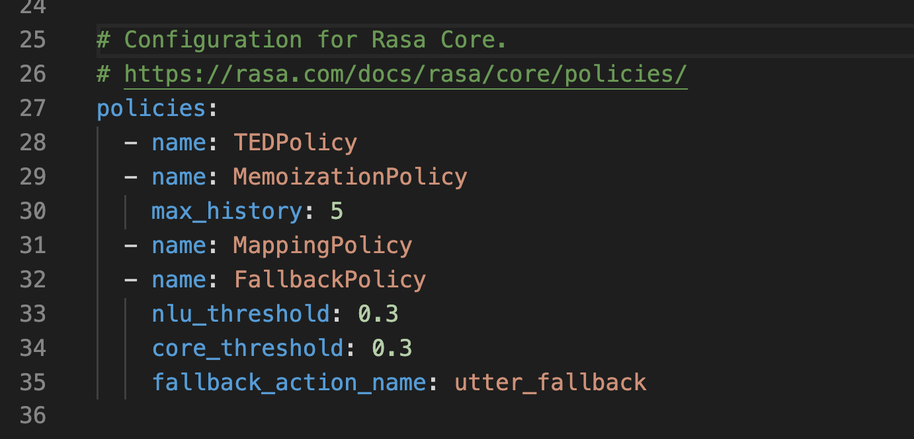

에피소드 7에서는 대화 정책에 대해 다루고 8에서는 7에서 배운 이론을 실습을 통해 익혀본다.

라사에서 Policy 는 대화 모델을 학습시키는 컴포넌트이고 사용자의 입력에 대한 응답을 결정하는 데 중요한 역할을 한다.
에피소드 7에서는 라사에서 사용할 수 있는 정책들에 어떤 것이 있고 개발자들이 정책을 어떻게 구성하는지,
어떤 정책을 사용할 지에 대해 다룬다. 

# Policy Configuration in Rasa

NLU training pipeline 처럼 대화 정책도 *config.yml* 파일에서 구성할 수 있다.

다음은 config.yml 파일의 정책 부분이다.
 

정책 배치는 정책의 이름을 목록화하는 것으로 정의한다. NLU training pipeline 은 순서대로 작동한다면
대화 정책은 동시에 작동한다. 
각 대화 턴마다 각 정책은 다음 최적 행동을 예측하고 
confidence 값이 가장 높은 행동을 다음 행동으로 결정한다.


만약에 confidence 값이 동일할 때는 우선순위가 높은 시스템이 예측한 다음 행동으로 결정된다.
라사는 자동으로 기본 우선순위에 따라 정책의 가중치를 정한다. 
점수가 높은 것이 높은 우선순위를 지닌다. 머신러닝 정책들은 점수가 1이다.

5 - FormPolicy  
4 - FallbackPolicy and TwoStageFallbackPolicy  
3 - MemoizationPolicy and AugmentedMemoizationPolicy  
2 - MappingPolicy  
1 - TEDPolicy, EmbeddingPolicy, KerasPolicy, and SklearnPolicy  

우선순위 내에서 confidence 값이 동일할 경우 문제를 피하기 위해서
동일 수준에서는 하나만 선택하는게 좋다.  
또한 Fallback 과 TwoStageFallback 은 명백하게 함께 사용할 수 없으니 유의 바란다.  
*priority* 라는 패러미터로 모든 정책의 우선순위를 바꿀 수 있지만 추천하지 않는다.

# Hyperparameters

각 정책은 모델 행동을 조정할 수 있는 그것만의 패러미터를 지니고 있다. 
대화 정책에서 공통으로 중요한 패러미터에는 두 개가 있다: max-history 와 data augmentation

## Max-history

정책 컴포넌트는 다음 행동을 예측할 때 단순히 사용자가 직전에 말한 것만 보지는 않는다. 
그 전에 대화 턴에서 일어난 일도 고려한다. *max_history* 패러미터는 다음 행동을 예측할 때
몇 단계 전의 대화 턴까지 고려할지를 정한다. 
이는 반복된 내용의 요청과 같이 사용자 메시지에 특정 패턴이 있어서 응답하도록 할 때, 
특히 유용할 수 있다.
max_history 는 policy 의 featurizer 부분에서 설정 가능하다.  
MaxHistoryTrackerFeaturizer 만 max_history 를 사용할 수 있고 
FullDialogueTrackerFeaturizer 는 모든 대화 기록을 살핀다.

```markdown
policies:
  - name: "KerasPolicy"
    featurizer:
    - name: MaxHistoryTrackerFeaturizer
      max_history: 5
      state_featurizer:
        - name: BinarySingleStateFeaturizer
```

그럼 이 max_history 를 높게 잡을수록 좋은 것인가? max-history 관해서 정확도와 
반응 속도는 trade-off 관계이다. max_history 를 높이면 정확도는 올라가겠지만 
그만큼 모델이 커져서 반응 속도가 느려진다.  
그렇기 때문에 slot 을 활용해서 max_history 는 실험을 통해 적절한 값을 선택하는게
더 좋은 방법이다.

## Data augmentation

기본적으로 라사 코어는 임의로 스토리들을 선택하여 학습 데이터 파일에 추가한다. 
이를 data augmentation 이라고 부른다. data augmentation 을 통해 
모델은 관련 없는 대화 기록을 무시하도록 학습한다.   
예를 들어, 그 전의 대화가 어떤 것이든 간에 다음 행동이 동일해야 하는 짧은 스토리가 있다고 할 때,
**--augmentation** flag 를 통해 다음 행동을 통제할 수 있다.  
기본적으로, augmentation 은 20으로 지정되어 있고 이는 200개의 추가 스토리를 만든다는 것을 의미한다.
**--augmentation 0** 으로 세팅하면 data augmentation 은 하지 않는다. 데이터가 충분히 많을 때 
이렇게 해도 좋다.

간단히 생각해서 스토리 데이터가 적을 때 임의로 데이터를 더 추출하여 학습시킨다는 것이다. 

# Dialogue Policies


# References

* [https://blog.rasa.com/the-rasa-masterclass-handbook-episode-7/](https://blog.rasa.com/the-rasa-masterclass-handbook-episode-7/){:target="_blank"}
* [https://blog.rasa.com/the-rasa-masterclass-handbook-episode-8/](https://blog.rasa.com/the-rasa-masterclass-handbook-episode-8/){:target="_blank"}
* [https://rasa.com/docs/rasa/core/policies/#id1](https://rasa.com/docs/rasa/core/policies/#id1){:target="_blank"}

