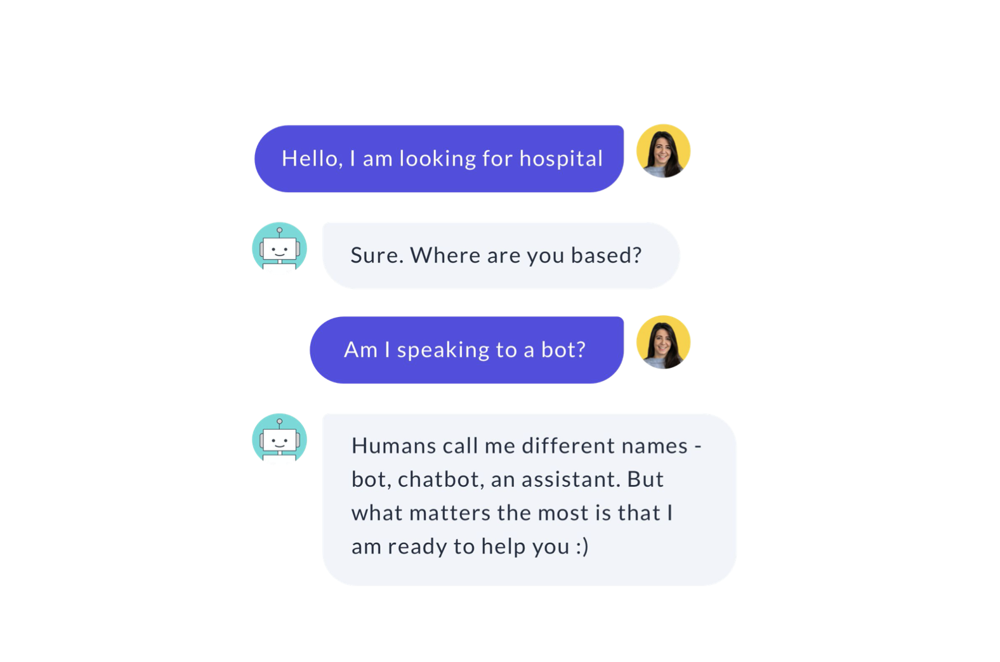
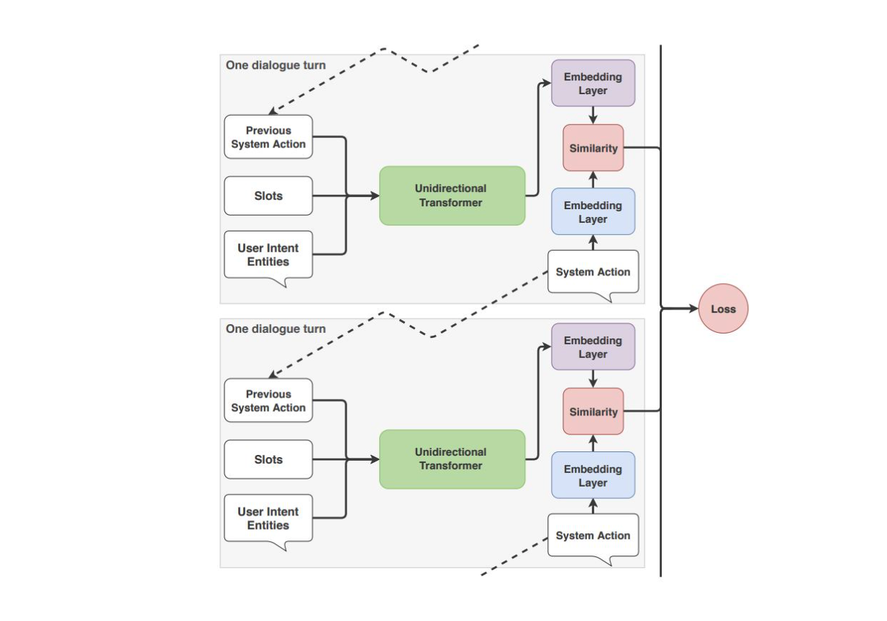

에피소드 7에서는 대화 정책에 대해 다루고 8에서는 7에서 배운 이론을 실습을 통해 익혀본다.

라사에서 Policy 는 대화 모델을 학습시키는 컴포넌트이고 사용자의 입력에 대한 응답을 결정하는 데 중요한 역할을 한다.
에피소드 7에서는 라사에서 사용할 수 있는 정책들에 어떤 것이 있고 개발자들이 정책을 어떻게 구성하는지,
어떤 정책을 사용할 지에 대해 다룬다. 

# Policy Configuration in Rasa

NLU training pipeline 처럼 대화 정책도 *config.yml* 파일에서 구성할 수 있다.

다음은 config.yml 파일의 정책 부분이다.
 

정책 배치는 정책의 이름을 목록화하는 것으로 정의한다. NLU training pipeline 은 순서대로 작동한다면
대화 정책은 동시에 작동한다. 
각 대화 턴마다 각 정책은 다음 최적 행동을 예측하고 
confidence 값이 가장 높은 행동을 다음 행동으로 결정한다.


만약에 confidence 값이 동일할 때는 우선순위가 높은 시스템이 예측한 다음 행동으로 결정된다.
라사는 자동으로 기본 우선순위에 따라 정책의 가중치를 정한다. 
점수가 높은 것이 높은 우선순위를 지닌다. 머신러닝 정책들은 점수가 1이다.

5 - FormPolicy  
4 - FallbackPolicy and TwoStageFallbackPolicy  
3 - MemoizationPolicy and AugmentedMemoizationPolicy  
2 - MappingPolicy  
1 - TEDPolicy, EmbeddingPolicy, KerasPolicy, and SklearnPolicy  

우선순위 내에서 confidence 값이 동일할 경우 문제를 피하기 위해서
동일 수준에서는 하나만 선택하는게 좋다.  
또한 Fallback 과 TwoStageFallback 은 명백하게 함께 사용할 수 없으니 유의 바란다.  
*priority* 라는 패러미터로 모든 정책의 우선순위를 바꿀 수 있지만 추천하지 않는다.

# Hyperparameters

각 정책은 모델 행동을 조정할 수 있는 그것만의 패러미터를 지니고 있다. 
대화 정책에서 공통으로 중요한 패러미터에는 두 개가 있다: max-history 와 data augmentation

## Max-history

정책 컴포넌트는 다음 행동을 예측할 때 단순히 사용자가 직전에 말한 것만 보지는 않는다. 
그 전에 대화 턴에서 일어난 일도 고려한다. *max_history* 패러미터는 다음 행동을 예측할 때
몇 단계 전의 대화 턴까지 고려할지를 정한다. 
이는 반복된 내용의 요청과 같이 사용자 메시지에 특정 패턴이 있어서 응답하도록 할 때, 
특히 유용할 수 있다.
max_history 는 policy 의 featurizer 부분에서 설정 가능하다.  
MaxHistoryTrackerFeaturizer 만 max_history 를 사용할 수 있고 
FullDialogueTrackerFeaturizer 는 모든 대화 기록을 살핀다.

```markdown
policies:
  - name: "KerasPolicy"
    featurizer:
    - name: MaxHistoryTrackerFeaturizer
      max_history: 5
      state_featurizer:
        - name: BinarySingleStateFeaturizer
```

그럼 이 max_history 를 높게 잡을수록 좋은 것인가? max-history 관해서 정확도와 
반응 속도는 trade-off 관계이다. max_history 를 높이면 정확도는 올라가겠지만 
그만큼 모델이 커져서 반응 속도가 느려진다.  
그렇기 때문에 slot 을 활용해서 max_history 는 실험을 통해 적절한 값을 선택하는게
더 좋은 방법이다.

## Data augmentation

기본적으로 라사 코어는 임의로 스토리들을 선택하여 학습 데이터 파일에 추가한다. 
이를 data augmentation 이라고 부른다. data augmentation 을 통해 
모델은 관련 없는 대화 기록을 무시하도록 학습한다.   
예를 들어, 그 전의 대화가 어떤 것이든 간에 다음 행동이 동일해야 하는 짧은 스토리가 있다고 할 때,
**--augmentation** flag 를 통해 다음 행동을 통제할 수 있다.  
기본적으로, augmentation 은 20으로 지정되어 있고 이는 200개의 추가 스토리를 만든다는 것을 의미한다.
**--augmentation 0** 으로 세팅하면 data augmentation 은 하지 않는다. 데이터가 충분히 많을 때 
이렇게 해도 좋다.

간단히 생각해서 스토리 데이터가 적을 때 임의로 데이터를 더 추출하여 학습시킨다는 것이다. 

# Dialogue Policies

라사에서 사용 가능한 정책은 다음과 같다.
* Memoization Policy
* Mapping Policy
* Keras Policy
* Embedding Policy(TEDPolicy)
* FormPolicy
* FallbackPolicy

## Memoization Policy

비교적 간단한 대화 정책이다. max_history 로 대화를 부분으로 잘라서 일치하는 스토리 부분을 찾는다.
일치하는 것을 찾으면 학습 데이터에서 본 그 다음 행동을 산출한다.
일치하는 것을 찾고 이를 그대로 산출하기 때문에 100% 확신을 지니고 예측한다. 
그래서 단독으로 사용하는 것보다는 다른 정책과 함께 쓰는 것을 추천한다.

* Configuration
    * max_history : default - 5
    * priority

## Mapping Policy

Mapping Policy 는 인텐트를 특정 행동으로 매핑해준다. 대화가 이전에 어떤 상황이었든 간에
그 인텐트에 대한 특정 대답을 하기를 바랄 때 유용하다.   
중요한 특징은 대화 중간에도 특정 인텐트에 대해 정해진 답변을 하면서 대화 흐름을 깨지 않을 수 있다.



외부에서 바로 매핑을 하기 때문에 다른 정책과 꼭 함께 쓰여야 한다.

* Configuration
    * config.yml 파일에 MappingPolicy 를 등록하고 domain.yml 파일에서 인텐트에 대한 행동도
    매핑해줘야 한다. *triggers* 라는 속성을 사용한다. 이 경우에는 하나의 행동으로만 매핑 가능하다.
    * 예시
    ```
    intents:
    - ask_is_bot:
        triggers: action_is_bot
    ```
    * 앞선 예시처럼 매핑한 내용이 대화의 흐름에서 제외되길 원하면 action server 부분에서 
    run() 의 반환값으로 *UserUtteranceReverted()*를 지정해야 한다.  
    ```python
    class ActionIsBot(Action):
        """Revertible mapped action for utter_is_bot"""
        
        def name(self):
            return "action_is_bot"
        
        def run(self, dispatcher, tracker, domain):
            dispatcher.utter_template(template="utter_is_bot")
            return [UserUtteranceReverted()]
    ```
    * 만약 triggers: utter_{} 이런 식으로 쓰면 stories.md 와 domain.yml 을 기준으로 바로 응답한다.  
    이 경우는 대화 기록에 남는다. 특정 인텐트에 지정할 대답이 있지만 대화 흐름에 남기고 싶으면서 간단한 텍스트 응답일 때
    utter_{} 를 사용하면 된다.


## Keras Policy

Keras Policy 는 머신러닝을 대화 관리에 적용시킨 것이다. 
keras 로 구현한 신경망을 학습에 사용한다. 기본 아키텍쳐는 LSTM 기반이지만 
*KerasPolicy.model_architecture* method 를 override 하여 수정할 수 있다.

Keras Policy 는 예측을 위해 여러 요소를 고려한다.
* 마지막 행동
* NLU model 에 의해 추출된 인텐트와 엔티티
* slots
* 이전 대화 턴들 (max_history 에서 개수 정해줌)

Keras Policy 의 프로세스
1. 사용자가 질문을 한다
2. NLU components 가 인텐트와 엔티티를 추출한다. 
대화 모델 입력값으로 쓰이기 위해 인텐트와 엔티티는 벡터화된다.
3. 대화 모델은 이전 대화 상태, feature vector 를 입력으로 받아 처리한다.
4. 대화 모델은 다음 최적 행동을 예측한다
5. 다음 행동이 custom action 일 경우 그것을 실행한다.
6. 사용자에게 예측된 응답을 전달한다.


* Configuration
    * max_history : 고려해야 할 이전 대화 상태 개수
    * epochs : 학습 데이터를 돌릴 횟수
    * validation_split : 학습 데이터셋을 검증 데이터와 분리할 비율, 검증 데이터 셋의 비율.
    * random_seed : integer value, 가중치의 최초값을 지정할 때 랜덤값을 주는데 이 때 
    그 seed 값을 지정하는 것이다. 

```markdown
policies:
    - name : MemoizationPolicy
    - name : KerasPolicy
      max_history : 3
      epochs: 200
      validation_split: 0.1
      random_seed: 1
```

## Embedding Policy

TEDPolicy 로 이름이 변경되었다. 

## TEDPolicy

Transformer Embedding Dialogue Policy(TED Policy)는 라사의 기본 ML 기반 정책이다.
Keras 와 같은 다른 머신러닝 정책과 비교했을 때 TED Policy 가 멀티 턴 대화 상황에서 성능이 더 좋다.
(연구가 있는 듯 하다.)

RNN(Keras Policy) 대신에 Transformer 를 사용한다. Transformer 는 여러 코퍼라 혹은 데이터셋에 걸쳐서
보다 정확한 결과를 만들어내고, 예상치 못한 사용자의 입력에도 대처할 수 있다.

TED Policy 의 작동 원리
1. 매 스텝마다 다음 세 가지를 이어서 벡터화하여 transformer model 로 들어간다.
    1. 사용자 메시지에서 뽑힌 인텐트와 엔티티
    2. 이전 시스템 액션
    3. slot data
2. dialogue embedding 추출
3. 각 범주형의 시스템 액션에 대한 임베딩 추출
4. dialogue embedding 과 시스템 액션 embedding 간 유사도 계산 (StarSpace 에 근거)

 

* Configuration
    - epochs, default 는 1
    - hidden_layers_sizes : feed-forward layer 개수, 대화와 인텐트의 출력 차원을 정해준다.
        - default : dialogue: [], label: []
        - dialogue : [256, 128] 로 지정하면 2개의 feed-forward layer 가 생기고 첫 번째 레이어의 
        출력 차원은 256이고 두 번째는 128 이다.  빈 리스트이면 feed-forward layer 는 없다.  
        0이상의 정수만 써야 한다.  
    - number_of_transformer_layers : default 는 1
    - transformer_size : default 는 128, transformer unit 개수
    - weight_sparsity : 
        - default 는 0.8
        - 범위 : 0 과 1 사이
        - 0으로 설정하면 커널 가중치가 0으로 설정되지 않고 표준 feed-forward layer 역할을 한다. 
        - 1로 설정하면 모든 커널 가중치가 0이 되므로, 모델이 학습할 수 없다.
    - max_history : TED Policy 에서 기본으로 FullDialogueTrackerFeaturizer 를 사용하고 있어서 모든 과거 대화기록을
    살펴본다. 빠르게 학습하기 위해서는 MaxHistoryTrackerFeaturizer 를 사용하여 유한한 수를 지정해주는 것도 좋다.
    - evaluate_on_number_of_examples : default 는 0, 검증 데이터 개수, 랜덤하게 고르고 검증 셋으로 분리되면 학습 데이터셋에 넣지 않기 때문에
    너무 큰 수를 쓰면 학습 성능이 오르지 않는다.
    - [hyperparameters 더보기](https://rasa.com/docs/rasa/core/policies/#ted-policy){:target="_blank"}
    
## Form Policy


# References

* [https://blog.rasa.com/the-rasa-masterclass-handbook-episode-7/](https://blog.rasa.com/the-rasa-masterclass-handbook-episode-7/){:target="_blank"}
* [https://blog.rasa.com/the-rasa-masterclass-handbook-episode-8/](https://blog.rasa.com/the-rasa-masterclass-handbook-episode-8/){:target="_blank"}
* [https://rasa.com/docs/rasa/core/policies/#id1](https://rasa.com/docs/rasa/core/policies/#id1){:target="_blank"}

