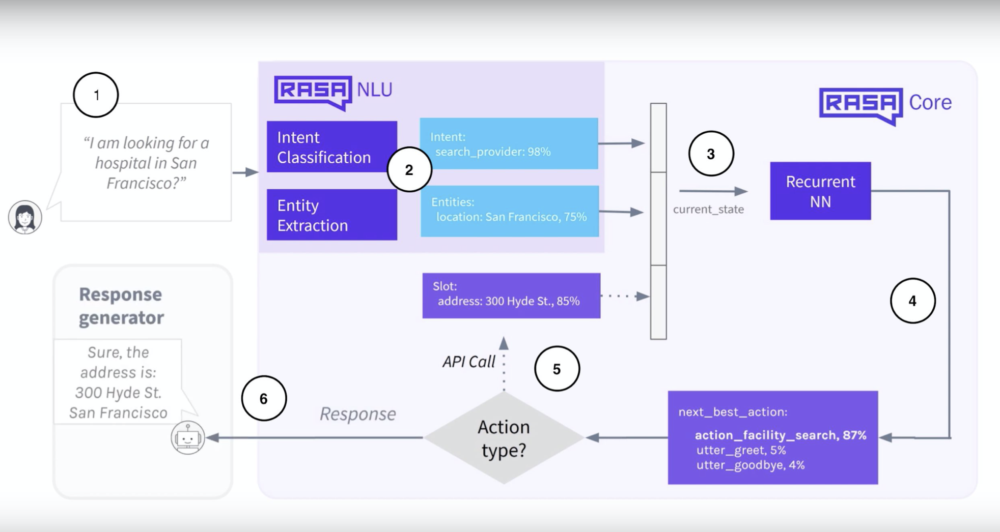
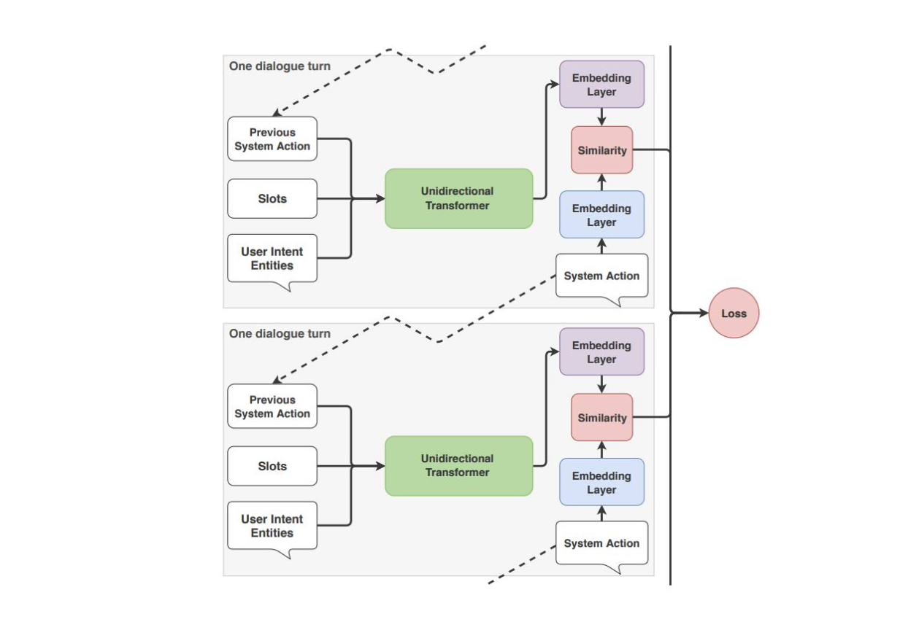
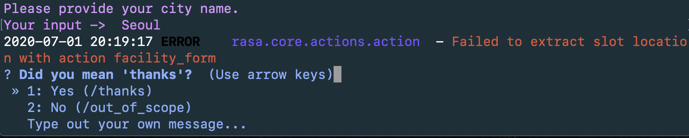

에피소드 7에서는 대화 정책에 대해 다루고 8에서는 7에서 배운 이론을 실습을 통해 익혀본다.

# Episode 7 : Dialogue Policies

라사에서 Policy 는 대화 모델을 학습시키는 컴포넌트이고 사용자의 입력에 대한 응답을 결정하는 데 중요한 역할을 한다.
에피소드 7에서는 라사에서 사용할 수 있는 정책들에 어떤 것이 있고 개발자들이 정책을 어떻게 구성하는지,
어떤 정책을 사용할 지에 대해 다룬다. 

# Policy Configuration in Rasa

NLU training pipeline 처럼 대화 정책도 *config.yml* 파일에서 구성할 수 있다.

다음은 config.yml 파일의 정책 부분이다.
 

정책 배치는 정책의 이름을 목록화하는 것으로 정의한다. NLU training pipeline 은 순서대로 작동한다면
대화 정책은 동시에 작동한다. 
각 대화 턴마다 각 정책은 다음 최적 행동을 예측하고 
confidence 값이 가장 높은 행동을 다음 행동으로 결정한다.


만약에 confidence 값이 동일할 때는 우선순위가 높은 시스템이 예측한 다음 행동으로 결정된다.
라사는 자동으로 기본 우선순위에 따라 정책의 가중치를 정한다. 
점수가 높은 것이 높은 우선순위를 지닌다. 머신러닝 정책들은 점수가 1이다.

5 - FormPolicy  
4 - FallbackPolicy and TwoStageFallbackPolicy  
3 - MemoizationPolicy and AugmentedMemoizationPolicy  
2 - MappingPolicy  
1 - TEDPolicy, EmbeddingPolicy, KerasPolicy, and SklearnPolicy  

우선순위 내에서 confidence 값이 동일할 경우 문제를 피하기 위해서
동일 수준에서는 하나만 선택하는게 좋다.  
또한 Fallback 과 TwoStageFallback 은 명백하게 함께 사용할 수 없으니 유의 바란다.  
*priority* 라는 패러미터로 모든 정책의 우선순위를 바꿀 수 있지만 추천하지 않는다.

# Hyperparameters

각 정책은 모델 행동을 조정할 수 있는 그것만의 패러미터를 지니고 있다. 
대화 정책에서 공통으로 중요한 패러미터에는 두 개가 있다: max-history 와 data augmentation

## Max-history

정책 컴포넌트는 다음 행동을 예측할 때 단순히 사용자가 직전에 말한 것만 보지는 않는다. 
그 전에 대화 턴에서 일어난 일도 고려한다. *max_history* 패러미터는 다음 행동을 예측할 때
몇 단계 전의 대화 턴까지 고려할지를 정한다. 
이는 반복된 내용의 요청과 같이 사용자 메시지에 특정 패턴이 있어서 응답하도록 할 때, 
특히 유용할 수 있다.
max_history 는 policy 의 featurizer 부분에서 설정 가능하다.  
MaxHistoryTrackerFeaturizer 만 max_history 를 사용할 수 있고 
FullDialogueTrackerFeaturizer 는 모든 대화 기록을 살핀다.

```markdown
policies:
  - name: "KerasPolicy"
    featurizer:
    - name: MaxHistoryTrackerFeaturizer
      max_history: 5
      state_featurizer:
        - name: BinarySingleStateFeaturizer
```

그럼 이 max_history 를 높게 잡을수록 좋은 것인가? max-history 관해서 정확도와 
반응 속도는 trade-off 관계이다. max_history 를 높이면 정확도는 올라가겠지만 
그만큼 모델이 커져서 반응 속도가 느려진다.  
그렇기 때문에 slot 을 활용해서 max_history 는 실험을 통해 적절한 값을 선택하는게
더 좋은 방법이다.

## Data augmentation

기본적으로 라사 코어는 임의로 스토리들을 선택하여 학습 데이터 파일에 추가한다. 
이를 data augmentation 이라고 부른다. data augmentation 을 통해 
모델은 관련 없는 대화 기록을 무시하도록 학습한다.   
예를 들어, 그 전의 대화가 어떤 것이든 간에 다음 행동이 동일해야 하는 짧은 스토리가 있다고 할 때,
**--augmentation** flag 를 통해 다음 행동을 통제할 수 있다.  
기본적으로, augmentation 은 20으로 지정되어 있고 이는 200개의 추가 스토리를 만든다는 것을 의미한다.
**--augmentation 0** 으로 세팅하면 data augmentation 은 하지 않는다. 데이터가 충분히 많을 때 
이렇게 해도 좋다.

간단히 생각해서 스토리 데이터가 적을 때 임의로 데이터를 더 추출하여 학습시킨다는 것이다. 

# Dialogue Policies

라사에서 사용 가능한 정책은 다음과 같다.
* Memoization Policy
* Mapping Policy
* Keras Policy
* Embedding Policy(TEDPolicy)
* FormPolicy
* FallbackPolicy

## Memoization Policy

비교적 간단한 대화 정책이다. max_history 로 대화를 부분으로 잘라서 일치하는 스토리 부분을 찾는다.
일치하는 것을 찾으면 학습 데이터에서 본 그 다음 행동을 산출한다.
일치하는 것을 찾고 이를 그대로 산출하기 때문에 100% 확신을 지니고 예측한다. 
그래서 단독으로 사용하는 것보다는 다른 정책과 함께 쓰는 것을 추천한다.

* Configuration
    * max_history : default - 5
    * priority

## Mapping Policy

Mapping Policy 는 인텐트를 특정 행동으로 매핑해준다. 대화가 이전에 어떤 상황이었든 간에
그 인텐트에 대한 특정 대답을 하기를 바랄 때 유용하다.   
중요한 특징은 대화 중간에도 특정 인텐트에 대해 정해진 답변을 하면서 대화 흐름을 깨지 않을 수 있다.


외부에서 바로 매핑을 하기 때문에 다른 정책과 꼭 함께 쓰여야 한다.

* Configuration
    * config.yml 파일에 MappingPolicy 를 등록하고 domain.yml 파일에서 인텐트에 대한 행동도
    매핑해줘야 한다. *triggers* 라는 속성을 사용한다. 이 경우에는 하나의 행동으로만 매핑 가능하다.
    * 예시
    ```
    intents:
    - ask_is_bot:
        triggers: action_is_bot
    ```
    * 앞선 예시처럼 매핑한 내용이 대화의 흐름에서 제외되길 원하면 action server 부분에서 
    run() 의 반환값으로 *UserUtteranceReverted()*를 지정해야 한다.  
    ```python
    class ActionIsBot(Action):
        """Revertible mapped action for utter_is_bot"""
        
        def name(self):
            return "action_is_bot"
        
        def run(self, dispatcher, tracker, domain):
            dispatcher.utter_template(template="utter_is_bot")
            return [UserUtteranceReverted()]
    ```
    * 만약 triggers: utter_{} 이런 식으로 쓰면 stories.md 와 domain.yml 을 기준으로 바로 응답한다.  
    이 경우는 대화 기록에 남는다. 특정 인텐트에 지정할 대답이 있지만 대화 흐름에 남기고 싶으면서 간단한 텍스트 응답일 때
    utter_{} 를 사용하면 된다.


## Keras Policy

Keras Policy 는 머신러닝을 대화 관리에 적용시킨 것이다. 
keras 로 구현한 신경망을 학습에 사용한다. 기본 아키텍쳐는 LSTM 기반이지만 
*KerasPolicy.model_architecture* method 를 override 하여 수정할 수 있다.

Keras Policy 는 예측을 위해 여러 요소를 고려한다.
* 마지막 행동
* NLU model 에 의해 추출된 인텐트와 엔티티
* slots
* 이전 대화 턴들 (max_history 에서 개수 정해줌)

Keras Policy 의 프로세스
1. 사용자가 질문을 한다
2. NLU components 가 인텐트와 엔티티를 추출한다. 
대화 모델 입력값으로 쓰이기 위해 인텐트와 엔티티는 벡터화된다.
3. 대화 모델은 이전 대화 상태, feature vector 를 입력으로 받아 처리한다.
4. 대화 모델은 다음 최적 행동을 예측한다
5. 다음 행동이 custom action 일 경우 그것을 실행한다.
6. 사용자에게 예측된 응답을 전달한다.



* Configuration
    * max_history : 고려해야 할 이전 대화 상태 개수
    * epochs : 학습 데이터를 돌릴 횟수
    * validation_split : 학습 데이터셋을 검증 데이터와 분리할 비율, 검증 데이터 셋의 비율.
    * random_seed : integer value, 가중치의 최초값을 지정할 때 랜덤값을 주는데 이 때 
    그 seed 값을 지정하는 것이다. 

```markdown
policies:
    - name : MemoizationPolicy
    - name : KerasPolicy
      max_history : 3
      epochs: 200
      validation_split: 0.1
      random_seed: 1
```

## Embedding Policy

TEDPolicy 로 이름이 변경되었다. 

## TEDPolicy

Transformer Embedding Dialogue Policy(TED Policy)는 라사의 기본 ML 기반 정책이다.
Keras 와 같은 다른 머신러닝 정책과 비교했을 때 TED Policy 가 멀티 턴 대화 상황에서 성능이 더 좋다.
(연구가 있는 듯 하다.)

RNN(Keras Policy) 대신에 Transformer 를 사용한다. Transformer 는 여러 코퍼라 혹은 데이터셋에 걸쳐서
보다 정확한 결과를 만들어내고, 예상치 못한 사용자의 입력에도 대처할 수 있다.

TED Policy 의 작동 원리
1. 매 스텝마다 다음 세 가지를 이어서 벡터화하여 transformer model 로 들어간다.
    1. 사용자 메시지에서 뽑힌 인텐트와 엔티티
    2. 이전 시스템 액션
    3. slot data
2. dialogue embedding 추출
3. 각 범주형의 시스템 액션에 대한 임베딩 추출
4. dialogue embedding 과 시스템 액션 embedding 간 유사도 계산 (StarSpace 에 근거)

 

* Configuration
    - epochs, default 는 1
    - hidden_layers_sizes : feed-forward layer 개수, 대화와 인텐트의 출력 차원을 정해준다.
        - default : dialogue: [], label: []
        - dialogue : [256, 128] 로 지정하면 2개의 feed-forward layer 가 생기고 첫 번째 레이어의 
        출력 차원은 256이고 두 번째는 128 이다.  빈 리스트이면 feed-forward layer 는 없다.  
        0이상의 정수만 써야 한다.  
    - number_of_transformer_layers : default 는 1
    - transformer_size : default 는 128, transformer unit 개수
    - weight_sparsity : 
        - default 는 0.8
        - 범위 : 0 과 1 사이
        - 0으로 설정하면 커널 가중치가 0으로 설정되지 않고 표준 feed-forward layer 역할을 한다. 
        - 1로 설정하면 모든 커널 가중치가 0이 되므로, 모델이 학습할 수 없다.
    - max_history : TED Policy 에서 기본으로 FullDialogueTrackerFeaturizer 를 사용하고 있어서 모든 과거 대화기록을
    살펴본다. 빠르게 학습하기 위해서는 MaxHistoryTrackerFeaturizer 를 사용하여 유한한 수를 지정해주는 것도 좋다.
    - evaluate_on_number_of_examples : default 는 0, 검증 데이터 개수, 랜덤하게 고르고 검증 셋으로 분리되면 학습 데이터셋에 넣지 않기 때문에
    너무 큰 수를 쓰면 학습 성능이 오르지 않는다.
    - [hyperparameters 더보기](https://rasa.com/docs/rasa/core/policies/#ted-policy){:target="_blank"}
    
## Form Policy

사용자로부터 특정 데이터 조각들을 받아야 할 때가 사용한다. 예를 들어, 식당 예약을 하고 싶을 때 '사람 이름', '인원 수', '시간' 등 필수적인 정보들이 있다.  
slots 을 사용하면 가능하지만 충분한 학습 데이터가 필요하다.  
다른 좋은 대안이 Form Policy 이다.


Form Policy 를 활성화하면 필요한 데이터가 충족될 때까지 사용자에게 계속 질문(*FormAction*)한다. 자세한 내용은 에피소드 8에서 다룰 예정이다.

## Fallback Policy

사용자의 쿼리가 어시스턴트의 주제에서 벗어낫거나 이해하지 못한 요청일 경우 지정된 응답을 하게 되어 있다. 구체적으로 예측값의 confidence 가 임계치보다 작으면 
사전에 지정한 fallback utter(ex - '이해하지 못했습니다. 다시 말씀해주세요')를 사용자에게 전달한다. nlu component 와 core component 의 임계치가
따로 있다.

* Configuration
    * nlu_threshold : nlu 예측값의 최소 confidence
    * ambiguity_threshold : 최상위 인텐트와 차상위 인텐트의 confidence 차이
    * core_threshold : core 예측값의 최소 confidence
    * fallback_action_name : fallback action 이름

## Two-stage Fallback Policy



Fallback policy 의 변형이다. 임계치보다 낮을 때 바로 fallback action 을 수행하지 않고, 사용자에게 예측값을 확인하는 작업을 거친다.
임계치보다는 낮지만 그 예측값이 맞을 경우 사용자가 맞다고 하면 그대로 이어서 대화를 진행한다. 아니면 fallback action 을 수행한다.  
Fallback Policy 와 Two-stage Fallback Policy 는 둘 중에 하나만 있어야 한다.

* Configuration
    * nlu_threshold : nlu 예측값의 최소 confidence
    * ambiguity_threshold : 최상위 인텐트와 차상위 인텐트의 confidence 차이
    * core_threshold : core 예측값의 최소 confidence
    * fallback_core_action_name : 다음 행동 예측값이 임계치 이하일 대 fallback action name
    * fallback_nlu_action_name : 인텐트 예측값이 임계치 이하일 대 fallback action name
    * deny_suggestion_intent_name : 인텐트 제안하였으나 사용자로부터 거절당한 인텐트

## 중간 정리

policy configuration 을 커스텀하고 패러미터를 조정하는 것은 라사 어시스턴트를 다음 레벨로 올리는데 중요한 역할을 한다. 기본 설정이
나쁜 것은 아니나 시간이 지날수록 자신의 어시스턴트에 맞는 정책을 만드는 것이 좋다.

이어지는 다음 에피소드(8)에서는 백엔드에서 integrations, forms, fallback 같은 custom action 을 구현하는 것에 대해 알아본다. 


# Episode 8 : Integrations, Forms, and Fallbacks

에피소드 7에서 배운 것을 적용하는 시간을 갖는다. 

## Improving the NLU

이전 에피소드들에서 인텐트를 구별하고 엔티티를 추출하는 간단한 NLU model를 만들어보았다.
모델은 작동하지만 데이터가 충분하지 않아서 잘못 대답하는 경우도 있었다. 
데이터를 충분히 해야 한다. 인텐트와 엔티티를 충분히 준비하면 성능이 올라갈 것이다. 

## Using Regex in Entites

고정된 형태의 value를 지니고 있는 엔티티의 경우 정규식을 사용하면 다수의 데이터를 준비하지 않아도 쉽게 엔티티를 추출할 수 있다.
예를 들어, 미국의 zip code는 5개의 숫자로 이루어져 있어서 다음과 같이 표현할 수 있다.

```markdown
## regex:zipcode
- [0-9]{5}
```

## Using Synonyms

유사어 기능은 동일한 의미의 value 를 하나의 value 로 통합하는데 의미가 있다. 
그래서 유사어가 있을 경우 매핑은 유사어로 된다. 여기서 유사어라는 용어보다는 '유사 대표어'가 나을 듯하다.  
본 교재에서 예시는 기관의 종류가 있을 때 코드명을 유사 대표어로 지정한다. 이렇게 하는 데는 custom action 을 사용하려는
목적이 크다. api call 할 때 기관의 종류를 코드명으로 받고 있어서 이렇게 한 것이다.  
또한 유사어를 사용하려면 파이프라인에 *EntitySynonymMapper*를 포함시켜야 한다. 순서는 extractor 뒤가 좋다.

다음과 같이 2개 형태로 표현할 수 있다.  
'어메니티'가 대표 유사어이다.

```markdown
# intent:호텔+편의용품구비여부문의
- [편의용품](amenity)으로 뭐 있죠?
- 기본적으로 [비품](amenity)은 뭐 어떤 게 준비되어 있어요?
- [객실 비품](amenity)는 어떤게 있어요?
- [어매니티](amenity:어메니티) 제공되나요?
- [어메니티](amenity)는 제공되죠?
- [욕실용품](amenity)은 다 구비되어 있나요?
- [칫솔](amenity)도 있나요?
- 룸에 [세면도구](amenity) 제공되나요?

## synonym: 어메니티
- 객실 비품
- 비품
- 편의용품
```

## Retraining the NLU Model

데이터의 변화가 있을 때 재학습 시작한다.  
NLU model만 학습하고 싶을 때는 *rasa train nlu* 를 터미널에 입력한다.

## Implementing a Form Action in Rasa

### Defining a Form Action

form action 은 actions.py 에서 정의한다. custom action 의 경우 form action 을 비롯하여 매핑과 코딩이 필요하다.
form action 을 사용하려면 rasa sdk 내부의 FormAction 을 import 해야 한다.

```python
from rasa_sdk.forms import FormAction
```

form 은 일반적으로 4개의 주요 function 을 갖는다 : name, required_slots, slot_mappings, submit  

#### 아래 예시는 의료기관 위치를 알려주는 assistant 의 FormAction 이다.
```python
class FacilityForm(FormAction):
    """Custom form action to fill all slots required to find specific type
    of healthcare facilities in a certain city or zip code."""

    def name(self) -> Text:
        """Unique identifier of the form"""

        return "facility_form"

    @staticmethod
    def required_slots(tracker: Tracker) -> List[Text]:
        """A list of required slots that the form has to fill"""

        return ["facility_type", "location"]

    def slot_mappings(self) -> Dict[Text, Any]:
        return {"facility_type": self.from_entity(entity="facility_type",
                                                  intent=["inform",
                                                          "search_provider"]),
                "location": self.from_entity(entity="location",
                                             intent=["inform",
                                                     "search_provider"])}

    def submit(self,
               dispatcher: CollectingDispatcher,
               tracker: Tracker,
               domain: Dict[Text, Any]
               ) -> List[Dict]:
        """Once required slots are filled, print buttons for found facilities"""
        ...
```

* name : form action 이름 반환 
* required_slots : 
    - 모든 form action 이 가져야 할 필수 메서드로, 어시스턴트가 대화를 이어나가기 전에 채워져 있어야 할 슬랏을 정의한다.
    - required_slots 에서 지정한 슬랏이 충족되지 않을 경우 슬랏 정보를 채울 때까지 assistant 는 사용자에게 해당 정보를 얻기 위해 질문을 계속한다.
    - 위 예에서 의료기관 상세 위치 정보를 얻기 위해서는 기관 유형 정보(facility_type)와 위치(도시, location) 정보가 있어야 하기 때문에 
    facility_type 과 location 을 required_slots 에 등록한다. 
* slot_mappgins :
    - Form Action 에서 선택적인 메서드이지만 유용하다.
    - required slots 은 매우 다른 사용자 입력으로부터 오고 이는 자연스럽게 다른 인텐트와 엔티티를 가질 수 있다.
    - 기본적으로 Form Action 은 슬롯과 정확히 동일한 이름을 가진 엔터티 또는 엔티티에서 추출한 값만 사용하여 필요한 슬롯을 채운다. 
    - 슬롯 매핑을 하면 다른 엔터티와 엔티티의 값을 required slots 에 매핑할 수 있는 방법을 정의할 수 있다. 
    - 다만 해주는게 아니라 직접 정의해야 한다.
    - 예시를 보면
        - "inform"과 "search_provider"라는 인텐트의 'location' entity 나오면 그 엔티티를 "location" slot에 매핑한다는 의미이다.
        - 이 예에서는 다행히 엔티티 이름과 slot 이름이 동일하다.
        - 다를 경우도 있다.
            - 예를 들어, 기차 예약과 관련된 인텐트를 가지고 있는 텍스트에서 추출된 entity가 'time' 일 때(보통 정규식으로 추출),
            출발 시간과 도착 시간 slot의 이름은 추출된 엔티티 명과 다르고 인텐트도 다를 수 있다.   
* submit
    - 필요한 슬랏이 충족되면 일어나는 이벤트를 정의한다.
        - 위 예시에서는 facility_type 과 location 을 기반으로 정부가 제공하는 api 를 통해 기관의 구체적인 주소를 전달 받아 이를 사용자에게 전달한다.
    - 예시를 통해 구체적으로 어떻게 구현해야 할지 살펴보자.
    - tracker.get_slot method 를 통해 원하는 slot 정보를 얻을 수 있다.
        - 이 슬랏이 필수 정보이면 required_slots 에 등록이 되어 있어야 한다.
    - 이 슬랏 데이터를 _find_facilities method 에 입력값으로 준다.  
     
    - results(결과값) 비었으면 user 에게 찾지 못했다고 응답한다.
    - 결과값이 있으면 상위 3개의 결과값에 대해 버튼으로 반환하고 dispatcher 내부의 메서드를 이용해서 메시지를 전달한다.
        
    

## Updating the Domain File and Model Configuration for Forms

* form 을 사용하려면 domain.yml 파일에도 form 이름을 등록해야 한다.


* core model 의 파이프라인(config.yml)에 FormPolicy 를 추가해야 한다.


## Updating Training Stories with Forms

마지막으로 stories.md 파일에서 form action 내용을 추가해야 한다.


facility_form 작동을 위해 3줄이 추가된다.
* facility_form :  facility_form 을 활성화할 것이라는 알려주고 form 을 완성하기 위해 정보를 모으기 시작함
* form{"name": "facility_form"} : required slots 이 모두 채워질 때까지 FormPolicy 가 form action 을 수행할 것이라는 표시
* form{"name": "null"} : 이 작은 스토리를 끝냈고, form 이 채워져서 대화로 돌아갈 수 있음을 가리킨다.

facility_id 는 facitlity_form 에서 세팅한 데이터이다. 

사용자가 한 개의 필수 slot 정보를 제공하지만 다른 정보들은 제공하지 않거나, 한 번에 모든 정보들로 응답하거나, 
필요한 정보를 어떤 것도 제공하지 않는 등 다양한 상황들이 발생할 수 있는 여러 경로가 있다. 
이러한 상황에서 form action 은 유용한 툴이 될 수 있다.

사용자가 처음 요청에서 모든 필수 slot 정보를 제공하였을 때 assistant 가 어떻게 응답할 것인지 추가로 스토리를 만들어보자.


---
### 팩트 체크
Q. 예시에서 인텐트 옆에 엔티티를 적으면 지역을 Austin 이라고 말했을 때만 답할까?  

A. 아니다. 오해할만한 여지가 있어 보이는데 테스트해본 결과, 위 예시로 Virginia 의 nursing home 을 찾으려고 할 때도 적절한 응답이 왔다.
즉, entity_name 만 동일하면 된다. 이 내용이 명시적으로 공식 docs 에 없어서 지금까지 오해하고 있었다. 위 예시에서 인텐트 옆에 엔티티를 빼도 적절한 응답이 온다.
다만, 저렇게 하는게 entity_name 으로 필수조건을 만들 수 있어서 사용하는 것이다.

--- 

api call 을 할 때 아래 예시처럼 꼭 할 필요는 없지만 예를 들면 이렇다.
사전에 엔티티 학습시 유사대표어로 코드명을 등록해두어서 entity value 는 모두 코드명으로 올 것이다. 
코드명이 아니더라도 동의어에 대해서는 유사 대표어를 지정하는 것이 더 낫다.

create_path method 는 사전에 정의된 내용을 기반으로 call 할 주소를 endpoint 까지 맞춰서 반환하고 
이를 가지고 api call 하여 결과를 반환하는 것이 _find_facilities 이다.

```python
# We use the medicare.gov database to find information about 3 different
# healthcare facility types, given a city name, zip code or facility ID
# the identifiers for each facility type is given by the medicare database
# xubh-q36u is for hospitals
# b27b-2uc7 is for nursing homes
# 9wzi-peqs is for home health agencies

ENDPOINTS = {
    "base": "https://data.medicare.gov/resource/{}.json",
    "xubh-q36u": {
        "city_query": "?city={}",
        "zip_code_query": "?zip_code={}",
        "id_query": "?provider_id={}"
    },
    "b27b-2uc7": {
        "city_query": "?provider_city={}",
        "zip_code_query": "?provider_zip_code={}",
        "id_query": "?federal_provider_number={}"
    },
    "9wzi-peqs": {
        "city_query": "?city={}",
        "zip_code_query": "?zip={}",
        "id_query": "?provider_number={}"
    }
}

FACILITY_TYPES = {
    "hospital":
        {
            "name": "hospital",
            "resource": "xubh-q36u"
        },
    "nursing_home":
        {
            "name": "nursing home",
            "resource": "b27b-2uc7"
        },
    "home_health":
        {
            "name": "home health agency",
            "resource": "9wzi-peqs"
        }
}


def _create_path(base: Text, resource: Text,
                 query: Text, values: Text) -> Text:
    """Creates a path to find provider using the endpoints."""

    if isinstance(values, list):
        return (base + query).format(
            resource, ', '.join('"{0}"'.format(w) for w in values))
    else:
        return (base + query).format(resource, values)


def _find_facilities(location: Text, resource: Text) -> List[Dict]:
    """Returns json of facilities matching the search criteria."""

    if str.isdigit(location):
        full_path = _create_path(ENDPOINTS["base"], resource,
                                 ENDPOINTS[resource]["zip_code_query"],
                                 location)
    else:
        full_path = _create_path(ENDPOINTS["base"], resource,
                                 ENDPOINTS[resource]["city_query"],
                                 location.upper())
    #print("Full path:")
    #print(full_path)
    results = requests.get(full_path).json()
    return results

```

## Conclusion

다음 에피소드부터는 rasa X 활용 방법 및 메신저 앱 연동 방법에 대해 다룬다. 따라서 대화 관련 내용은 여기까지이다.

새로 챗봇을 만들기 전에 블로그에는 공개하지 않았지만 라사의 다양한 기능을 사용하고 실제로 구현해보면서 
느끼는 바가 많았다. 

논문으로만 챗봇의 단위 기능들만 볼 때는 무언가 엄청나게 대단한게 될 줄 알았는데 실제 서비스를 위해서는 
하나부터 열까지 신경쓸게 많고 자동화라는게 엄청 힘든 일인 것을 깨달았다.

또한 라사의 장단점을 보면서 내가 만들 때는 달리 해야겠다라는 지점도 있었다.

### 배울 점
1. 커뮤니티 활성화
2. rasa X
3. 파이프라인으로 각 component 를 쉽게 놓을 수 있어서 편리하다.
4. nlu 학습 데이터의 경우 다른 형식의 챗봇 데이터를 라사용으로 변환 가능하다.
5. 영어의 경우 ConveRT+DIET 속도 빠르고 성능도 우수


### 고쳐야할 점  
1. 학습 데이터를 만들 때 너무 여러 파일을 건드려야 하고 같은 내용을 여러 군데에 입력해야 한다.
2. 프로젝트 단위라서 여러 개의 agent 를 만들 수 없다. 
    * 이 경우 프로젝트를 여러 개 만들어서 이를 연동할 수는 있다고 한다.


# References

* [https://blog.rasa.com/the-rasa-masterclass-handbook-episode-7/](https://blog.rasa.com/the-rasa-masterclass-handbook-episode-7/){:target="_blank"}
* [https://blog.rasa.com/the-rasa-masterclass-handbook-episode-8/](https://blog.rasa.com/the-rasa-masterclass-handbook-episode-8/){:target="_blank"}
* [https://rasa.com/docs/rasa/core/policies/#id1](https://rasa.com/docs/rasa/core/policies/#id1){:target="_blank"}
* [https://rasa.com/docs/rasa/core/forms/%23form-basics/](https://rasa.com/docs/rasa/core/forms/%23form-basics/){:target="_blank"}
* [https://rasa.com/docs/rasa/core/actions/%23id2/](https://rasa.com/docs/rasa/core/actions/%23id2/){:target="_blank"}
